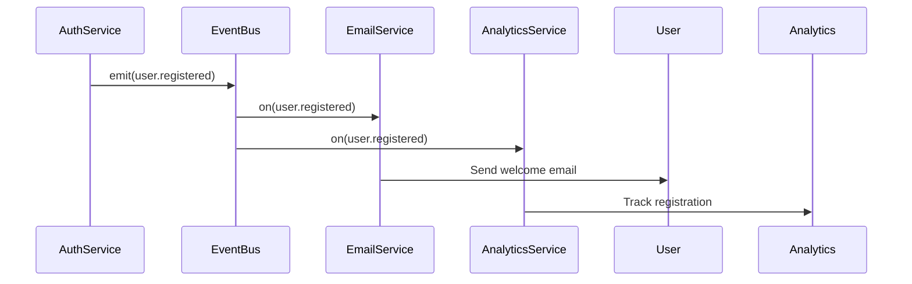
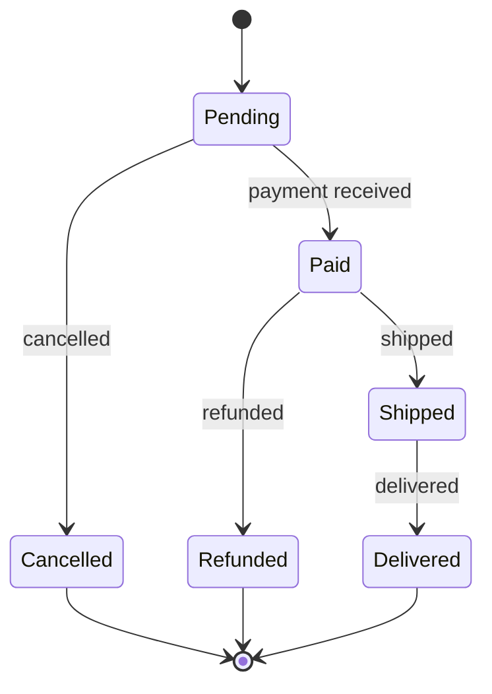
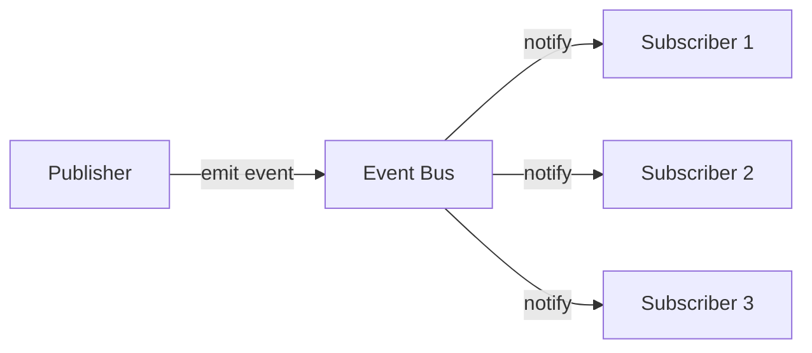

# PROMPT_15 — Phase 14: State Management & Event System Analysis

## PHASE CLASS: Behavioral Analysis
## DEPENDENCIES: PROMPT_14 (API Boundaries) — complete
## OUTPUT DIRECTORY: `re-docs/14-state-events/`

---

## OBJECTIVE

Document every state management mechanism and event system in the repository. Cover client-side state, server-side state, database state, cache state, event buses, message queues, pub/sub systems, and state transitions.

## PREREQUISITES

- [ ] PROMPT_14 completed
- [ ] APIs are documented
- [ ] Data flows are traced
- [ ] Components are identified

## INPUTS

- `re-docs/05-modules/01-module-inventory.md`
- `re-docs/08-data-flow/04-state-shapes.md`
- `re-docs/12-design-patterns/03-behavioral-patterns.md`
- Full source code

## ANALYSIS STEPS

### Step 1: Client-Side State Analysis (Frontend)

Document all client-side state:

```markdown
## Client State: Global App State

### State Management Tool: Zustand

### Store: useAuthStore
#### Location: src/store/auth.ts
#### State Shape:
```typescript
interface AuthState {
  user: User | null;
  token: string | null;
  isAuthenticated: boolean;
  isLoading: boolean;
  error: string | null;
}
```
#### Actions:
- login(email, password) → sets user, token
- logout() → clears user, token
- refreshToken() → updates token
- setUser(user) → updates user

#### Persistence:
- Token saved to localStorage
- State restored from localStorage on app init
```

### Step 2: Server-Side State Analysis (Backend)

Document all server-side state:

```markdown
## Server State: Application State

### In-Memory State
- Session store: Map<string, Session> (src/session/store.ts)
- Rate limiter: Map<string, Attempt[]> (src/middleware/rateLimit.ts)
- Cache: NodeCache instance (src/cache/memory.ts)

### Database State
- See: re-docs/08-data-flow/04-state-shapes.md

### File System State
- Upload directory: /uploads/
- Log files: /logs/
- Temp files: /tmp/
```

### Step 3: State Machine Analysis

Identify and document all state machines:

```markdown
## State Machine: Order Lifecycle

### Location: src/orders/state-machine.ts

### States
┌──────────┐     ┌──────────┐     ┌──────────┐
│  Pending  │────>│  Paid    │────>│ Shipped  │
└──────────┘     └──────────┘     └──────────┘
     │                │                │
     ▼                ▼                ▼
┌──────────┐     ┌──────────┐     ┌──────────┐
│ Cancelled│     │ Refunded │     │ Delivered│
└──────────┘     └──────────┘     └──────────┘

### Transitions
| From | To | Trigger | Guard Condition |
|------|----|---------|-----------------|
| Pending | Paid | paymentReceived | payment.amount >= order.total |
| Pending | Cancelled | cancelOrder | user.isAdmin OR user.id == order.userId |
| Paid | Shipped | shipOrder | user.isAdmin AND order.address.valid |
| Paid | Refunded | refundOrder | within 30 days of payment |
| Shipped | Delivered | confirmDelivery | delivery.confirmed |

### Guards
- cancelOrder: Only owner or admin can cancel
- shipOrder: Only admin can ship
- refundOrder: Only within 30 days of payment
```

### Step 4: Event System Analysis

Document all event systems:

```markdown
## Event Bus: Application Event Bus

### Technology: EventEmitter3 (src/events/bus.ts)

### Events Published
| Event Name | Payload | Publisher | Subscribers | Async? |
|------------|---------|-----------|-------------|--------|
| user.registered | {userId, email} | AuthService | EmailService, AnalyticsService | Yes |
| user.loggedIn | {userId, ip} | AuthService | AuditService | Yes |
| order.created | {orderId, total} | OrderService | NotificationService, InventoryService | Yes |
| order.paid | {orderId, amount} | PaymentService | OrderService, EmailService | Yes |

### Event Flow Diagram

```

### Step 5: Message Queue Analysis (if applicable)

```markdown
## Message Queue: Job Processing

### Technology: Bull (Redis-backed)

### Queues
| Queue Name | Concurrency | Job Types | Location |
|------------|-------------|-----------|----------|
| email | 5 | sendWelcome, sendReset, sendAlert | src/queues/email.ts |
| reports | 2 | generateDaily, generateWeekly | src/queues/reports.ts |

### Job Definition
```typescript
interface EmailJob {
  type: 'sendWelcome' | 'sendReset' | 'sendAlert';
  to: string;
  data: Record<string, unknown>;
}
```

### Error Handling
- Failed jobs: retry 3 times with exponential backoff
- Stalled jobs: auto-restart after 30 seconds
- Dead letter: jobs that fail all retries go to failed queue
```

### Step 6: State Synchronization

Document how state is synchronized across:
- Client ↔ Server
- Service ↔ Service
- Memory ↔ Database
- Cache ↔ Database
- Primary ↔ Replica

## OUTPUT SPECIFICATION

### File 1: `01-client-state.md`

Client-side state documentation (if frontend exists).

### File 2: `02-server-state.md`

Server-side state documentation.

### File 3: `03-state-machines.md`

All state machines with diagrams.

### File 4: `04-event-system.md`

Event bus/event system documentation.

### File 5: `05-message-queues.md` (if applicable)

Message queue documentation.

### File 6: `06-state-synchronization.md`

State synchronization documentation.

### File 7: `07-state-events-summary.md`

Summary including:
- State management approach
- State complexity assessment
- Event-driven architecture maturity
- State consistency observations
- Recommendations

## REQUIRED DIAGRAMS

### State Machine Diagram



### Event Flow Diagram



## VALIDATION CHECKS

- [ ] Client-side state is documented (if applicable)
- [ ] Server-side state is documented
- [ ] All state machines are identified and diagrammed
- [ ] All events are cataloged with payloads and subscribers
- [ ] Message queues are documented (if applicable)
- [ ] State synchronization is understood

## COMPLETION CHECKLIST

- [ ] All 7 output files generated
- [ ] Client state documented
- [ ] Server state documented
- [ ] State machines diagrammed
- [ ] Event system cataloged
- [ ] Message queues documented
- [ ] State synchronization understood
- [ ] All outputs saved to `re-docs/14-state-events/`
- [ ] Phase validation checks passed

---

*Proceed to PROMPT_16_ERROR_CACHE_RETRY.md only after all checklist items are complete.*
