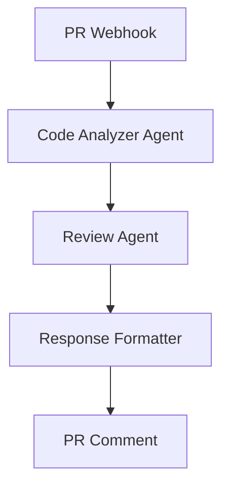
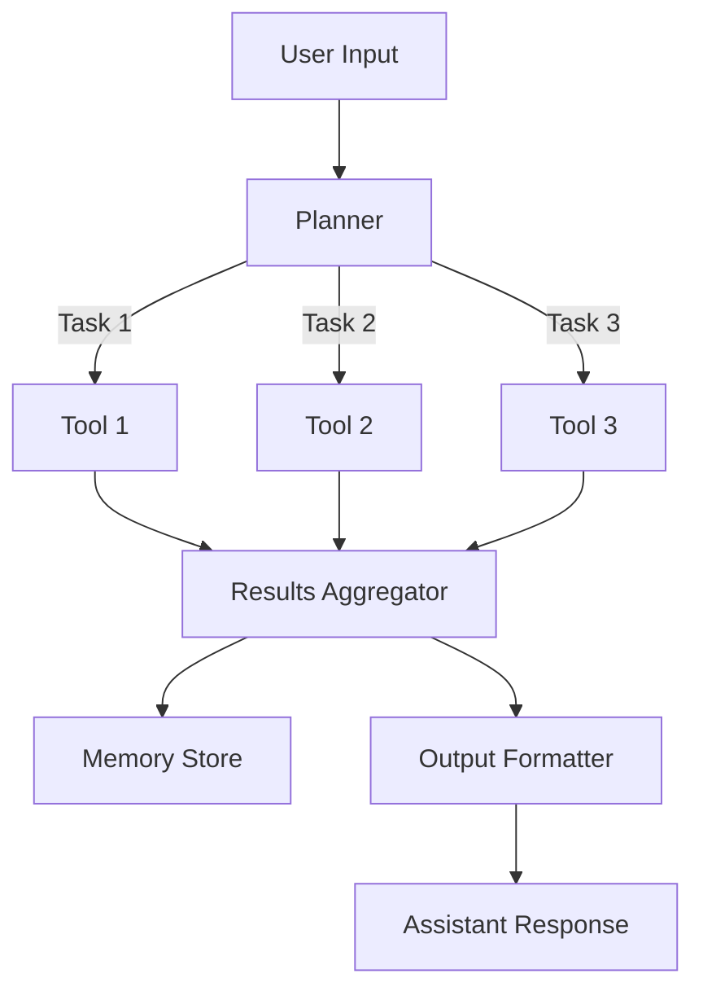
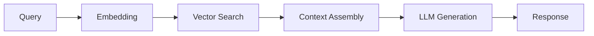

# PROMPT_17 — Phase 16: AI Workflow Analysis

## PHASE CLASS: AI Systems Analysis
## DEPENDENCIES: PROMPT_16 (Error, Cache, Retry) — complete
## OUTPUT DIRECTORY: `re-docs/16-ai-workflows/`
## APPLIES TO: Repositories containing AI/LLM/agent/RAG systems

---

## OBJECTIVE

Document every AI-related workflow in the repository: prompts, prompt templates, agent architectures, RAG pipelines, memory systems, planning workflows, tool calling mechanisms, LLM integrations, embedding strategies, and AI reasoning processes.

## PREREQUISITES

- [ ] PROMPT_16 completed
- [ ] System architecture is understood
- [ ] Data flows are traced

## DETECTION CHECK

First, determine if this phase is applicable. Search for AI-related indicators:

- **LLM libraries**: openai, anthropic, langchain, llamaindex, huggingface
- **AI frameworks**: crewai, autogen, langgraph, haystack
- **Prompt files**: .prompt, .hbs, .mustache files, prompt templates
- **AI configuration**: AI provider config, model selection, API keys
- **Vector stores**: pinecone, weaviate, chroma, qdrant, pgvector
- **Embedding libraries**: openai-embeddings, sentence-transformers
- **Agent definitions**: Agent class, Tool class, Task class
- **RAG pipelines**: Retriever, Generator, Context Builder

If none of these are found, output: `01-not-applicable.md` stating the repository does not contain AI workflows, and proceed to PROMPT_18.

## ANALYSIS STEPS

### Step 1: Prompt Architecture Analysis

Document all prompt templates and prompt management:

```markdown
## Prompt Template: Customer Support Agent

### Location: src/prompts/support-agent.prompt

### Template Content
```
You are a helpful customer support agent for {company_name}.
Be polite, professional, and concise.

Customer context:
- Name: {customer_name}
- Plan: {plan_type}
- Previous issues: {issue_history}

Customer question: {question}

Respond with:
1. Acknowledgment of the issue
2. Resolution steps (if known)
3. Escalation option (if needed)
```

### Variables
| Variable | Source | Type |
|----------|--------|------|
| company_name | Config | string |
| customer_name | Auth context | string |
| plan_type | Database | string |
| issue_history | Database query | string[] |
| question | User input | string |

### Usage Location
- src/ai/support-agent.ts:30-50
```

### Step 2: Agent Architecture Documentation

Document every AI agent in the system:

```markdown
## Agent: Code Review Assistant

### Framework: LangGraph
### Location: src/agents/code-review/

### Architecture


### Agent Components
| Component | Role | Tool Access |
|-----------|------|-------------|
| CodeAnalyzer | Analyze changed files | file-reader, git-diff |
| ReviewAgent | Generate review comments | llm-call, lint-runner |
| Formatter | Format response | template-renderer |

### State Management
```typescript
interface AgentState {
  prNumber: number;
  changedFiles: string[];
  analysisResults: AnalysisResult[];
  reviewComments: Comment[];
  currentStep: 'analyze' | 'review' | 'format' | 'done';
}
```

### Tools
| Tool | Description | Schema |
|------|-------------|--------|
| file-reader | Read file contents | {path: string} → {content: string} |
| git-diff | Get diff for a PR | {pr: number} → {diff: string} |
| lint-runner | Run linter on files | {files: string[]} → {results: LintResult[]} |
| llm-call | Call LLM with prompt | {prompt: string} → {response: string} |
```

### Step 3: RAG Pipeline Documentation

```markdown
## RAG Pipeline: Documentation Q&A

### Location: src/rag/documentation-qa/

### Pipeline Steps
1. **Query Input**: User asks a question
2. **Query Embedding**: Embed query with text-embedding-3-small
3. **Vector Search**: Search ChromaDB for top-5 relevant docs
4. **Context Assembly**: Combine retrieved chunks with metadata
5. **Prompt Construction**: Build prompt with context + question
6. **LLM Generation**: Call GPT-4 with constructed prompt
7. **Response Post-Processing**: Extract answer, format, add citations

### Vector Store
- **Technology**: ChromaDB
- **Collection**: documentation
- **Embedding Model**: text-embedding-3-small (1536 dimensions)
- **Chunk Size**: 1000 characters
- **Chunk Overlap**: 200 characters
- **Chunk Strategy**: RecursiveCharacterTextSplitter
- **Retrieval**: Top-5 by cosine similarity
- **Metadata**: source_url, section_title, chunk_index

### Prompt Template
```
You are a documentation assistant. Answer based ONLY on the provided context.

Context:
{context}

Question: {question}

Answer (include citations from context):
```

### Evaluation
- **Metrics**: faithfulness, answer_relevancy, context_precision
- **Test data**: 50 Q&A pairs
```

### Step 4: Memory System Analysis

```markdown
## Memory: Conversational Memory

### Type: Buffer with Summarization

### Short-term Memory
- Last N messages (N=20)
- Stored in: Agent state (in-memory)

### Long-term Memory
- Conversation summaries
- Stored in: PostgreSQL
- Updated every 10 messages
- Summarization model: GPT-3.5-turbo

### Retrieval
- On new conversation: load last 3 summaries
- On new message: append to buffer
- On buffer full: summarize and archive
```

### Step 5: Planning Workflow Analysis

```markdown
## Planning: Task Decomposition

### Planner Type: ReAct (Reasoning + Acting)

### Planning Process
1. Receive complex user request
2. LLM decomposes into sub-tasks
3. Each sub-task assigned to available tool
4. Execute sub-tasks sequentially (or parallel if independent)
5. Aggregate results
6. Return final response

### Plan Structure
```typescript
interface Plan {
  goal: string;
  steps: PlanStep[];
}

interface PlanStep {
  id: string;
  description: string;
  tool: string;
  input: Record<string, unknown>;
  dependsOn: string[]; // step IDs
}
```
```

### Step 6: Tool Calling Analysis

```markdown
## Tool Calling: OpenAI Function Calling

### Configuration
- Model: gpt-4-turbo
- Tool choice: auto (model decides)
- Parallel tool calls: enabled

### Tool Definitions
| Tool Name | Description | Parameters |
|-----------|-------------|------------|
| search_docs | Search documentation | query: string, limit: int |
| get_code | Get code from file | path: string, lines: int |
| run_query | Run database query | query: string |

### Error Handling
- Tool timeout: 15 seconds
- Retry on failure: 2 attempts
- Invalid tool call: return explanation to LLM
```

### Step 7: AI Configuration Analysis

Document all AI-related configuration:

```markdown
## AI Configuration

### LLM Provider: OpenAI
- Model: gpt-4-turbo (default)
- Fallback: gpt-3.5-turbo
- Max tokens: 4096
- Temperature: 0.7
- API key: OPENAI_API_KEY (env)

### Embedding Provider: OpenAI
- Model: text-embedding-3-small
- Dimensions: 1536

### Cost Tracking
- Location: src/ai/cost-tracker.ts
- Metrics: tokens used, cost per request, cumulative cost
```

## OUTPUT SPECIFICATION

### File 1: `01-not-applicable.md` (if no AI workflows)

### File 2: `02-prompt-architecture.md`

All prompt templates and management.

### File 3: `03-agent-architecture.md`

All agent definitions and architectures.

### File 4: `04-rag-pipeline.md`

RAG pipeline documentation.

### File 5: `05-memory-system.md`

Memory system documentation.

### File 6: `06-planning-workflows.md`

Planning and reasoning documentation.

### File 7: `07-tool-calling.md`

Tool calling configuration and patterns.

### File 8: `08-ai-configuration.md`

AI configuration and settings.

### File 9: `09-ai-workflow-summary.md`

Summary including:
- AI/LLM integration maturity
- Prompt quality assessment
- Agent architecture assessment
- RAG pipeline quality
- Memory system effectiveness
- Cost optimization opportunities
- Improvement recommendations

## REQUIRED DIAGRAMS

### Agent Architecture



### RAG Pipeline



## VALIDATION CHECKS

- [ ] AI indicators detected (or confirmed absent)
- [ ] All prompt templates cataloged
- [ ] All agent architectures documented
- [ ] RAG pipeline documented with all steps
- [ ] Memory system documented
- [ ] Planning workflows documented
- [ ] Tool calling documented
- [ ] AI configuration captured

## COMPLETION CHECKLIST

- [ ] Applicability determined
- [ ] All relevant output files generated
- [ ] Prompts documented
- [ ] Agents documented
- [ ] RAG pipelines documented
- [ ] Memory systems documented
- [ ] AI configuration captured
- [ ] All outputs saved to `re-docs/16-ai-workflows/`
- [ ] Phase validation checks passed

---

*Proceed to PROMPT_18_CONFIG_ENV.md only after all checklist items are complete.*
