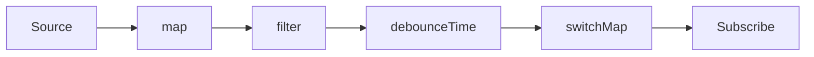
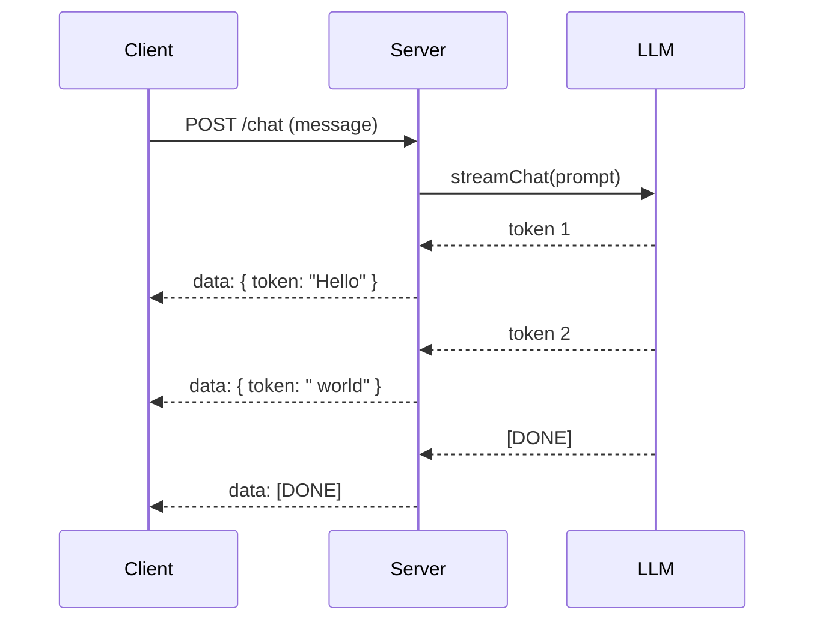

# PROMPT_21 — Phase 20: Streaming & Reactive Systems Analysis

## PHASE CLASS: Runtime Behavior Analysis (Dynamic)
## DEPENDENCIES: PROMPT_20 (Validation) — complete
## OUTPUT DIRECTORY: `re-docs/20-streaming/`

---

## OBJECTIVE

Identify, analyze, and document all streaming, reactive, and event-driven runtime patterns in the system. This includes data streaming pipelines, reactive streams, Server-Sent Events (SSE), WebSocket streaming, backpressure handling, asynchronous generators, and observable patterns.

Run this phase only if streaming or reactive patterns are detected in Phase 00 (Scouting) or Phase 14 (State & Events).

## DETECTION CHECKLIST

Indications that streaming/reactive analysis is needed:
- [ ] Use of reactive libraries (RxJS, Reactor, Akka Streams, Kafka Streams, Flink)
- [ ] WebSocket or SSE endpoints detected
- [ ] Async generators or iterators detected
- [ ] Observable/Observer pattern implementations detected
- [ ] Message queue consumers detected
- [ ] Streaming data pipelines (Kafka, Kinesis, Pulsar)
- [ ] Backpressure mechanisms detected
- [ ] Streaming AI responses detected
- [ ] Real-time data synchronization detected
- [ ] Server push patterns detected

If none of these indicators are present, skip this phase (output: NOT APPLICABLE — no streaming patterns detected).

## ANALYSIS STEPS

### Step 1: Streaming Architecture Inventory

Identify all streaming subsystems:

```markdown
## Streaming Architecture Inventory

### Subsystem: [Name]
- Type: [Data Pipeline | WebSocket | SSE | Reactive Stream | Message Queue Consumer | AI Streaming]
- Location: `path/to/main/file.ts`
- Libraries/Frameworks used: [RxJS, KafkaJS, ws, socket.io, etc.]
- Scale: [single process | distributed | cluster]
```

### Step 2: Data Streaming Pipelines

For each data streaming pipeline:

```markdown
## Streaming Pipeline: [Name]

### Source
- Input: [Kafka topic, queue, data source]
- Format: [Avro, JSON, Protobuf, raw bytes]
- Consumer config: [group.id, auto.offset.reset, etc.]

### Processing Steps
| Step | Type | File:Line | Description |
|------|------|-----------|-------------|
| 1    | Map  | file:line | transform |
| 2    | Filter | file:line | predicate |
| 3    | Aggregate | file:line | window |

### Sink
- Output: [Kafka topic, database, API, file]
- Write mode: [append, upsert, replace]

### Backpressure Strategy
- Mechanism: [buffer, drop, throttle, pull-based]
- Configuration: [buffer size, max concurrency, drop policy]
- Behavior under load: [describe what happens when producer outruns consumer]

### Error Handling
- Failures: [skip, retry, dead-letter queue]
- Retry strategy: [if applicable]
- Data loss risk: [none | possible under X condition]
```

### Step 3: Reactive Streams Analysis

For reactive streams (RxJS, Reactor, etc.):

```markdown
## Reactive Stream: [Name]

### Observable/Source
- File: `file.ts:line`
- Creation: [fromEvent, of, from, interval, custom]
- Type: [Hot | Cold | Connectable]

### Operator Chain


| Operator | File:Line | Purpose |
|----------|-----------|---------|
| map() | file:line | transforms value |
| filter() | file:line | removes nulls |
| debounceTime(300) | file:line | debounce input |
| switchMap() | file:line | cancel previous request |

### Subscription
- Subscriber count: [dynamic, single, unknown]
- Lifecycle: [managed by component, manual unsubscribe, takeUntil]
- Cleanup: [file:line where unsubscription happens]

### Schedulers
- Scheduler used: [async, asap, animationFrame, custom]
- Purpose: [throttling, animation sync, etc.]
```

### Step 4: WebSocket & SSE Streaming

For real-time streaming connections:

```markdown
## Real-Time Stream: [Name]

### Connection
- Protocol: [WebSocket | SSE | Custom]
- Endpoint: `ws://host/path` or `/api/events`
- File: `file.ts:line`

### Connection Lifecycle
- Open: `file:line` — handshake, auth
- Message: `file:line` — message handler
- Error: `file:line` — error handler
- Close: `file:line` — cleanup, reconnect
- Reconnect: `file:line` — strategy (exponential backoff, fixed interval)

### Message Types
| Message Type | Direction | Payload | Handler |
|-------------|-----------|---------|---------|
| `event:update` | Server → Client | `{ id, data }` | `handleUpdate()` |
| `command:action` | Client → Server | `{ action, params }` | `processCommand()` |

### Streaming Patterns
- Push vs Pull: [server pushes | client pulls | hybrid]
- Buffering: [none | in-memory | disk]
- Flow control: [send window | rate limit | ack-based]
```

### Step 5: AI Response Streaming

For streaming AI/LLM responses:

```markdown
## AI Streaming: [Name]

### Provider
- Provider: [OpenAI | Anthropic | Custom]
- SDK: [langchain, openai-node, anthropic-sdk]
- File: `file.ts:line`

### Streaming Implementation
- Transport: [SSE | WebSocket | Chunked HTTP]
- Stream type: [token-by-token | chunked | event-based]
- Cancellation: [AbortController | signal | manual]

### Client-Side Handling


### Error Handling
- Stream interruption: [reconnect | show partial | error state]
- Timeout handling: [timeout duration, behavior on timeout]
- Rate limiting: [tokens per second, backoff]
```

### Step 6: Backpressure & Flow Control

Document all backpressure mechanisms:

```markdown
## Backpressure Analysis

### Detected Mechanisms
| Pattern | Location | Strategy | Capacity |
|---------|----------|----------|----------|
| Buffer | file:line | Fixed size | 1000 items |
| Throttle | file:line | time-based | 10/sec |
| Debounce | file:line | idle-based | 300ms |
| Dropping | file:line | newest/oldest | configurable |
| Pull-based | file:line | demand-driven | unbounded |

### Critical Paths
- [ ] Path where backpressure can cause data loss
- [ ] Path where backpressure can cause OOM
- [ ] Path where backpressure can cause latency

### Assessment
- Backpressure adequacy: [Adequate | Partial | None]
- Risk level: [Low | Medium | High]
- Recommendations: [if any]
```

### Step 7: Streaming State Management

For stateful streaming:

```markdown
## Streaming State

### State Location
- In-memory state: `file:line`
- Persistent state: `file:line`
- Window state: `file:line`

### State Management
- Windowing: [tumbling | sliding | session] — [duration/size]
- State store: [in-memory | Redis | database]
- Checkpointing: [file:line — frequency, mechanism]
- State recovery: [file:line — on restart behavior]
```

## OUTPUT SPECIFICATION

### File 1: `01-streaming-architecture.md`
Streaming architecture inventory and overview.

### File 2: `02-data-pipelines.md`
Detailed data streaming pipeline documentation.

### File 3: `03-reactive-streams.md`
Reactive stream operator chain analysis.

### File 4: `04-real-time-streams.md`
WebSocket and SSE streaming analysis.

### File 5: `05-ai-streaming.md`
AI response streaming analysis.

### File 6: `06-backpressure.md`
Backpressure and flow control documentation.

### File 7: `07-streaming-diagrams.md`
Streaming-specific diagrams (pipeline flows, reactive graphs, sequence diagrams).

## DIAGRAMS REQUIRED

Generate at minimum:
1. Streaming pipeline flow diagram (per pipeline)
2. Reactive operator chain diagram (per observable chain)
3. WebSocket/SSE lifecycle sequence diagram
4. AI streaming sequence diagram (if applicable)

All diagrams in Mermaid syntax.

## QUALITY STANDARDS

- [ ] Every streaming source has documented origin
- [ ] Every transformation step has file:line reference
- [ ] Every streaming sink has documented destination
- [ ] Error handling documented for every stream
- [ ] Backpressure mechanism documented for every pipeline
- [ ] All diagrams are valid Mermaid syntax
- [ ] Cancellation/cleanup paths documented
- [ ] Resource lifecycle documented (connections, subscriptions)
- [ ] Accuracy tiers assigned to all claims

---

*Skip this phase if the system has no streaming or reactive patterns. Document the skip reason.*
