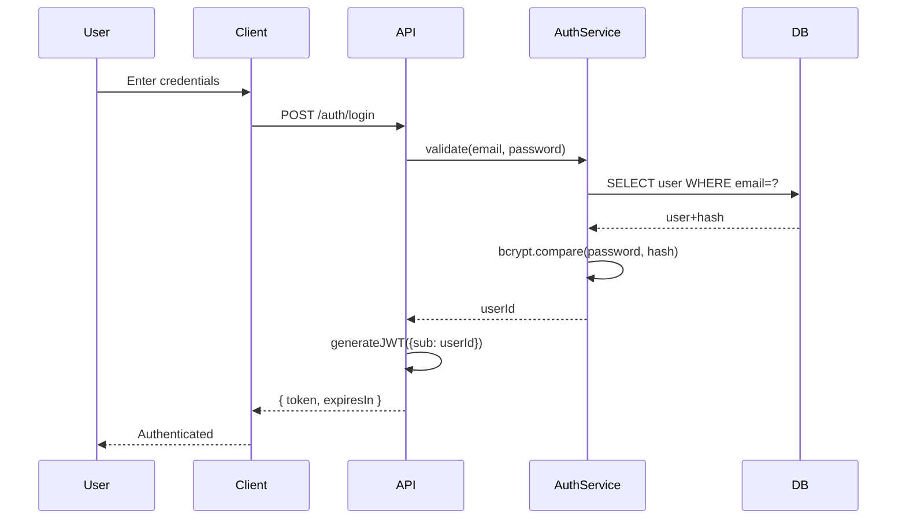
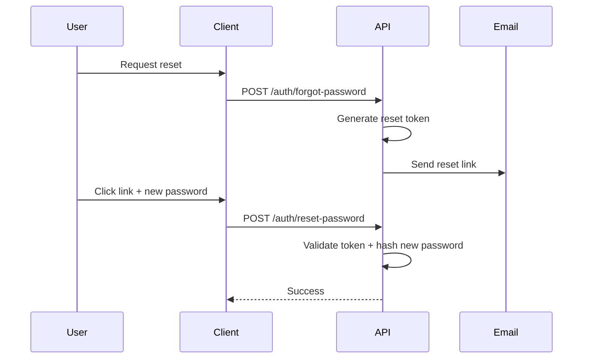

# PROMPT_22 — Phase 21: Authentication Architecture

## PHASE CLASS: Security & Identity Analysis
## DEPENDENCIES: PROMPT_21 (Streaming) — complete
## OUTPUT DIRECTORY: `re-docs/21-authentication/`

---

## OBJECTIVE

Perform a comprehensive, end-to-end analysis of the system's authentication and authorization architecture. Mappings: identity flows, token lifecycle, session management, permission models, auth providers, and credential storage.

Run this phase if any auth mechanisms were detected (log in, sign up, JWT, OAuth, session cookies, API keys, SSO, MFA).

## DETECTION CHECKLIST

- [ ] Login/signup endpoints exist
- [ ] JWT or token-based auth detected
- [ ] Session cookies or session stores detected
- [ ] OAuth/SSO providers detected (Google, GitHub, Okta, Auth0, etc.)
- [ ] API key validation detected
- [ ] Role-based access control (RBAC) detected
- [ ] Permission/ability checks detected
- [ ] Multi-factor authentication (MFA) detected
- [ ] Password management (hashing, reset, policy) detected
- [ ] Auth middleware detected
- [ ] Auth provider SDK detected (Auth0, Clerk, Supabase Auth, Firebase Auth, etc.)

## ANALYSIS STEPS

### Step 1: Auth Provider & Framework Inventory

```markdown
## Auth Provider Inventory

### Primary Auth Framework
- Framework/Library: [Passport.js | Devise | Spring Security | Supabase Auth | Firebase Auth | Auth0 | Clerk | Custom]
- Version: [version]
- Location: `path/to/auth/config`

### Auth Providers / Strategies
| Strategy | Provider | Config Location | Enabled |
|----------|----------|-----------------|---------|
| Email/Password | Built-in | `file:line` | Yes |
| Google OAuth | Google | `file:line` | Yes |
| GitHub OAuth | GitHub | `file:line` | No |
| Magic Link | Custom | `file:line` | Yes |

### Auth SDK Configuration
- SDK config: `file:line`
- API keys/secrets: managed via [env vars | secrets manager | hardcoded]
- Callback URLs: [list of registered callback URLs]
```

### Step 2: Authentication Flows (End-to-End)

For each auth flow:

```markdown
## Auth Flow: [Login | Signup | OAuth | MFA | Password Reset | API Key]

### Flow Diagram


### Step-by-Step
| Step | File:Line | Action | Data |
|------|-----------|--------|------|
| 1 | `file:line` | Input validation | email, password |
| 2 | `file:line` | User lookup | SQL query |
| 3 | `file:line` | Password verification | bcrypt.compare |
| 4 | `file:line` | Token generation | JWT.sign({sub, role}) |
| 5 | `file:line` | Response | { token, user } |

### Token Generation
- Algorithm: [HS256 | RS256 | ES256]
- Secret/key location: `file:line`
- Token payload: `{ sub, role, iat, exp, ... }`
- Expiration: [15m | 1h | 7d]

### Error Handling
- Invalid credentials: `file:line` — returns 401
- Account locked: `file:line` — returns 423
- Rate limited: `file:line` — returns 429
```

### Step 3: Token Lifecycle

```markdown
## Token Lifecycle

### Access Token
- Generation: `file:line`
- Format: [JWT | opaque | session ID]
- Payload: `{ sub, name, role, iat, exp }`
- Expiration: [15 minutes | 1 hour]
- Storage (client): [memory | httpOnly cookie | localStorage | SecureStore]
- Refresh mechanism: [refresh token | re-authenticate]

### Refresh Token (if applicable)
- Generation: `file:line`
- Storage: `file:line` (server-side: [database | Redis | not stored])
- Rotation: [yes — old invalidated | no — reusable]
- Expiration: [7 days | 30 days | never]
- Revocation: `file:line` — [on logout | on password change | admin]

### Token Validation Middleware
- File: `file:line`
- Header expected: `Authorization: Bearer <token>` or `Cookie: session=...`
- Validation steps:
  1. Extract token from header/cookie
  2. Verify signature: `file:line`
  3. Check expiration: `file:line`
  4. Attach user to request: `file:line`
- Failure behavior: [401 response | redirect to login | continue as anonymous]
```

### Step 4: Authorization & Permissions

```markdown
## Authorization Model

### Access Control Type
- [ ] Role-Based Access Control (RBAC)
- [ ] Attribute-Based Access Control (ABAC)
- [ ] Permission-based
- [ ] Ownership-based
- [ ] Custom/Policy-based

### Roles & Permissions
| Role | Permissions | Defined At |
|------|------------|------------|
| admin | read, write, delete, manage_users | `file:line` |
| user | read, write_own | `file:line` |
| viewer | read | `file:line` |

### Permission Checks in Code
| Resource | Required Permission | Check Location | Effect |
|----------|-------------------|----------------|--------|
| /api/users | admin | `file:line` | 403 if not admin |
| /api/posts/:id | owner || user | `file:line` | 403 if not owner |
| admin panel | admin | `file:line` | redirect if not admin |

### Auth Guards / Middleware
| Name | Route | File:Line | What It Checks |
|------|-------|-----------|----------------|
| requireAuth | all /api/* | `file:line` | valid JWT |
| requireAdmin | /api/admin/* | `file:line` | role === admin |
| requireOwner | /api/users/:id | `file:line` | userId === req.user.id |
```

### Step 5: Session Management

```markdown
## Session Management

### Session Store
- Storage: [in-memory | Redis | database | signed cookies]
- Configuration: `file:line`
- Expiration: [session | fixed TTL | sliding TTL]

### Session Lifecycle
- Creation: `file:line` — on login
- Access: `file:line` — on each request
- Destruction: `file:line` — on logout
- Regeneration: `file:line` — on privilege escalation

### Concurrent Session Policy
- [ ] Multiple sessions allowed
- [ ] Single session per user
- [ ] Configurable limit: [number]

### Session Security
- [ ] httpOnly cookies
- [ ] secure (HTTPS only) cookies
- [ ] sameSite: [Strict | Lax | None]
- [ ] Session fixation protection
```

### Step 6: Password Management

```markdown
## Password Management

### Hashing
- Algorithm: [bcrypt | argon2 | scrypt | PBKDF2]
- Config: `file:line` — [salt rounds: 10 | memory: 64MB | iterations: 100000]

### Policy (if applicable)
- Minimum length: [8 | 12 | none]
- Complexity: [uppercase, lowercase, number, special]
- History: [no reuse of last N passwords]
- Expiration: [90 days | never]

### Reset Flow

```

### Step 7: API Key Authentication (if applicable)

```markdown
## API Key Authentication

### Key Generation
- File: `file:line`
- Format: [uuid | custom prefix + random | hash]
- Storage (server): `file:line` — [hashed | plaintext]

### Key Validation
- Header: `X-API-Key` or `Authorization: Bearer <key>`
- Validation: `file:line` — [lookup + constant-time comparison]
- Rate limiting per key: `file:line`

### Key Management
- Creation: `file:line` — [admin panel | API]
- Revocation: `file:line` — [soft delete | blacklist]
- Rotation: [supported | not supported]
```

### Step 8: Auth Security Assessment

```markdown
## Auth Security Assessment

### Strengths
- [bcrypt/argon2] for password hashing ✅
- [httpOnly + secure + sameSite] cookies ✅
- [Short-lived JWT (15m)] ✅
- [Rate limiting on login] ✅
- [Account lockout after N attempts] ⚠️

### Weaknesses / Risks
- [Token in localStorage — XSS vulnerable] ⚠️
- [No MFA support] ⚠️
- [Refresh token not rotated] ⚠️
- [Password policy too weak] ⚠️
- [Auth middleware not applied to all routes] ⚠️

### Recommendations
1. Move tokens from localStorage to httpOnly cookies
2. Implement MFA for admin accounts
3. Add refresh token rotation
4. Apply auth middleware check to all API routes
```

## OUTPUT SPECIFICATION

### File 1: `01-auth-providers.md`
Auth provider and framework inventory.

### File 2: `02-auth-flows.md`
End-to-end authentication flow documentation.

### File 3: `03-token-lifecycle.md`
Token generation, validation, refresh, and revocation.

### File 4: `04-authorization-permissions.md`
RBAC/ABAC model, permission checks, auth guards.

### File 5: `05-session-management.md`
Session storage, lifecycle, and security.

### File 6: `06-password-management.md`
Password hashing, policy, and reset flow.

### File 7: `07-api-keys.md`
API key auth (if applicable).

### File 8: `08-auth-diagrams.md`
Auth flow sequence diagrams and architecture diagrams.

### File 9: `09-auth-assessment.md`
Security assessment and recommendations.

## DIAGRAMS REQUIRED

1. Auth architecture overview diagram
2. Login flow sequence diagram
3. OAuth/SSO flow sequence diagram (if applicable)
4. Token validation middleware flow diagram
5. Permission check decision diagram

## QUALITY STANDARDS

- [ ] Every auth flow has an end-to-end sequence diagram
- [ ] Token payload fields documented with types
- [ ] Token expiration policies documented
- [ ] All auth middleware registered and ordered
- [ ] Permission checks mapped to every protected endpoint
- [ ] Password hashing algorithm and config documented
- [ ] Auth provider SDK configuration documented
- [ ] Callback URLs and redirect URIs documented
- [ ] Security weaknesses flagged with recommendations
- [ ] Accuracy tiers assigned to all claims
