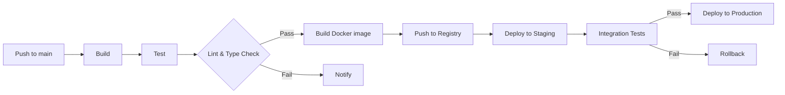
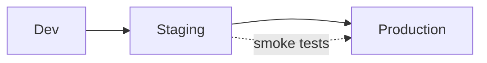
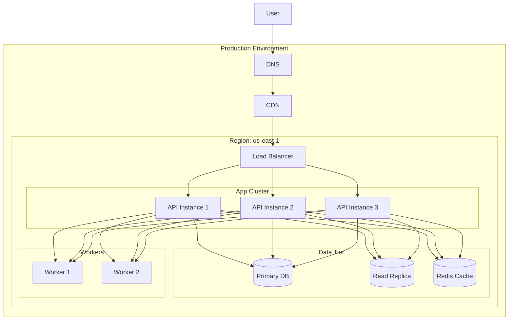

# PROMPT_23 — Phase 22: Deployment Architecture

## PHASE CLASS: Operations & Infrastructure Analysis
## DEPENDENCIES: PROMPT_22 (Authentication) — complete
## OUTPUT DIRECTORY: `re-docs/22-deployment/`

---

## OBJECTIVE

Analyze and document the complete deployment architecture of the system: infrastructure topology, hosting platform, networking configuration, scaling strategy, release process, monitoring, and disaster recovery.

## DETECTION CHECKLIST

- [ ] Dockerfile or docker-compose files exist
- [ ] Kubernetes manifests exist
- [ ] CI/CD pipeline configuration exists
- [ ] Cloud provider configuration exists
- [ ] Infrastructure-as-Code files exist (Terraform, Pulumi, CloudFormation)
- [ ] `.env` or environment-specific config files exist
- [ ] Nginx/Apache/Caddy configuration exists
- [ ] SSL/TLS certificate configuration exists
- [ ] Database connection configuration exists
- [ ] CDN configuration exists
- [ ] Load balancer configuration exists
- [ ] Monitoring/alerting configuration exists
- [ ] Backup configuration exists

## ANALYSIS STEPS

### Step 1: Hosting & Infrastructure Platform

```markdown
## Hosting Platform

### Primary Platform
- Provider: [AWS | Azure | GCP | Vercel | Netlify | Railway | Heroku | Self-hosted | Multi-cloud]
- Account/Organization: [if identifiable]
- Region(s): [us-east-1, eu-west-1, etc.]

### Compute
- Type: [VMs | Containers (K8s/ECS) | Serverless (Lambda/Functions) | Edge (Workers) | PaaS]
- Configuration: `file:line` — [instance type, memory, CPU, scaling limits]
- Auto-scaling: [horizontal | vertical | none] — [min: N, max: N]

### Networking
- VPC/Network config: `file:line`
- Subnets: [public: N, private: N]
- Load balancer: [ALB | Nginx | Cloudflare | none]
  - Config: `file:line`
  - SSL termination: `file:line`
  - Health check: `file:line`
- DNS: [Route53 | Cloudflare | custom]
  - Config: `file:line`
  - Records: [A, CNAME, TXT, etc.]

### CDN
- Provider: [Cloudflare | CloudFront | Fastly | none]
- Config: `file:line`
- Cached content: [static assets | API responses | full site]
- Cache rules: `file:line`
```

### Step 2: Container Orchestration (if applicable)

```markdown
## Container Orchestration

### Platform
- Type: [Kubernetes | ECS | Docker Swarm | Nomad]
- Config location: `path/to/k8s/` or `path/to/ecs/`

### Kubernetes Resources (if K8s)
| Resource | Name | File | Details |
|----------|------|------|---------|
| Deployment | api-server | `deployment.yaml` | 3 replicas, 2GB RAM |
| Service | api-service | `service.yaml` | ClusterIP, port 3000 |
| Ingress | main-ingress | `ingress.yaml` | TLS, path-based routing |
| ConfigMap | app-config | `configmap.yaml` | 12 keys |
| Secret | db-credentials | `secret.yaml` | 3 keys |
| HPA | api-hpa | `hpa.yaml` | CPU > 70% |

### Service Mesh (if applicable)
- Provider: [Istio | Linkerd | Consul | none]
- Config: `path/to/mesh/`
- Key policies: [mTLS, traffic splitting, circuit breaking]
```

### Step 3: CI/CD Pipeline

```markdown
## CI/CD Pipeline

### Platform
- Provider: [GitHub Actions | GitLab CI | Jenkins | CircleCI | custom]
- Config file: `file:line`

### Pipeline Stages


### Stage Details
| Stage | Trigger | Time | Fail Action |
|-------|---------|------|-------------|
| Build | push | 2m | notify |
| Test | after build | 5m | block + notify |
| Deploy Staging | test pass | 1m | — |
| Deploy Production | manual approval | 2m | rollback |

### Artifacts
- Build output: [Docker image | zip | bundle]
- Registry: [Docker Hub | ECR | GCR | GHCR]
- Version strategy: [semver | commit hash | latest tag]

### Deployment Strategy
- Type: [rolling update | blue/green | canary | recreate]
- Config: `file:line`
- Strategy details:
  - Rolling: maxSurge=25%, maxUnavailable=0
  - Canary: 10% → 50% → 100%, with metrics gate
  - Blue/green: switch via load balancer
```

### Step 4: Environment Topology

```markdown
## Environment Topology

### Environments
| Name | URL | Purpose | Scaling | Deploy Trigger |
|------|-----|---------|---------|----------------|
| Development | dev.example.com | active dev | 1 instance | push to dev |
| Staging | staging.example.com | pre-prod test | 2 instances | push to main |
| Production | example.com | live | auto (3-10) | manual approval |

### Infrastructure Per Environment
| Resource | Dev | Staging | Production |
|----------|-----|---------|------------|
| Database | shared (dev) | separate | separate, multi-AZ |
| Cache | shared | separate | cluster |
| Workers | 1 | 2 | 3-5 |
| Backup | none | daily | hourly + daily |

### Environment Promotion


### Feature Flags in Deployment
- [ ] Flags gating deployment rollout
- [ ] Percentage-based flag rollout
- [ ] Environment-specific flag defaults
```

### Step 5: Database Infrastructure

```markdown
## Database Infrastructure

### Primary Database
- Engine: [PostgreSQL | MySQL | MongoDB | etc.]
- Version: [version]
- Hosting: [self-hosted | RDS | Cloud SQL | MongoDB Atlas]
- Configuration:
  - Instance type: [size]
  - Storage: [SSD: N GB, auto-scaling: yes/no]
  - Multi-AZ: [yes | no]
  - Read replicas: [N]
  - Connection pooling: [PgBouncer | built-in | none]
  - Config: `file:line`

### Backup Strategy
- Schedule: [hourly | daily | weekly]
- Retention: [7 days | 30 days | 90 days]
- Type: [full | incremental | WAL archiving]
- Location: [S3 | GCS | separate region]
- Restore tested: [yes | no | unknown]

### Migration Process
- Tool: [Prisma | Sequelize | Flyway | Alembic | custom]
- Config: `file:line`
- Strategy: [downtime | zero-downtime (expand/migrate/contract)]
- Rollback: [migration revert | backup restore]
```

### Step 6: Cache Infrastructure

```markdown
## Cache Infrastructure

### Caching Layers
| Layer | Technology | Config Location | Purpose |
|-------|-----------|-----------------|---------|
| Application | In-memory | `file:line` | hot data |
| Distributed | Redis / Memcached | `file:line` | session, API cache |
| CDN | Cloudflare / CloudFront | `file:line` | static assets |
| HTTP | Nginx / browser cache | `file:line` | public responses |

### Redis / Cache Cluster
- Configuration: `file:line`
- Instance type: [size]
- Persistence: [RDB | AOF | none]
- Eviction policy: [allkeys-lru | volatile-ttl | noeviction]
- High availability: [sentinel | cluster | none]
```

### Step 7: Observability Infrastructure

```markdown
## Observability

### Logging
- Provider: [CloudWatch | DataDog | ELK | Loki | custom]
- Config: `file:line`
- Log levels: [error, warn, info, debug]
- Structured logging: [JSON | plain text]
- Retention: [30 days | 90 days]

### Metrics
- Provider: [Prometheus + Grafana | DataDog | CloudWatch | New Relic]
- Config: `file:line`
- Key dashboards: [API health, Database, Queue, Business metrics]
- Alert rules: `file:line`
- PagerDuty/OpsGenie integration: `file:line`

### Tracing
- Provider: [OpenTelemetry | DataDog APM | Jaeger | X-Ray]
- Config: `file:line`
- Sampled rate: [1% | 10% | 100%]
- Key traces: [API requests, async operations, DB queries]

### Uptime Monitoring
- Provider: [Pingdom | Better Uptime | Statuspage | custom]
- Endpoints monitored: [health, critical APIs, public pages]
- Alert channels: [email, Slack, PagerDuty, SMS]
```

### Step 8: Security Infrastructure

```markdown
## Security Infrastructure

### Network Security
- WAF: [Cloudflare | AWS WAF | none]
  - Rules: `file:line` — [rate limiting, SQL injection, XSS]
- DDoS protection: [Cloudflare | AWS Shield | none]
- IP allow/block lists: `file:line`
- VPN: [for admin access | none]

### Secrets Management
- Provider: [AWS Secrets Manager | HashiCorp Vault | Doppler | env files]
- Config: `file:line`
- Rotation policy: [automatic | manual | none]

### SSL/TLS
- Certificate provider: [Let's Encrypt | Cloudflare | AWS ACM]
- Config: `file:line`
- Renewal: [automatic | manual]
- Minimum TLS version: [1.2 | 1.3]

### Compliance
- Standards: [SOC2 | HIPAA | GDPR | PCI-DSS | none]
- Evidence in code: `file:line` — [audit logs, access controls, encryption]
```

### Step 9: Disaster Recovery

```markdown
## Disaster Recovery

### RPO & RTO
- Recovery Point Objective (RPO): [1 hour | 1 day | 1 week]
- Recovery Time Objective (RTO): [5 minutes | 1 hour | 24 hours]

### Backup & Restore
- Database backup: [location, frequency, retention]
- File storage backup: [location, frequency, retention]
- Configuration backup: [IaC — always current | manual]

### DR Plan
- [ ] Multi-region deployment
- [ ] Automated failover
- [ ] Database replicas in standby region
- [ ] DNS failover configured
- [ ] DR tested: [last tested date | never]
```

### Step 10: Deployment Diagram

Generate a complete deployment architecture diagram:



## OUTPUT SPECIFICATION

### File 1: `01-hosting-infrastructure.md`
Hosting platform, compute, and networking.

### File 2: `02-container-orchestration.md`
Kubernetes/ECS resources and configuration.

### File 3: `03-cicd-pipeline.md`
CI/CD pipeline stages, deployment strategy, artifacts.

### File 4: `04-environments.md`
Environment topology and promotion strategy.

### File 5: `05-database-infrastructure.md`
Database hosting, backup, and migration.

### File 6: `06-cache-infrastructure.md`
Cache layers and configuration.

### File 7: `07-observability.md`
Logging, metrics, tracing, and monitoring.

### File 8: `08-security-infrastructure.md`
Network security, secrets, SSL/TLS, compliance.

### File 9: `09-disaster-recovery.md`
DR plan, RPO/RTO, backup strategy.

### File 10: `10-deployment-architecture.md`
Deployment architecture diagram and description.

## DIAGRAMS REQUIRED

1. Deployment architecture diagram (multi-region if applicable)
2. CI/CD pipeline flow diagram
3. Environment promotion diagram
4. Network topology diagram
5. Database replication diagram (if applicable)

## QUALITY STANDARDS

- [ ] Hosting provider and region documented
- [ ] Compute type and scaling configuration documented
- [ ] CI/CD pipeline stages and triggers fully documented
- [ ] All environment-specific configurations documented
- [ ] Database infrastructure (instance, backup, migration) documented
- [ ] Observability stack (logging, metrics, tracing) documented
- [ ] Security measures (WAF, SSL, secrets) documented
- [ ] DR plan and RPO/RTO documented
- [ ] All configuration files referenced with file:line
- [ ] Deployment diagram covers all components
- [ ] Accuracy tiers assigned to all claims
