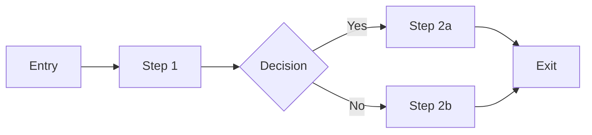
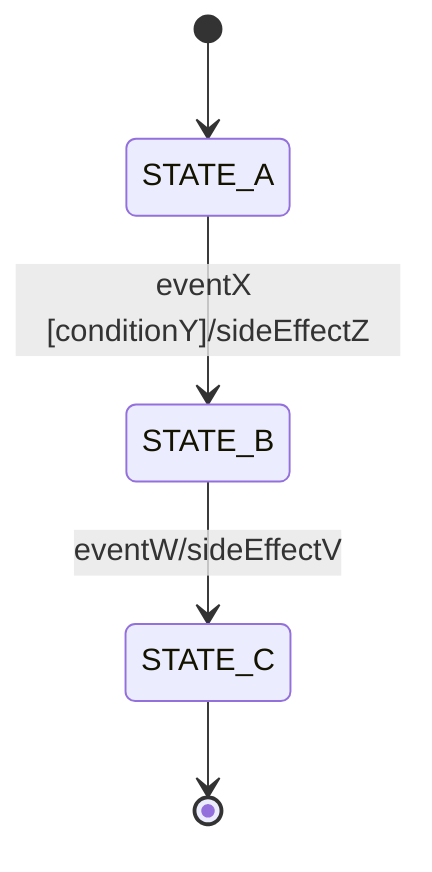

# DOCUMENTATION TEMPLATES

## FRAMEWORK: Enterprise Reverse Engineering Prompt Framework

---

## T1 — FILE HEADER

```markdown
# FILENAME

## FILE: `relative/path/to/file`
## TYPE: [Class | Interface | Config | Utility | Module | etc.]
## DEPENDENCIES: [comma-separated list of files this depends on]
## ACCURACY: [A | B | C | D]

---

## OVERVIEW

[1-3 sentence description of what this file does]

## KEY TYPES

### [TypeName]
**Purpose**: [what this type represents]
**Fields**:
- `field1: Type` — description
- `field2: Type` — description

## KEY FUNCTIONS

### `functionName(param1: Type, param2: Type): ReturnType`
**Purpose**: [what this function does]
**Parameters**:
- `param1`: description
- `param2`: description
**Returns**: description
**Side effects**: [none | modifies X | calls Y]
**Error conditions**: [when does it throw/return error]
```

---

## T2 — MODULE HEADER

```markdown
# MODULE: [Name]

## PATH: `path/to/module/`
## RESPONSIBILITY: [one-sentence description]
## ACCURACY: [A | B | C | D]

---

## PUBLIC INTERFACE

- `exportA` — description
- `exportB` — description

## INTERNAL STRUCTURE

| File | Responsibility | Key Exports |
|------|---------------|-------------|
| `fileA.ts` | description | exportX, exportY |
| `fileB.ts` | description | exportZ |

## DEPENDENCIES (MODULE-LEVEL)

| Module | Dependency Type |
|--------|----------------|
| ModuleA | Strong (must exist) |
| ModuleB | Optional |

## COHESION ASSESSMENT
- Module cohesion: [High | Medium | Low]
- Notes: [observations]
```

---

## T3 — CLASS DOCUMENTATION

```markdown
## CLASS: `ClassName`

### LOCATION: `path/to/file.ts:line`
### EXTENDS: `ParentClass | None`
### IMPLEMENTS: `InterfaceA, InterfaceB | None`
### ACCURACY: A

---

### PURPOSE
[1-2 sentences]

### PROPERTIES

| Property | Type | Visibility | Description |
|----------|------|-----------|-------------|
| `propA` | string | private | description |
| `propB` | TypeB | public | description |

### METHODS

#### `methodA(param1: Type): ReturnType`
- **Purpose**: description
- **Parameters**: param1 — description
- **Returns**: description
- **Complexity**: O(n)
```

---

## T4 — FUNCTION DOCUMENTATION

```markdown
### `functionName(param1: Type, param2: Type): ReturnType`

**Location**: `relative/path.ts:line`
**Accuracy**: A

**Purpose**: [one sentence]

**Parameters**:
| Param | Type | Description |
|-------|------|-------------|
| param1 | string | description |
| param2 | number | description |

**Returns**: [description]

**Complexity**: O(n) time, O(1) space

**Side Effects**: [none / modifies X]

**Error Conditions**: [throws when...]

**Callers**: [list of callers]
```

---

## T5 — EXTERNAL DEPENDENCY

```markdown
### Package: `package-name` (v1.2.3)

**Category**: [Framework | Library | Dev Tool | Runtime]
**Role**: [description of what it provides]
**License**: MIT
**Usage Location**: `src/file.ts:line`
**Criticality**: [High | Medium | Low]

**Notes**:
- Key features used: [feature1, feature2]
- Alternatives: [alternative packages]
```

---

## T6 — ENDPOINT DOCUMENTATION

```markdown
### `GET /api/v1/resource/:id`

**File**: `src/routes/resource.ts:line`
**Accuracy**: A

**Purpose**: [description]

**Authentication**: Required (JWT Bearer)

**Rate Limit**: 100/min

**Request**:
- Path params: `id: string`
- Query params: `?include=related`
- Headers: `Authorization: Bearer <token>`

**Response**: `200 OK`
```json
{
  "id": "string",
  "name": "string",
  "createdAt": "ISO8601"
}
```

**Error Responses**:
- `401 Unauthorized` — missing/invalid token
- `404 Not Found` — resource not found

**Callers**: [list of callers]
```

---

## T7 — DATA FLOW

```markdown
## DATA FLOW: [Flow Name]

**Entry Point**: `file.ts:line` — function/callback
**Exit Point**: `file.ts:line` — function/output
**Accuracy**: A

### Flow Diagram



### Step-by-Step

| Step | File:Line | What Happens | Data | Transformation |
|------|-----------|-------------|------|----------------|
| 1 | `file.ts:10` | description | input format | — |
| 2 | `file.ts:25` | description | intermediate | transformer |
| 3 | `file.ts:40` | description | output format | finalizer |

### State Changes
- Before: [state]
- After: [state]

### Error Paths
- Step 2 failure: [what happens]
- Step 3 failure: [what happens]
```

---

## T8 — ARCHITECTURE COMPONENT

```markdown
## COMPONENT: [Name]

### PATH: `path/to/component/`
### TYPE: [Layer | Service | Module | Integration]
### ACCURACY: A

---

**Responsibility**: [one sentence]

**Key Files**:
- `fileA.ts` — responsibility
- `fileB.ts` — responsibility

**Interfaces**:
- `InterfaceA` — consumed by ComponentX
- `InterfaceB` — provided by ComponentY

**Dependencies**:
- → ComponentX (for feature A)
- → ComponentY (for feature B)

**Used By**:
- ComponentZ calls ComponentA.getData()
```

---

## T9 — ALGORITHM / BUSINESS RULE

```markdown
## ALGORITHM: [Name]

### LOCATIONS: `file.ts:line` (definition), `file.ts:line` (first call)
### ACCURACY: A

---

### Purpose
[one sentence]

### Input
- `param1: Type` — description

### Output
- Description of what's returned

### Logic (Pseudocode)
```
function algorithmName(param1, param2):
    if condition1:
        return resultA
    for each item in param2:
        if item matches pattern:
            accumulate result
    return finalResult
```

### Complexity
- Time: O(n log n)
- Space: O(n)

### Edge Cases
- Empty input: returns default
- Invalid input: throws ErrorType

### Business Rules
- Rule 1: [rule description]
- Rule 2: [rule description]
```

---

## T10 — STATE MACHINE

```markdown
## STATE MACHINE: [Name]

### LOCATION: `path/to/file.ts:line`
### ACCURACY: A

---

### States
- `STATE_A` — description
- `STATE_B` — description
- `STATE_C` — description

### Transitions
| From | To | Trigger | Guard | Action |
|------|----|---------|-------|--------|
| STATE_A | STATE_B | eventX | conditionY | sideEffectZ |
| STATE_B | STATE_C | eventW | — | sideEffectV |

### Diagram



### Error Transitions
| From | To | Trigger | Action |
|------|----|---------|--------|
| STATE_B | ERROR | timeout | rollback |
```

---

## T11 — ERROR HANDLING

```markdown
## ERROR TYPE: [ErrorName]

### LOCATION: `path/to/file.ts:line`
### ACCURACY: A

---

### Definition
```typescript
class ErrorName extends BaseError {
    constructor(message: string, code: number)
}
```

### Thrown By
- `functionX()` — when condition A
- `functionY()` — when condition B

### Handled By
| Handler | Action | Recovery |
|---------|--------|----------|
| `errorHandlerZ()` | logs + returns 500 | retry later |
| `middlewareW()` | formats error response | return to client |

### Retry Strategy
- Retryable? [Yes | No]
- Max retries: 3
- Backoff: exponential (1s, 2s, 4s)
```

---

## T12 — CONFIGURATION VARIABLE

```markdown
## VAR: `VARIABLE_NAME`

**Type**: string
**Required**: Yes | No
**Default**: (none | value)
**Sensitive**: Yes | No

**Description**: [what this variable controls]

**Used In**:
- `src/file.ts:line` (`process.env.VARIABLE_NAME`)

**Valid Values**: [comma-separated or pattern]

**Example**: `VARIABLE_NAME=value`
```

---

## T13 — CROSS-REFERENCE TABLE

```markdown
## CROSS-REFERENCE: [Feature Name]

| Artifact | Location | Phase |
|----------|----------|-------|
| Entry point | `src/api/routes.ts:line` | Phase 00 |
| Class | `src/services/svc.ts:line` | Phase 06 |
| Data flow | `re-docs/08-data-flow/feature-flow.md` | Phase 08 |
| Tests | `tests/feature.test.ts` | Phase 02 |
```

---

## T14 — GAP REPORT

```markdown
## GAP: GAP-[ID]

### Phase: [Phase Number]
### Type: [Missing Information | Incomplete | Ambiguous | Dead Code]
### Severity: [Critical | High | Medium | Low]

---

### Description
[What is missing or unclear]

### Location
[Where in the codebase this gap exists]

### Impact
[What cannot be determined due to this gap]

### Attempted Resolution
- Tool/technique used: [grep, AST analysis, etc.]
- Result: [why resolution failed]

### Status
- **Status**: [Open | Resolved | Mitigated]
- **Resolution**: [if resolved, how]
```

---

## T15 — CHECKS FILE ENTRY

```markdown
### CHK-001: [Check Description]

- **Status**: [PASS | FAIL | WARN | SKIP]
- **Phase**: [Phase Number]
- **Evidence**: `file.ts:line` — description
```

---

## T16 — VIOLATION LOG ENTRY

```markdown
### V-001: [Rule ID] — [Short Description]

- **File**: `path/to/file.ts:line`
- **Rule Violated**: [rule reference]
- **Severity**: [error | warning]
- **Action Required**: [description of what to fix]
```

---

*Use these templates consistently across all 20 phases. Each template has a T-number for cross-referencing.*
