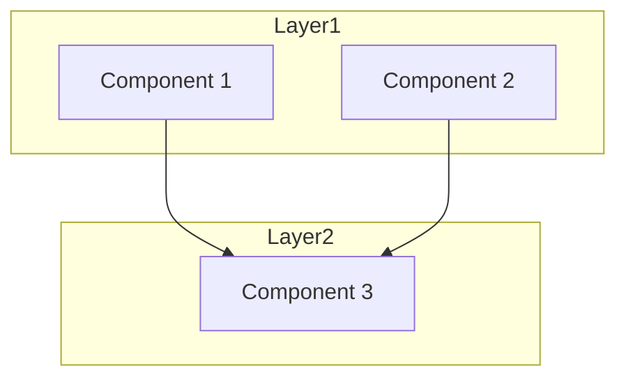
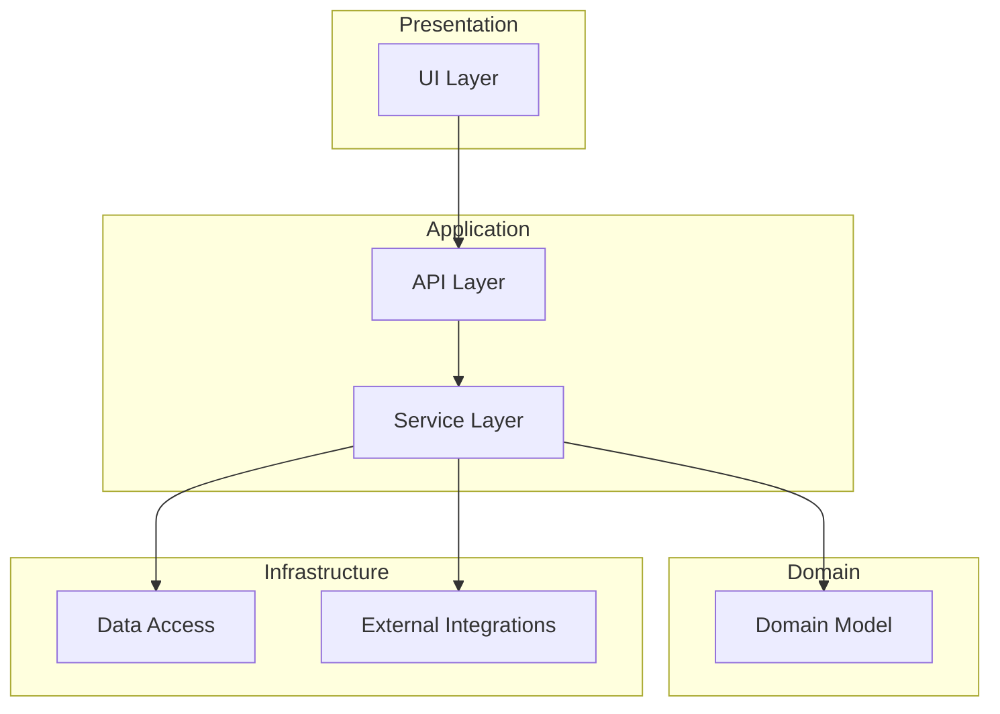
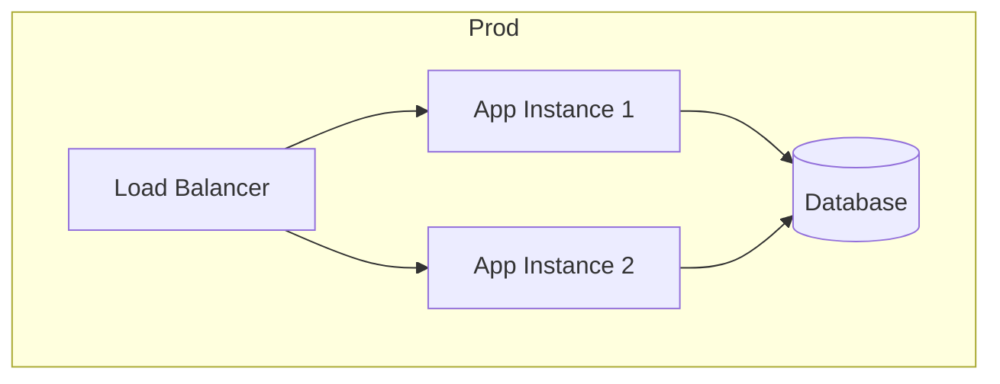

========================================================================
ARCHITECTURE HANDBOOK
========================================================================
Template: Enterprise Reverse Engineering Prompt Framework
This file is a TEMPLATE. The executing AI must populate all sections.

========================================================================
1. SYSTEM OVERVIEW
========================================================================

1.1. Purpose and Capabilities
[Describe the system's primary purpose, what it does, who uses it.]

1.2. Major Subsystems
[List and briefly describe each major subsystem.]

1.3. System Context Diagram
```mermaid
graph LR
    [System] --> [External Entity 1]
    [System] --> [External Entity 2]
    [User] --> [System]
```

========================================================================
2. ARCHITECTURAL STYLE
========================================================================

2.1. Style Determination
[Document the architectural style with evidence from the code.]

2.2. Architectural Constraints
[Document constraints that shaped the architecture.]

2.3. Key Architectural Decisions
[Document significant architectural decisions and trade-offs.]

2.4. Architecture Evaluation
[Assess strengths and weaknesses of the architecture.]

========================================================================
3. COMPONENT ARCHITECTURE
========================================================================

3.1. Component Diagram


3.2. Component Responsibilities
| Component | Responsibility | Dependencies | Location |
|-----------|---------------|--------------|----------|
| Comp1     | [description] | [deps]       | [path]   |

3.3. Component Interaction Patterns
[Document how components communicate, with code evidence.]

========================================================================
4. LAYERED ARCHITECTURE
========================================================================

4.1. Layer Diagram


4.2. Layer Responsibilities
[Document what each layer does and what it contains.]

4.3. Layer Dependency Analysis
[Document whether dependency rules are followed, with violations.]

========================================================================
5. DEPLOYMENT ARCHITECTURE
========================================================================

5.1. Deployment Diagram


5.2. Infrastructure Components
[List all infrastructure components and their configuration.]

5.3. Scaling Strategy
[Document how the system scales, with evidence.]

========================================================================
6. TECHNOLOGY DECISIONS
========================================================================

| Technology | Purpose | Rationale | Alternatives |
|------------|---------|-----------|--------------|
| [lang/fw]  | [why]   | [reason]  | [considered] |

========================================================================
7. ARCHITECTURAL PATTERNS
========================================================================

| Pattern | Location | Purpose | Implementation |
|---------|----------|---------|----------------|
| [name]  | [path]   | [why]   | [how]          |

========================================================================
8. SYSTEM BOUNDARIES
========================================================================

| Boundary | Protocol | Data Format | Auth | Location |
|----------|----------|-------------|------|----------|
| [name]   | [proto]  | [format]    | [auth] | [path]  |

========================================================================
9. ARCHITECTURAL EVOLUTION
========================================================================

9.1. Historical Architecture
[Document what the architecture looked like previously, if evident.]

9.2. Current Architecture
[Document the current state.]

9.3. Future Directions
[Document any planned changes or migration paths.]

========================================================================
END OF ARCHITECTURE HANDBOOK
========================================================================
