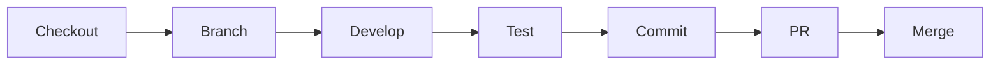
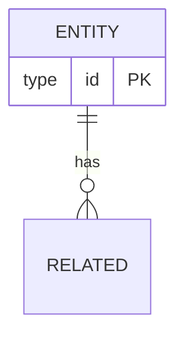

========================================================================
DEVELOPER HANDBOOK
========================================================================
Template: Enterprise Reverse Engineering Prompt Framework
This file is a TEMPLATE. The executing AI must populate all sections.

========================================================================
1. REPOSITORY OVERVIEW
========================================================================

1.1. Repository Structure
```
root/
  src/            - Source code
    main/         - Application code
    test/         - Test code
  config/         - Configuration
  docs/           - Documentation
  scripts/        - Utility scripts
```

1.2. Tech Stack Summary
| Category | Technology | Version | Purpose |
|----------|------------|---------|---------|
| Language | [name]     | [ver]   | [why]   |
| Framework| [name]     | [ver]   | [why]   |

1.3. Development Environment Setup
[Step-by-step setup instructions with code evidence.]

========================================================================
2. CODE ORGANIZATION
========================================================================

2.1. Module Map
| Module | Directory | Responsibility |
|--------|-----------|----------------|
| [name] | [path]    | [description]  |

2.2. File Naming Conventions
[Document conventions with examples from the codebase.]

2.3. Import/Export Patterns
[Document import/export conventions with examples.]

========================================================================
3. CODING CONVENTIONS
========================================================================

3.1. Language Conventions
[Document language-specific conventions found in the code.]

3.2. Framework Conventions
[Document framework-specific conventions.]

3.3. Naming Convention Examples
| Element | Convention | Example |
|---------|------------|---------|
| Classes | [pattern]  | [ex]    |
| Functions| [pattern]  | [ex]    |

========================================================================
4. KEY WORKFLOWS
========================================================================

4.1. Development Workflow


4.2. Testing Workflow
[Document how tests are organized and run.]

4.3. CI/CD Workflow
[Document the CI/CD pipeline with Mermaid diagram.]

4.4. Release Workflow
[Document the release process.]

========================================================================
5. MODULE GUIDE
========================================================================

5.1. [Module Name]
- Purpose: [description]
- Location: [path]
- Key Files:
  - [file]: [purpose]
- Public API:
  - [export]: [description]
- Dependencies:
  - [dep]: [purpose]
- Configuration:
  - [config]: [description]

[Repeat for each module]

========================================================================
6. DATABASE GUIDE
========================================================================

6.1. Schema Overview


6.2. Common Queries
[Document important/canonical queries.]

6.3. Migration Guide
[Document how migrations work.]

========================================================================
7. API REFERENCE
========================================================================

7.1. Endpoint Summary
| Method | Path | Auth | Description |
|--------|------|------|-------------|
| GET    | /api/resource | JWT | [desc] |

7.2. Authentication
[Document how to authenticate.]

7.3. Error Response Format
[Document standard error response format.]

========================================================================
8. TESTING GUIDE
========================================================================

8.1. Test Organization
[Document test directory structure.]

8.2. Running Tests
[Document test commands and configurations.]

8.3. Writing Tests
[Document test patterns and conventions with examples.]

========================================================================
9. TROUBLESHOOTING GUIDE
========================================================================

| Issue | Cause | Solution |
|-------|-------|----------|
| [problem] | [cause] | [solution] |

========================================================================
END OF DEVELOPER HANDBOOK
========================================================================
