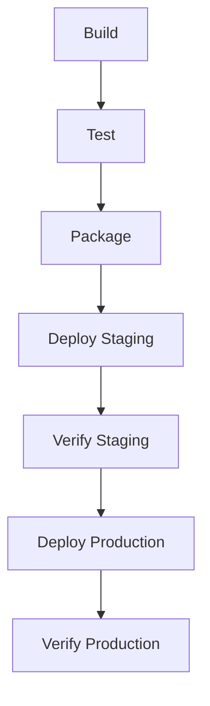

========================================================================
REBUILD GUIDE
========================================================================
Template: Enterprise Reverse Engineering Prompt Framework
This file is a TEMPLATE. The executing AI must populate all sections.

========================================================================
1. PREREQUISITES
========================================================================

1.1. Required Tools
| Tool | Version | Purpose | Installation |
|------|---------|---------|--------------|
| [tool] | [ver] | [purpose] | [instructions] |

1.2. Required Access
[List all accounts, keys, and access needed.]

1.3. Required Knowledge
[List prerequisite knowledge areas.]

========================================================================
2. BUILD PROCESS
========================================================================

2.1. Step-by-Step Build Instructions

Step 1: Clone Repository
```
git clone [url]
cd [repo]
```

Step 2: Install Dependencies
[Document dependency installation commands.]

Step 3: Configure
[Document configuration steps.]

Step 4: Build
[Document build commands.]

Step 5: Verify Build
[Document how to verify the build succeeded.]

2.2. Build Variants
| Variant | Command | Configuration | Purpose |
|---------|---------|---------------|---------|
| Dev     | [cmd]   | [config]      | [why]   |
| Prod    | [cmd]   | [config]      | [why]   |

2.3. Troubleshooting
| Error | Cause | Solution |
|-------|-------|----------|
| [err] | [why] | [fix]    |

========================================================================
3. DATABASE SETUP
========================================================================

3.1. Database Creation
[Document how to create the database.]

3.2. Schema Migration
[Document migration commands and order.]

3.3. Seed Data
[Document seed data setup.]

3.4. Connection Configuration
[Document connection string format and configuration.]

========================================================================
4. DEPLOYMENT PROCESS
========================================================================

4.1. Infrastructure Provisioning
[Document how infrastructure is provisioned.]

4.2. Deployment Steps


4.3. Rollback Procedure
[Document rollback steps.]

4.4. Post-Deployment Verification
[Document verification steps.]

========================================================================
5. INTEGRATION SETUP
========================================================================

5.1. Third-Party Service Configuration
| Service | Configuration Required | Setup Steps |
|---------|----------------------|-------------|
| [svc]   | [config]            | [steps]     |

5.2. API Key Setup
[Document API key generation and configuration.]

5.3. Webhook Configuration
[Document webhook setup.]

========================================================================
6. VERIFICATION PROCESS
========================================================================

6.1. Smoke Tests
[Document smoke test procedures.]

6.2. Health Check Verification
[Document health check endpoints and expected responses.]

6.3. Integration Test Execution
[Document how to run and verify integration tests.]

6.4. Performance Validation
[Document performance test procedures and thresholds.]

========================================================================
7. OPERATIONS GUIDE
========================================================================

7.1. Monitoring Setup
[Document monitoring configuration.]

7.2. Logging Configuration
[Document logging setup and log locations.]

7.3. Alert Configuration
[Document alert rules and notification channels.]

7.4. Backup and Recovery
[Document backup procedures and recovery steps.]

7.5. Scaling Procedures
[Document scaling approach and procedures.]

========================================================================
END OF REBUILD GUIDE
========================================================================
