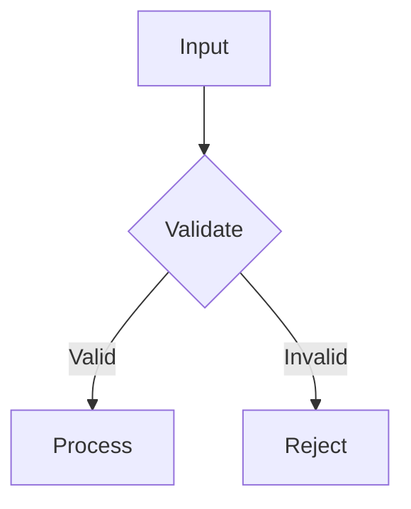

========================================================================
OUTPUT RULES
========================================================================
Enterprise Reverse Engineering Prompt Framework
Version: 3.0

========================================================================
RULE 1: FILE FORMAT
========================================================================

All generated artifacts must be Markdown (.md) files unless
otherwise specified.

Markdown must:
- Use ATX headings (# through ######)
- Use fenced code blocks with language specification
- Use GitHub-flavored Markdown
- Include Mermaid diagrams in fenced mermaid blocks
- Use tables for structured data
- Use lists for enumerations

========================================================================
RULE 2: HEADER FORMAT
========================================================================

Every artifact must begin with a standard header:

```
========================================================================
ARTIFACT TITLE
========================================================================
Enterprise Reverse Engineering Prompt Framework
Generated for: [Repository Path]
Date: [Generation Date]
Phase: [Phase Name]
```

========================================================================
RULE 3: FOOTER FORMAT
========================================================================

Every artifact must end with a standard footer:

```
========================================================================
END OF [ARTIFACT TITLE]
========================================================================
```

========================================================================
RULE 4: CITATION FORMAT
========================================================================

Citations must follow this format:

`[filepath:line]` for specific lines:
  `src/auth/login.ts:45`
  `src/services/user.ts:12-30`

`[filepath]` for entire files:
  `src/config/database.ts`

`[dir/]` for directories:
  `src/api/routes/`

========================================================================
RULE 5: DIAGRAM FORMAT
========================================================================

Mermaid diagrams must:
- Be placed in fenced code blocks with "mermaid" language tag
- Have a descriptive caption preceding the block
- Have a narrative explanation following the block
- Use clear, readable labels
- Avoid excessive width (keep under 100 characters per line)

Example:


========================================================================
RULE 6: CODE SNIPPET FORMAT
========================================================================

Code snippets must:
- Be placed in fenced code blocks with language specification
- Include the file path and line numbers in a comment
- Be relevant and illustrative
- Be truncated to essential lines only

Example:

```typescript
// src/auth/login.ts:45-52
function authenticate(token: string): User | null {
  const decoded = jwt.verify(token, SECRET_KEY);
  return userRepository.findById(decoded.userId);
}
```

========================================================================
RULE 7: TABLE FORMAT
========================================================================

Tables must have:
- Header row with column names
- Separator row (|---|---|---|)
- Alignment specified where needed (:---, :---:, ---:)
- Consistent column widths

========================================================================
RULE 8: CROSS-REFERENCE FORMAT
========================================================================

Cross-references to other artifacts must use:

- `[Architecture Handbook](./HANDBOOK_ARCHITECTURE.md#section-name)`
- `[Developer Handbook §3.2](./HANDBOOK_DEVELOPER.md#32-dependency-injection)`

========================================================================
RULE 9: SECTION NUMBERING
========================================================================

Sections must be numbered for documents with 3+ sections:
1. First Level
   1.1. Second Level
   1.1.1. Third Level

For documents with fewer than 3 sections, numbering is optional.

========================================================================
RULE 10: TERMINOLOGY CONSISTENCY
========================================================================

Define all domain-specific terms on first use:
"The Authenticator module (a service that validates JWT tokens)
processes incoming requests..."

Use the defined term consistently thereafter.
Maintain a glossary if the document uses 10+ domain terms.

========================================================================
RULE 11: TONE
========================================================================

Tone must be:
- Professional but not overly formal
- Technical but not jargon-heavy
- Clear and direct
- Objective and factual

Avoid:
- Marketing language ("revolutionary," "cutting-edge")
- Opinion without evidence ("poorly designed," "elegant")
- Anthropomorphism ("the code wants to," "the system believes")
- Excessive adverbs ("simply," "easily," "just")

========================================================================
RULE 12: FILE NAMING
========================================================================

Generated artifact files must follow these conventions:

- All uppercase with underscores for framework files
  (MASTER_PROMPT.md, OPERATING_RULES.md)

- Descriptive names for analysis artifacts
  (ARCHITECTURE_ANALYSIS.md, DATA_FLOW_DIAGRAMS.md)

- Use underscores, not spaces

- Extension is always .md

========================================================================
RULE 13: DIAGRAM ACCURACY
========================================================================

Diagrams must:
- Accurately represent the actual code structure
- Be validated against the source code
- Include a legend for any non-standard notation
- Be accompanied by a textual description
- Be updated if the code analysis reveals errors

========================================================================
RULE 14: COMPLETENESS MARKER
========================================================================

Use these markers to indicate completeness:

[COMPLETE] - Section is fully analyzed
[PARTIAL]  - Section is partially analyzed, more work needed
[PENDING]  - Section is noted but not yet analyzed
[SCOPE]    - Section is acknowledged but out of scope
[FLAG]     - Section has issues that need human review

========================================================================
END OF OUTPUT RULES
========================================================================
