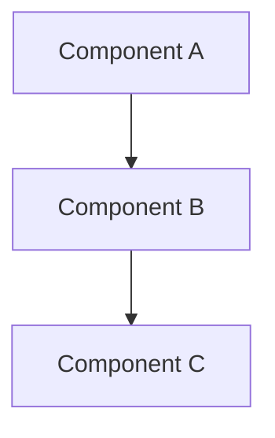
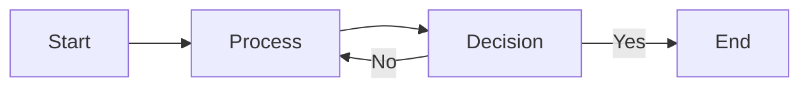
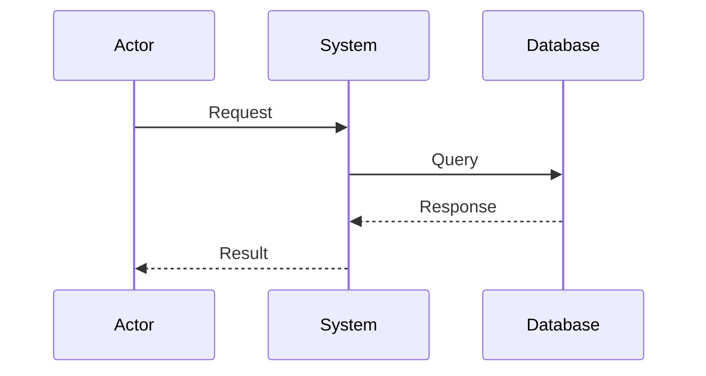
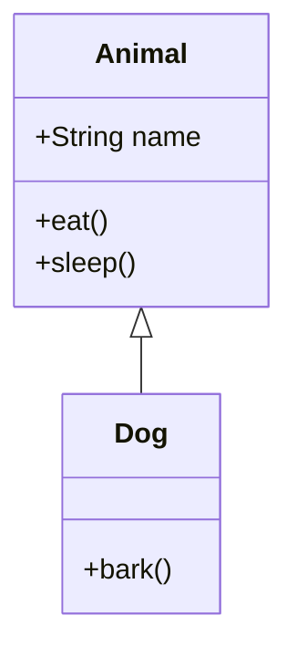
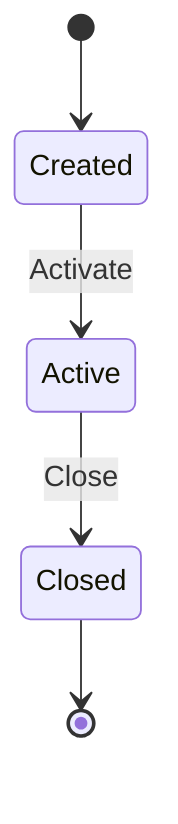
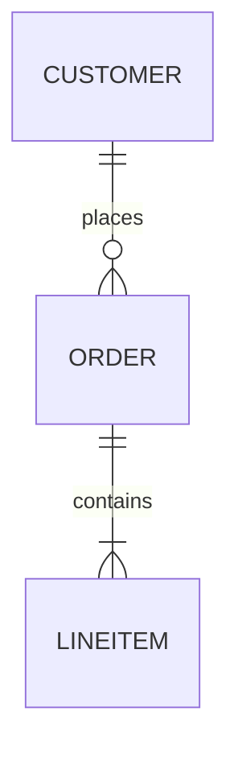

# OUTPUT RULES

## Formatting and Structural Rules for Generated Documentation

---

## 1. DOCUMENT STRUCTURE RULES

### 1.1 Document Header Format

**Every document must begin with:**

```markdown
# [DOCUMENT TITLE]

## Repository: [Repository Name]

**Generated:** YYYY-MM-DD  
**Framework Version:** 1.0.0  
**Document Version:** 1.0  
**Status:** [Draft/Review/Complete]  
**Author:** AI Reverse Engineering Agent  

---

[Table of Contents if document exceeds 200 lines]

---

[Document Content]
```

### 1.2 Section Hierarchy

**Use consistent heading levels:**

```markdown
# H1: Document Title (one per document)

## H2: Major Sections

### H3: Subsections

#### H4: Detailed Sections

##### H5: Minor Details (use sparingly)
```

**Rules:**
- Never skip heading levels
- Each H2 should have at least one H3 (or content)
- Avoid going deeper than H4 unless necessary
- Keep heading text concise and descriptive

### 1.3 Table of Contents

**Generate TOC for documents > 200 lines:**

```markdown
## Table of Contents

1. [Section One](#section-one)
   1.1. [Subsection](#subsection)
2. [Section Two](#section-two)
3. [Section Three](#section-three)
```

---

## 2. FORMATTING RULES

### 2.1 Text Formatting

**Bold:** Use for emphasis and key terms
```markdown
**Important concept** or **key term**
```

**Italic:** Use for definitions and subtle emphasis
```markdown
*term* is defined as...
```

**Code:** Use for code references
```markdown
The `functionName()` function handles...
```

**Rules:**
- Never use bold for entire paragraphs
- Limit bold to 10% of text maximum
- Use code formatting for all code references
- Be consistent in formatting choices

### 2.2 Lists

**Unordered Lists:** Use for non-sequential items
```markdown
- Item one
- Item two
  - Nested item
  - Another nested item
- Item three
```

**Ordered Lists:** Use for sequential items
```markdown
1. First step
2. Second step
3. Third step
```

**Task Lists:** Use for checklists
```markdown
- [ ] Incomplete task
- [x] Complete task
- [ ] Pending task
```

**Rules:**
- Keep list items parallel in structure
- Limit nesting to 3 levels maximum
- Add blank line before and after lists
- Use consistent bullet style throughout

### 2.3 Tables

**Standard Table Format:**

```markdown
| Column 1 | Column 2 | Column 3 |
|----------|----------|----------|
| Value 1  | Value 2  | Value 3  |
| Value 4  | Value 5  | Value 6  |
```

**Tables with Alignment:**

```markdown
| Left Align | Center Align | Right Align |
|:-----------|:------------:|------------:|
| Data       | Data         | Data        |
| Data       | Data         | Data        |
```

**Rules:**
- Always include header row
- Use alignment for readability
- Keep column headers concise
- Break large tables into multiple tables
- Reference tables in surrounding text

### 2.4 Code Blocks

**Inline Code:** For short references
```markdown
Call the `initialize()` method first.
```

**Fenced Code Blocks:** For code examples
````markdown
```typescript
// Language identifier specified
function example(): void {
  console.log("Hello");
}
```
````

**Code Block Rules:**
- Always specify language identifier
- Include comments for clarity
- Keep examples focused and minimal
- Use syntax-appropriate formatting
- Preserve indentation exactly

### 2.5 Blockquotes

**For excerpts and important notes:**

```markdown
> This is an important note about the system behavior.
> It spans multiple lines for emphasis.
>
> Multiple paragraphs within quote.
```

**For code excerpts:**

```markdown
> ```typescript
> // Excerpt from src/example.ts, lines 10-15
> export class Example {
>   private value: string;
> }
> ```
```

---

## 3. DIAGRAM RULES

### 3.1 Mermaid Diagram Format

**All diagrams must use Mermaid syntax:**

```markdown

```

### 3.2 Diagram Types

**Flowchart (graph):**


**Sequence Diagram:**


**Class Diagram:**


**State Diagram:**


**Entity Relationship:**


### 3.3 Diagram Rules

**Required Elements:**
- Descriptive title above diagram
- Mermaid code block with proper syntax
- Brief explanation below diagram
- Legend if using non-standard symbols

**Quality Requirements:**
- All elements must exist in code
- Relationships must be verified
- Labels must match code names
- Diagrams must render correctly

**Placement:**
- Place diagrams near relevant text
- Reference diagrams in text
- Keep diagrams under 30 elements (split if larger)
- Provide alt-text description

---

## 4. REFERENCE RULES

### 4.1 File References

**Format:**
```markdown
File: `path/to/file.ext`
Location: `path/to/file.ext`, lines X-Y
Reference: See `path/to/file.ext` for details
```

**Examples:**
```markdown
✅ The main entry point is `src/main.ts`
✅ Authentication logic is in `src/auth/auth.service.ts`, lines 25-87
✅ For complete implementation, see `src/utils/helpers.ts`
```

**Rules:**
- Use backticks for file paths
- Include line numbers when specific
- Verify all paths exist
- Use relative paths from repo root

### 4.2 Cross-References

**Internal Document References:**
```markdown
As described in [Architecture Overview](#architecture-overview)...
See [Component Diagram](#component-diagram) for visualization.
Refer to Section [Dependency Analysis](#dependency-analysis).
```

**External Document References:**
```markdown
See [ARCHITECTURE.md](./ARCHITECTURE.md) for system architecture.
Details in [DEPENDENCIES.md](./DEPENDENCIES.md), Section 2.1.
Related: [CODEBASE.md](./CODEBASE.md#file-organization)
```

**Rules:**
- Use descriptive link text
- Verify all links resolve
- Use consistent reference format
- Include section anchors when specific

### 4.3 Evidence Citations

**Standard Citation Format:**
```markdown
**Claim:** The system uses dependency injection.

**Evidence:** 
- `src/app.module.ts`, line 15: `@Module({ providers: [...] })`
- `src/services/user.service.ts`, line 8: `constructor(private repo: UserRepo)`
- `src/main.ts`, line 22: Container initialization

**Confidence:** Certain
```

---

## 5. NAMING CONVENTIONS

### 5.1 Document Names

**Framework Documents:** UPPER_CASE.md
```
MISSION.md
OPERATING_RULES.md
QUALITY_STANDARDS.md
```

**Output Documents:** PascalCase.md
```
Architecture.md
Codebase.md
Dependencies.md
DataFlow.md
```

**Prompt Documents:** PROMPT_XX_DESCRIPTION.md
```
PROMPT_01_REPOSITORY_DISCOVERY.md
PROMPT_02_TECH_STACK_ANALYSIS.md
```

### 5.2 Section Names

**Use descriptive, consistent names:**

```markdown
✅ ## Architecture Overview
✅ ## Component Architecture
✅ ## Data Flow Analysis

❌ ## Stuff About Architecture
❌ ## Things We Found
❌ ## Random Notes
```

### 5.3 Terminology Consistency

**Maintain glossary:**
- Define each term once
- Use same term consistently
- Note synonyms when they exist
- Create terminology index

---

## 6. VERSION CONTROL RULES

### 6.1 Version Headers

**Every document includes:**

```markdown
**Document Version:** 1.0  
**Last Updated:** YYYY-MM-DD  
**Change Summary:** Initial generation  
```

### 6.2 Revision History

**For documents with multiple revisions:**

```markdown
## Revision History

| Version | Date | Author | Changes |
|---------|------|--------|---------|
| 1.0 | 2024-01-15 | AI Agent | Initial generation |
| 1.1 | 2024-01-16 | AI Agent | Added missing components |
| 2.0 | 2024-01-17 | AI Agent | Major revision based on review |
```

### 6.3 Change Markers

**Mark changed sections:**

```markdown
<!-- CHANGE: v2.0 - Added new component analysis -->
### New Component: PaymentProcessor
<!-- END CHANGE -->
```

---

## 7. COMPLETENESS MARKERS

### 7.1 Status Indicators

**Use badges/indicators:**

```markdown
**Status:** ✅ Complete  
**Status:** ⚠️ Partial  
**Status:** ❌ Not Analyzed  
**Status:** 🔄 In Progress  
**Status:** ❓ Uncertain  
```

### 7.2 Section Markers

**Mark section status:**

```markdown
### Component Analysis [COMPLETE]
Content here...

### Edge Cases [PARTIAL]
Partial content with gaps noted...
<!-- GAP: Error handling for network timeouts not found in code -->

### Performance [PENDING]
Analysis pending...
```

### 7.3 Gap Documentation

**Explicitly document gaps:**

```markdown
> **GAP IDENTIFIED**
> 
> **What:** Unable to determine caching strategy
> **Why:** No cache configuration files found
> **Impact:** Cannot document caching behavior
> **Verification Needed:** Check runtime configuration
```

---

## 8. ACCESSIBILITY RULES

### 8.1 Readability

**Ensure accessibility:**

- Use sufficient contrast (in any generated images)
- Provide text alternatives for diagrams
- Use clear, simple language
- Define technical terms
- Include examples

### 8.2 Navigation

**Enable easy navigation:**

- Include table of contents
- Use descriptive headings
- Provide cross-references
- Include summary sections
- Add indexes for large documents

### 8.3 Searchability

**Make content searchable:**

- Use consistent terminology
- Include keyword-rich headings
- Add metadata where applicable
- Create comprehensive indexes

---

## 9. EXPORT FORMATS

### 9.1 Markdown (Primary)

**Optimize for Markdown:**

- Use standard Markdown syntax
- Ensure GitHub compatibility
- Test Mermaid diagram rendering
- Validate internal links

### 9.2 HTML (Derived)

**When converting to HTML:**

- Preserve heading hierarchy
- Maintain link integrity
- Render diagrams as SVG
- Include CSS for readability

### 9.3 PDF (Derived)

**When converting to PDF:**

- Ensure page breaks are logical
- Include page numbers
- Generate bookmarks from headings
- Test print quality

---

## 10. FINAL CHECKLIST

**Before finalizing any document:**

### Structure
- [ ] Document header present
- [ ] Heading hierarchy correct
- [ ] Table of contents included (if needed)
- [ ] All sections properly organized

### Formatting
- [ ] Text formatting consistent
- [ ] Lists properly formatted
- [ ] Tables readable
- [ ] Code blocks correct

### Diagrams
- [ ] All diagrams render
- [ ] Diagrams accurately represent code
- [ ] Diagrams have titles and explanations
- [ ] Mermaid syntax valid

### References
- [ ] All file references valid
- [ ] All cross-references work
- [ ] All evidence properly cited
- [ ] No broken links

### Completeness
- [ ] All required sections present
- [ ] Status markers accurate
- [ ] Gaps documented
- [ ] Nothing marked TODO without reason

### Quality
- [ ] Writing is clear
- [ ] Terminology consistent
- [ ] No typos or errors
- [ ] Professional tone maintained

---

*These output rules define the formatting and structural requirements for all generated documentation. All outputs must comply with these rules.*
