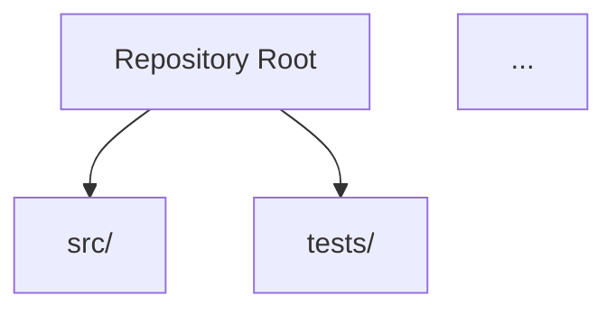

# PROMPT 01: REPOSITORY DISCOVERY

## Context Setting

You are beginning the reverse engineering process. No previous analysis has been completed.

This is the foundation prompt that establishes complete awareness of the repository contents.

All subsequent prompts will depend on the inventory and understanding you establish here.

---

## Objective

Create a complete inventory and structural map of the entire repository, identifying every file, folder, and configuration element with initial classification and responsibility assessment.

---

## Scope

**INCLUDED:**
- All source code files
- All configuration files
- All documentation files
- All build/deployment files
- All test files
- All asset files relevant to application

**EXCLUDED:**
- Binary files (unless critical like compiled configs)
- Generated files (with note about their existence)
- Dependencies in node_modules, vendor, etc. (document via package manifests)
- Git internals (.git directory)

---

## Instructions

### Step 1: Complete Repository Scan

Scan the entire repository and create a comprehensive file inventory.

For each file discovered, record:
- Full path from repository root
- File type/extension
- File size category (small <1KB, medium 1-10KB, large >10KB)
- Primary language (if code)
- Initial purpose assessment

### Step 2: Directory Structure Mapping

Map the complete directory hierarchy showing:
- All directories and subdirectories
- Directory naming patterns
- Organizational logic (by feature, by layer, by type)
- Special directories (tests, configs, assets)

### Step 3: File Classification

Classify each file into categories:

**Primary Categories:**
- Source Code
- Configuration
- Documentation
- Tests
- Build/Deploy
- Assets
- Other

**Secondary Categories (for Source Code):**
- Entry Point
- Module/Library
- Component
- Service
- Utility/Helper
- Type Definition
- Interface
- Model/Entity
- Controller/Handler
- Middleware

### Step 4: Initial Complexity Assessment

For each file, assess:
- Lines of code (approximate)
- Number of imports
- Number of exports
- Cyclomatic complexity indicators (many conditionals, nested logic)
- Dependencies on other files

### Step 5: Key File Identification

Identify and flag:
- Entry points (main, index, app files)
- Configuration files (all types)
- Package/dependency manifests
- Build configuration files
- Test configuration files
- Environment files
- Route/API definitions
- Database schemas/migrations

---

## Required Analysis

You MUST analyze and document:

### Repository Metadata
```
- Repository Name: [Name]
- Total Files: [Count]
- Total Directories: [Count]
- Primary Languages: [List]
- Repository Type: [Web/Mobile/Library/CLI/etc.]
- Estimated Size Category: [Small/Medium/Large/Enterprise]
```

### Complete File Inventory
Create a table with ALL files:

| Path | Type | Category | Size | Language | Purpose |
|------|------|----------|------|----------|---------|
| src/index.ts | .ts | Source | Medium | TypeScript | Entry point |
| src/app.ts | .ts | Source | Large | TypeScript | App initialization |
| ... | ... | ... | ... | ... | ... |

### Directory Tree
Generate complete tree structure:

```
repository-root/
├── src/
│   ├── controllers/
│   ├── services/
│   └── utils/
├── tests/
├── config/
├── docs/
└── package.json
```

### File Statistics
```
By Type:
- TypeScript: XX files
- JavaScript: XX files
- JSON: XX files
- Markdown: XX files
- etc.

By Category:
- Source Code: XX files
- Configuration: XX files
- Tests: XX files
- Documentation: XX files

By Size:
- Small (<1KB): XX files
- Medium (1-10KB): XX files
- Large (>10KB): XX files
```

### Key Files Inventory
Document all critical files:

| File | Purpose | Criticality |
|------|---------|-------------|
| src/main.ts | Application entry point | CRITICAL |
| package.json | Dependency manifest | CRITICAL |
| tsconfig.json | TypeScript configuration | HIGH |
| ... | ... | ... |

### Initial Observations
Document any notable patterns:
- Naming conventions observed
- Organizational patterns
- Architecture hints from structure
- Technology indicators
- Potential concerns or anomalies

---

## Required Outputs

1. **Repository Metadata Summary** - Key statistics about the repository

2. **Complete File Inventory Table** - Every file with classification

3. **Directory Tree Diagram** - Visual representation using Mermaid or text tree

4. **File Classification Summary** - Breakdown by category and type

5. **Key Files List** - Critical files with purposes

6. **Initial Observations** - Patterns, conventions, and notable findings

7. **Evidence References** - File paths confirming your analysis

---

## Output Format

Structure your response as follows:

### 1. Repository Metadata

[Summary statistics]

### 2. Complete File Inventory

| Path | Type | Category | Size | Language | Purpose |
|------|------|----------|------|----------|---------|
| ... | ... | ... | ... | ... | ... |

### 3. Directory Structure



Or use text tree format for complex structures.

### 4. File Classification Summary

**By Type:**
- [Type]: [Count] files
- ...

**By Category:**
- [Category]: [Count] files
- ...

### 5. Key Files

| File | Purpose | Criticality | Evidence |
|------|---------|-------------|----------|
| ... | ... | ... | ... |

### 6. Initial Observations

**Naming Conventions:**
[Observed patterns]

**Organizational Patterns:**
[How code is organized]

**Architecture Hints:**
[What structure suggests about architecture]

**Technology Indicators:**
[Technologies evident from file structure]

**Notable Findings:**
[Any unusual or interesting observations]

### 7. Evidence References

- File: [path], Line: [X] - [What this confirms]
- ...

---

## Quality Criteria

Your output is acceptable only if:

- [ ] Every file in repository is accounted for
- [ ] All file paths are accurate and verifiable
- [ ] Directory tree accurately represents structure
- [ ] Classifications are consistent and logical
- [ ] Key files are correctly identified
- [ ] Statistics match actual counts
- [ ] Observations are evidence-based

---

## Evidence Requirements

For each claim, provide:

**File Existence:**
```
CLAIM: File exists at src/main.ts
EVIDENCE: Verified during repository scan
```

**File Purpose:**
```
CLAIM: src/main.ts is the entry point
EVIDENCE: Contains main() function / module.exports / export default
LOCATION: src/main.ts, lines 1-10
```

**Classification:**
```
CLAIM: src/utils/ contains helper functions
EVIDENCE: All files export utility functions
LOCATION: src/utils/*.ts (multiple files)
```

---

## Common Pitfalls

**AVOID:**
❌ Missing hidden files (.eslintrc, .prettierrc, etc.)
❌ Overlooking configuration in non-standard locations
❌ Assuming file purpose from name alone
❌ Missing entry points in unexpected locations
❌ Forgetting about monorepo structures
❌ Ignoring generated vs. source distinction

**INSTEAD:**
✅ Scan recursively including hidden files
✅ Check all directories for configs
✅ Verify purpose by reading file content
✅ Search for common entry point patterns
✅ Check for workspace/package configurations
✅ Note which files are generated

---

## Continuation Guidance

If the repository is too large for one response:

**Part 1:** Repository metadata + File inventory (first 50 files)
**Part 2:** File inventory (continued) + Directory structure
**Part 3:** File classification + Key files
**Part 4:** Statistics + Observations

Mark continuation points clearly:
```
[CONTINUES IN NEXT RESPONSE - File inventory continued]
```

Priority order if truncation unavoidable:
1. Complete file inventory (can be condensed)
2. Directory structure
3. Key files identification
4. Statistics and observations

---

## Self-Validation Checklist

Before submitting your response, verify:

**CONTENT:**
- [ ] Repository metadata complete
- [ ] All files listed in inventory
- [ ] Directory tree accurate
- [ ] Classification summary included
- [ ] Key files identified
- [ ] Observations documented

**ACCURACY:**
- [ ] All file paths exist in repository
- [ ] File counts are accurate
- [ ] Classifications match file contents
- [ ] Key file purposes verified

**EVIDENCE:**
- [ ] Claims supported by file references
- [ ] Purposes verified against content
- [ ] Observations based on patterns found

**QUALITY:**
- [ ] Tables are properly formatted
- [ ] Tree structure is readable
- [ ] Writing is clear and precise
- [ ] Terminology is consistent

**COMPLETENESS:**
- [ ] Nothing marked TODO remains
- [ ] All sections are populated
- [ ] Ready to proceed to PROMPT_02

---

*Execute this prompt completely before proceeding to PROMPT_02. The file inventory you create here will be used throughout all subsequent analysis.*
