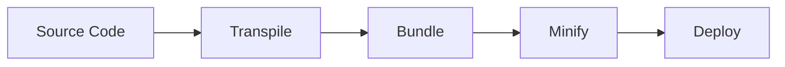
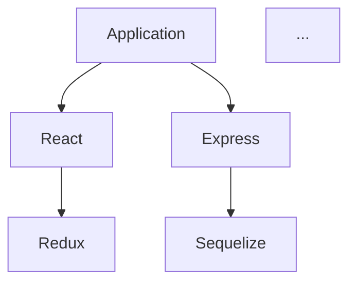

# PROMPT 02: TECHNOLOGY STACK ANALYSIS

## Context Setting

You have completed PROMPT_01: Repository Discovery.

You now have a complete file inventory and directory structure map.

This prompt builds upon that foundation to identify and analyze the complete technology stack.

---

## Objective

Identify, catalog, and analyze every technology, framework, library, and tool used in the repository with version information, purpose, and usage patterns.

---

## Scope

**INCLUDED:**
- Programming languages
- Frameworks and libraries
- Build tools and bundlers
- Package managers
- Testing frameworks
- Linting/formatting tools
- DevOps tools
- Database technologies
- API technologies
- Authentication/authorization tools
- Any other development or runtime dependencies

**EXCLUDED:**
- Transitive dependencies not directly used (document via package manifests)
- Development environment specifics not reflected in code

---

## Instructions

### Step 1: Package Manifest Analysis

Locate and analyze ALL package/dependency manifest files:

**Common Manifest Files:**
- `package.json` (Node.js)
- `requirements.txt`, `Pipfile`, `pyproject.toml` (Python)
- `pom.xml`, `build.gradle` (Java)
- `Cargo.toml` (Rust)
- `go.mod` (Go)
- `Gemfile` (Ruby)
- `composer.json` (PHP)
- `*.csproj`, `*.sln` (.NET)
- `pubspec.yaml` (Flutter/Dart)

For each manifest:
- Extract all dependencies
- Record exact versions
- Identify dependency type (runtime, dev, peer, optional)
- Note version constraints

### Step 2: Configuration File Analysis

Analyze configuration files for technology indicators:

**Build Configurations:**
- webpack.config.js, vite.config.ts, rollup.config.js
- tsconfig.json, jsconfig.json
- babel.config.js, .babelrc
- eslint config files, .prettierrc

**Runtime Configurations:**
- Database configs
- Server configs
- Environment templates

### Step 3: Import/Include Analysis

Scan source files for import patterns:

- External package imports
- Framework-specific imports
- Library usage patterns
- Plugin/extensions used

### Step 4: Code Pattern Recognition

Identify technologies from code patterns:

- Framework-specific decorators/annotations
- DSL usage
- Framework lifecycle methods
- Framework-specific APIs

### Step 5: Tool Detection

Identify development and operational tools:

- CI/CD configurations (.github/workflows, .gitlab-ci.yml)
- Docker files (Dockerfile, docker-compose.yml)
- IDE configurations (.vscode/, .idea/)
- Documentation tools (Docusaurus, MkDocs configs)

---

## Required Analysis

### Technology Inventory

Create comprehensive table of ALL technologies:

| Technology | Category | Version | Purpose | Usage Location | Criticality |
|------------|----------|---------|---------|----------------|-------------|
| React | Frontend Framework | 18.2.0 | UI rendering | src/components/* | CRITICAL |
| Express | Backend Framework | 4.18.0 | HTTP server | src/server.ts | CRITICAL |
| TypeScript | Language | 5.0.0 | Type safety | Entire codebase | CRITICAL |
| ... | ... | ... | ... | ... | ... |

### Category Breakdown

**Programming Languages:**
- Primary language(s)
- Version(s)
- Language-specific features used

**Frameworks:**
- Frontend frameworks
- Backend frameworks
- Testing frameworks
- Other frameworks

**Libraries:**
- By category (state management, routing, HTTP, utilities, etc.)
- Version information
- Purpose

**Build Tools:**
- Bundlers
- Transpilers
- Task runners
- Package managers

**Development Tools:**
- Linters
- Formatters
- Type checkers
- Test runners

**Infrastructure:**
- Container technologies
- Orchestration
- Cloud services
- Monitoring

### Dependency Analysis

**Direct Dependencies:**
- List with versions
- Categorize by purpose
- Identify critical vs. optional

**Dev Dependencies:**
- Testing tools
- Build tools
- Development utilities

**Peer Dependencies:**
- Required peer packages
- Version compatibility

### Version Compatibility

Check for:
- Outdated packages
- Version conflicts
- Deprecated technologies
- Security advisories (if known)

### Technology Relationships

Map how technologies work together:
- Which framework uses which libraries
- Build pipeline flow
- Runtime dependency chain

---

## Required Outputs

1. **Technology Stack Summary** - High-level overview

2. **Complete Technology Inventory Table** - All technologies with details

3. **Category Breakdown** - Organized by technology type

4. **Dependency Analysis** - Direct, dev, and peer dependencies

5. **Build Pipeline** - How code goes from source to production

6. **Version Report** - All versions with compatibility notes

7. **Technology Relationship Diagram** - Mermaid diagram showing tech stack

8. **Evidence References** - Manifest files and import statements

---

## Output Format

Structure your response as follows:

### 1. Technology Stack Summary

[High-level summary of primary technologies]

### 2. Complete Technology Inventory

| Technology | Category | Version | Purpose | Usage Location | Criticality |
|------------|----------|---------|---------|----------------|-------------|
| ... | ... | ... | ... | ... | ... |

### 3. Category Breakdown

#### Programming Languages
- [Language] v[version] - [Purpose]

#### Frameworks
- [Framework] v[version] - [Purpose]

#### Libraries
- [Library] v[version] - [Purpose]

#### Build Tools
- [Tool] v[version] - [Purpose]

#### Development Tools
- [Tool] v[version] - [Purpose]

### 4. Dependency Analysis

**Direct Dependencies:** [Count] packages
[List key dependencies]

**Dev Dependencies:** [Count] packages
[List key dev dependencies]

**Notable Dependencies:**
[Any particularly important or interesting dependencies]

### 5. Build Pipeline



### 6. Version Report

**Current Versions:**
- [Technology]: [version]

**Outdated (if known):**
- [Technology]: [current] → [latest]

**Compatibility Notes:**
[Any version compatibility concerns]

### 7. Technology Relationship Diagram



### 8. Evidence References

- File: `package.json`, lines X-Y - [Dependencies listed]
- File: `src/main.ts`, line X - `import { something } from 'package'`
- ...

---

## Quality Criteria

Your output is acceptable only if:

- [ ] All manifest files analyzed
- [ ] All direct dependencies listed
- [ ] Versions accurately recorded
- [ ] Purpose documented for each technology
- [ ] Usage locations identified
- [ ] Technology relationships clear
- [ ] Build pipeline understood

---

## Evidence Requirements

For each technology claim:

```
CLAIM: React 18.2.0 is used
EVIDENCE_TYPE: Package manifest + Import statement
LOCATION: package.json, line 15; src/App.tsx, line 1
EXCERPT: "react": "^18.2.0"
         import React from 'react';
CONFIDENCE: Certain
```

---

## Common Pitfalls

**AVOID:**
❌ Only looking at package.json without checking imports
❌ Missing workspace/monorepo dependencies
❌ Confusing dev dependencies with runtime dependencies
❌ Not identifying framework-specific plugins
❌ Overlooking implicit dependencies
❌ Missing global tools referenced in scripts

**INSTEAD:**
✅ Cross-reference manifests with actual imports
✅ Check for workspace configurations
✅ Verify which dependencies are actually used
✅ Identify framework extensions and plugins
✅ Look for dynamically loaded modules
✅ Check npm scripts for tool references

---

## Continuation Guidance

If analysis exceeds response limits:

**Part 1:** Package manifest analysis + Core technologies
**Part 2:** Framework and library analysis
**Part 3:** Build tools + Dev tools
**Part 4:** Infrastructure + Relationship diagram

Priority order:
1. Core runtime dependencies
2. Framework identification
3. Build toolchain
4. Development tools

---

## Self-Validation Checklist

**CONTENT:**
- [ ] All manifest files analyzed
- [ ] All technologies catalogued
- [ ] Versions recorded
- [ ] Categories assigned
- [ ] Relationships mapped

**ACCURACY:**
- [ ] Versions match manifest files
- [ ] Technologies actually used in code
- [ ] Purposes correctly identified
- [ ] No false positives

**EVIDENCE:**
- [ ] Each technology has evidence
- [ ] Import statements verified
- [ ] Manifest excerpts provided
- [ ] Confidence levels appropriate

**QUALITY:**
- [ ] Tables properly formatted
- [ ] Diagram renders correctly
- [ ] Writing is clear
- [ ] Terminology consistent

---

*Execute this prompt completely before proceeding to PROMPT_03. The technology stack understanding is essential for architecture analysis.*
