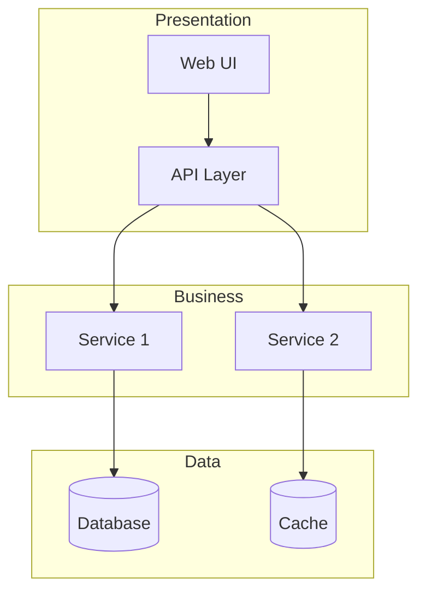

# PROMPT 03: ARCHITECTURE EXTRACTION

## Context Setting

You have completed:
- PROMPT_01: Repository Discovery (file inventory)
- PROMPT_02: Technology Stack Analysis (technology identification)

You now understand what files exist and what technologies are used.

This prompt extracts the system architecture from the codebase.

---

## Objective

Extract and document the complete system architecture, including architectural patterns, component organization, high-level design decisions, and structural relationships.

---

## Scope

**INCLUDED:**
- System-level architecture pattern
- Component architecture and boundaries
- Module organization
- Layer identification
- Architectural decision records
- Design patterns in use
- Communication mechanisms
- External system integrations

**EXCLUDED:**
- Detailed implementation logic (covered in later prompts)
- Individual function documentation
- Algorithm details

---

## Instructions

### Step 1: Entry Point Analysis

Identify all application entry points:
- Main execution entry (main.ts, index.js, app.py, etc.)
- HTTP server entry points
- CLI entry points
- Background job entry points
- Event handler registrations

### Step 2: Architecture Pattern Identification

Determine the primary architecture pattern(s):

**Common Patterns:**
- Monolithic
- Microservices
- Layered (n-tier)
- Hexagonal/Ports & Adapters
- Clean Architecture
- MVC/MVVM/MVP
- Event-driven
- Serverless
- Microkernel

Look for evidence in:
- Directory structure
- Import patterns
- Dependency directions
- Configuration files

### Step 3: Component Discovery

Identify major components by analyzing:
- Module boundaries (directories, packages)
- Cohesion of code within boundaries
- Coupling between boundaries
- Responsibility separation

### Step 4: Layer Identification

Map architectural layers:
- Presentation/UI layer
- Application/Business logic layer
- Domain layer
- Infrastructure/Data layer
- Cross-cutting concerns

### Step 5: Communication Analysis

Document how components communicate:
- Direct method calls
- Events/messages
- HTTP/RPC
- Shared state
- Database-mediated

### Step 6: External Integration Mapping

Identify external systems:
- APIs consumed
- APIs exposed
- Databases
- Message queues
- Third-party services

---

## Required Outputs

1. **Architecture Overview** - Executive summary of architecture

2. **Architecture Pattern Analysis** - Identified patterns with evidence

3. **Component Diagram** - Mermaid diagram of components

4. **Component Responsibility Matrix** - Table of components and purposes

5. **Layer Architecture** - Layer breakdown and responsibilities

6. **Communication Patterns** - How components interact

7. **External Systems Map** - Integrations with external systems

8. **Architectural Decisions Log** - Key decisions with rationale

9. **Evidence References** - Code evidence for architectural claims

---

## Output Format

Structure your response as follows:

### 1. Architecture Overview

[2-3 paragraph executive summary of the system architecture]

### 2. Architecture Pattern Analysis

**Primary Pattern:** [Pattern name]

**Evidence:**
- [Evidence 1 with file reference]
- [Evidence 2 with file reference]

**Secondary Patterns:**
- [Pattern] - [Where observed]

**Pattern Assessment:**
[How well the pattern is implemented]

### 3. Component Diagram



### 4. Component Responsibility Matrix

| Component | Responsibility | Files | Dependencies | Criticality |
|-----------|---------------|-------|--------------|-------------|
| AuthModule | Authentication | src/auth/* | UserService, TokenService | CRITICAL |
| ... | ... | ... | ... | ... |

### 5. Layer Architecture

#### Presentation Layer
**Responsibility:** [What this layer does]
**Components:** [List]
**Technologies:** [List]

#### Business Logic Layer
**Responsibility:** [What this layer does]
**Components:** [List]
**Technologies:** [List]

#### Data Layer
**Responsibility:** [What this layer does]
**Components:** [List]
**Technologies:** [List]

### 6. Communication Patterns

**Synchronous Communication:**
- [Pattern] used for [purpose]

**Asynchronous Communication:**
- [Pattern] used for [purpose]

**Event Handling:**
- [How events are handled]

### 7. External Systems Map

| External System | Type | Purpose | Integration Method |
|-----------------|------|---------|-------------------|
| PostgreSQL | Database | Primary data store | ORM (Sequelize) |
| Stripe | Payment API | Payment processing | REST API |
| ... | ... | ... | ... |

### 8. Architectural Decisions Log

| Decision | Evidence | Rationale | Alternatives Considered |
|----------|----------|-----------|------------------------|
| Use TypeScript | tsconfig.json, widespread TS usage | Type safety, maintainability | JavaScript with JSDoc |
| ... | ... | ... | ... |

### 9. Evidence References

- File: `src/main.ts`, lines X-Y - [Entry point evidence]
- File: `src/` directory structure - [Component boundaries]
- ...

---

## Quality Criteria

Your output is acceptable only if:

- [ ] Architecture pattern correctly identified
- [ ] All major components documented
- [ ] Component diagram accurately represents code
- [ ] Layer boundaries are clear
- [ ] Communication patterns evidenced
- [ ] External systems catalogued
- [ ] Architectural decisions have rationale

---

## Evidence Requirements

For each architectural claim:

```
CLAIM: System uses layered architecture
EVIDENCE_TYPE: Directory structure + Import patterns
LOCATION: src/presentation/*, src/domain/*, src/infrastructure/*
EXCERPT: Import direction analysis showing inward dependencies
CONFIDENCE: Confident
```

---

## Common Pitfalls

**AVOID:**
❌ Assuming architecture from folder names alone
❌ Confusing file structure with runtime architecture
❌ Missing implicit architectural constraints
❌ Overlooking configuration-driven architecture
❌ Ignoring dependency injection patterns
❌ Not identifying cross-cutting concerns

**INSTEAD:**
✅ Verify through import/dependency analysis
✅ Trace actual runtime relationships
✅ Look for architectural markers (decorators, base classes)
✅ Check configuration files for architecture hints
✅ Analyze dependency injection containers
✅ Identify middleware, interceptors, filters

---

## Continuation Guidance

If analysis exceeds response limits:

**Part 1:** Entry points + Architecture pattern
**Part 2:** Component discovery + Diagram
**Part 3:** Layer analysis + Communication
**Part 4:** External systems + Decisions

Priority order:
1. Architecture pattern identification
2. Major component mapping
3. Component diagram
4. Supporting analysis

---

## Self-Validation Checklist

**CONTENT:**
- [ ] Architecture overview complete
- [ ] Pattern identified with evidence
- [ ] Components mapped
- [ ] Layers defined
- [ ] Communication documented
- [ ] External systems listed
- [ ] Decisions logged

**ACCURACY:**
- [ ] Pattern matches code evidence
- [ ] Components exist in code
- [ ] Diagram reflects actual structure
- [ ] No assumed relationships

**EVIDENCE:**
- [ ] Each claim has file references
- [ ] Import patterns analyzed
- [ ] Entry points verified
- [ ] Confidence levels appropriate

**QUALITY:**
- [ ] Diagram renders correctly
- [ ] Tables properly formatted
- [ ] Writing is clear
- [ ] Terminology consistent

---

*Execute this prompt completely before proceeding to PROMPT_04. The architecture understanding provides context for detailed code analysis.*
