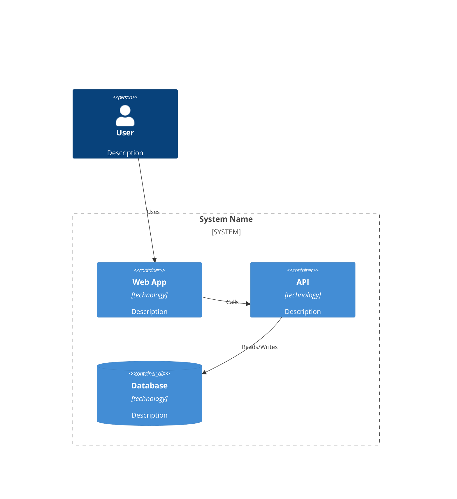
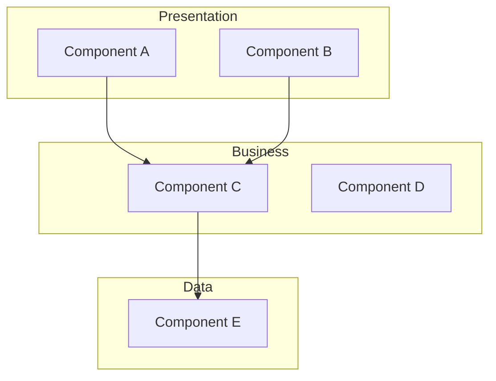
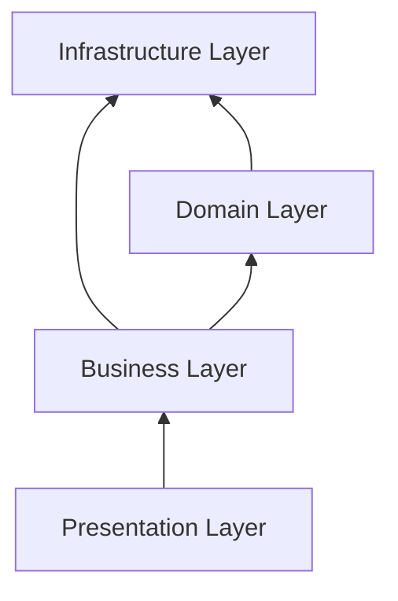
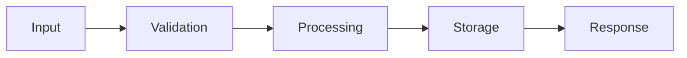

# TEMPLATE: ARCHITECTURE DOCUMENTATION

## Standard Template for Architecture Documentation

---

# [System Name] Architecture

## Repository: [Repository Name]

**Generated:** YYYY-MM-DD  
**Framework Version:** 1.0.0  
**Document Version:** 1.0  
**Status:** [Draft/Review/Complete]  

---

## Executive Summary

[2-3 paragraph overview of the system architecture]

---

## Table of Contents

1. [Architecture Overview](#architecture-overview)
2. [Architecture Patterns](#architecture-patterns)
3. [Component Architecture](#component-architecture)
4. [Layer Architecture](#layer-architecture)
5. [Communication Patterns](#communication-patterns)
6. [External Integrations](#external-integrations)
7. [Architectural Decisions](#architectural-decisions)
8. [Technology Stack](#technology-stack)

---

## Architecture Overview

### System Context



### Key Characteristics

- **Architecture Style:** [Style]
- **Deployment Model:** [Model]
- **Scalability Approach:** [Approach]
- **Primary Technologies:** [Technologies]

---

## Architecture Patterns

### Primary Pattern

**Pattern:** [Pattern Name]

**Evidence:**
- File: `path/to/file`, lines X-Y
- Description of evidence

**Implementation Quality:** [Assessment]

### Secondary Patterns

| Pattern | Location | Purpose | Implementation Status |
|---------|----------|---------|----------------------|
| Pattern 1 | src/path/* | Purpose | Complete/Partial |
| ... | ... | ... | ... |

---

## Component Architecture

### Component Diagram



### Component Catalog

#### Component: [Name]

**Responsibility:** [What it does]

**Files:**
- `path/to/file1.ts`
- `path/to/file2.ts`

**Dependencies:**
- Internal: [List]
- External: [List]

**Interfaces:**
- Provides: [List]
- Requires: [List]

**Criticality:** [CRITICAL/HIGH/MEDIUM/LOW]

---

## Layer Architecture

### Layer Overview



### Layer Details

#### Presentation Layer

**Responsibility:** [Layer responsibility]

**Components:**
- [Component list]

**Technologies:**
- [Technology list]

#### Business Layer

**Responsibility:** [Layer responsibility]

**Components:**
- [Component list]

**Technologies:**
- [Technology list]

#### Domain Layer

**Responsibility:** [Layer responsibility]

**Components:**
- [Component list]

**Technologies:**
- [Technology list]

#### Infrastructure Layer

**Responsibility:** [Layer responsibility]

**Components:**
- [Component list]

**Technologies:**
- [Technology list]

---

## Communication Patterns

### Synchronous Communication

| Pattern | Usage | Example |
|---------|-------|---------|
| Direct Call | Service to Service | `userService.getUser()` |
| HTTP/RPC | Cross-service | `axios.get('/api/users')` |

### Asynchronous Communication

| Pattern | Usage | Implementation |
|---------|-------|----------------|
| Events | Decoupled communication | EventEmitter |
| Messages | Queue-based | RabbitMQ/SQS |

### Data Flow



---

## External Integrations

### Integration Map

| System | Type | Protocol | Purpose | Criticality |
|--------|------|----------|---------|-------------|
| PostgreSQL | Database | TCP | Data persistence | CRITICAL |
| Stripe | API | HTTPS | Payments | HIGH |
| Redis | Cache | TCP | Caching | MEDIUM |

### API Endpoints (if applicable)

| Endpoint | Method | Purpose | Auth Required |
|----------|--------|---------|---------------|
| /api/users | GET | List users | Yes |
| ... | ... | ... | ... |

---

## Architectural Decisions

### Decision Log

| ID | Decision | Date | Status | Rationale |
|----|----------|------|--------|-----------|
| AD-001 | Use TypeScript | 2024-01-01 | Accepted | Type safety |
| ... | ... | ... | ... | ... |

### Key Decisions Detail

#### AD-001: [Decision Title]

**Context:** [Why this decision was needed]

**Decision:** [What was decided]

**Rationale:** [Why this choice was made]

**Alternatives Considered:**
1. [Alternative 1] - Why rejected
2. [Alternative 2] - Why rejected

**Consequences:**
- Positive: [Benefits]
- Negative: [Trade-offs]

**Evidence:**
- File: `path/to/file`
- Commit/PR: [Reference if available]

---

## Technology Stack

### Core Technologies

| Category | Technology | Version | Purpose |
|----------|------------|---------|---------|
| Language | TypeScript | 5.0.0 | Primary language |
| Framework | NestJS | 10.0.0 | Backend framework |
| Database | PostgreSQL | 15 | Data storage |

### Build & Deployment

| Tool | Version | Purpose |
|------|---------|---------|
| Webpack | 5.x | Bundling |
| Docker | Latest | Containerization |

---

## Quality Attributes

### Scalability

[How the system scales]

### Reliability

[Reliability mechanisms]

### Security

[Security architecture]

### Maintainability

[Maintainability features]

### Performance

[Performance considerations]

---

## Appendix

### A. File Structure

```
src/
├── presentation/
├── business/
├── domain/
└── infrastructure/
```

### B. Glossary

| Term | Definition |
|------|------------|
| Term | Definition |

### C. References

- [Related Document 1](./link)
- [Related Document 2](./link)

---

**Document Status:** [COMPLETE/PARTIAL/DRAFT]

**Last Updated:** YYYY-MM-DD

**Next Review:** YYYY-MM-DD
