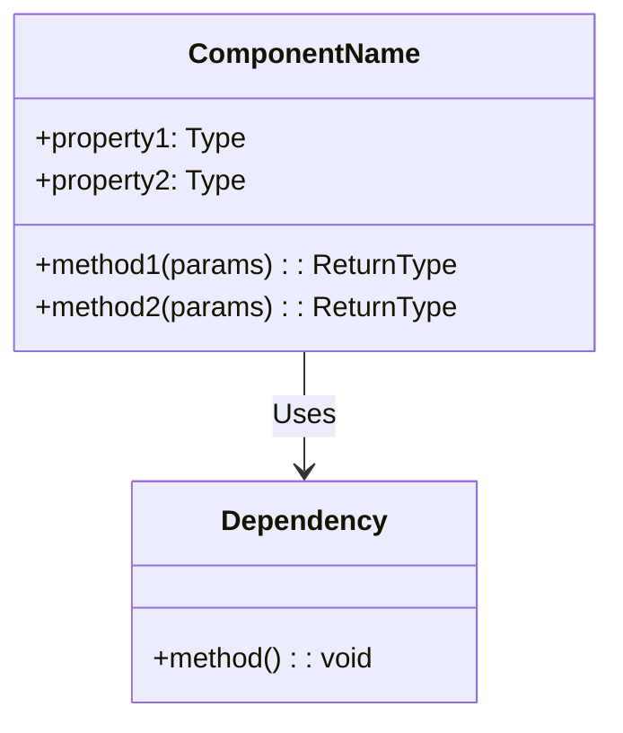
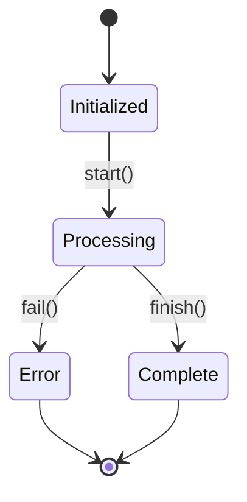

# TEMPLATE: COMPONENT DOCUMENTATION

## Standard Template for Component Documentation

---

# Component: [Component Name]

**Location:** `path/to/component/`  
**Type:** [Service/Controller/Module/Utility/etc.]  
**Criticality:** [CRITICAL/HIGH/MEDIUM/LOW]  
**Status:** [COMPLETE/PARTIAL]  

---

## Overview

[2-3 sentence description of what this component does]

---

## Responsibilities

| Responsibility | Description | Implementation |
|----------------|-------------|----------------|
| Primary responsibility | What it does | Main files/methods |
| Secondary responsibility | Additional function | Supporting files |

---

## Files

### Core Files

| File | Purpose | Size | Complexity |
|------|---------|------|------------|
| `component.service.ts` | Main business logic | Large | High |
| `component.types.ts` | Type definitions | Small | Low |
| `component.interface.ts` | Interface definition | Medium | Medium |

### Related Files

- `path/to/related/file1.ts` - [Purpose]
- `path/to/related/file2.ts` - [Purpose]

---

## Class Structure



---

## Public API

### Methods

#### `methodName(params)`

**Purpose:** [What this method does]

**Signature:**
```typescript
methodName(param1: Type, param2: Type): ReturnType
```

**Parameters:**
| Name | Type | Required | Description |
|------|------|----------|-------------|
| param1 | Type | Yes | Description |
| param2 | Type | No | Description |

**Returns:** `ReturnType` - [Description of return value]

**Throws:**
- `ErrorType` - When [condition]

**Example:**
```typescript
const result = component.methodName(value);
```

**Evidence:** File: `path/to/file.ts`, lines X-Y

---

### Properties

#### `propertyName: Type`

**Purpose:** [What this property stores]

**Visibility:** public/private/protected

**Default:** [Default value if any]

**Evidence:** File: `path/to/file.ts`, line X

---

## Dependencies

### Internal Dependencies

| Component | Type | Usage |
|-----------|------|-------|
| UserService | Injected | User operations |
| LoggerService | Injected | Logging |

### External Dependencies

| Package | Version | Usage |
|---------|---------|-------|
| lodash | 4.17.21 | Utility functions |
| axios | 1.4.0 | HTTP requests |

---

## Usage Examples

### Basic Usage

```typescript
const component = new ComponentName(dependency);
const result = await component.methodName(params);
```

### Advanced Usage

```typescript
// Complex usage scenario
const component = new ComponentName(dependency);
await component.initialize();
const result = await component.process(data);
await component.cleanup();
```

---

## State Management

### Internal State

| State | Type | Initial | Mutability |
|-------|------|---------|------------|
| cache | Map | Empty | Mutable |
| config | Config | From env | Immutable |

### State Transitions



---

## Error Handling

### Errors Thrown

| Error Type | When | Recovery |
|------------|------|----------|
| ValidationError | Invalid input | Fix input |
| NotFoundError | Resource missing | Handle missing case |
| NetworkError | Connection failed | Retry |

### Error Handling Strategy

[How this component handles errors]

---

## Testing

### Test Files

- `component.service.spec.ts` - Unit tests
- `component.integration.spec.ts` - Integration tests

### Coverage

| Metric | Coverage |
|--------|----------|
| Lines | XX% |
| Functions | XX% |
| Branches | XX% |

### Key Test Cases

| Test Case | Description | Status |
|-----------|-------------|--------|
| should create instance | Basic instantiation | ✅ Pass |
| should process valid input | Normal operation | ✅ Pass |
| should reject invalid input | Validation | ✅ Pass |

---

## Performance Considerations

### Time Complexity

| Method | Complexity | Notes |
|--------|------------|-------|
| methodName | O(n) | Linear scan |
| otherMethod | O(1) | Constant time |

### Memory Usage

[Memory characteristics]

### Optimization Opportunities

[Any identified optimizations]

---

## Security Considerations

### Input Validation

[How inputs are validated]

### Sensitive Operations

[Any security-sensitive operations]

### Vulnerabilities

[Any identified security concerns]

---

## Change History

| Version | Date | Changes | Author |
|---------|------|---------|--------|
| 1.0 | YYYY-MM-DD | Initial implementation | Original author |
| 1.1 | YYYY-MM-DD | Added caching | AI Analysis |

---

## Related Components

| Component | Relationship | Description |
|-----------|--------------|-------------|
| ParentComponent | Contains | Parent module |
| ChildComponent | Used by | Child service |

---

## References

- [Architecture Document](./ARCHITECTURE.md#component-section)
- [API Reference](./API_REFERENCE.md#component-api)
- [Related ADR](./DECISIONS.md#adr-xxx)

---

**Last Analyzed:** YYYY-MM-DD

**Analysis Status:** [COMPLETE/PARTIAL]

**Confidence Level:** [Certain/Confident/Probable]
