# Business Logic

> This repository is not a traditional business application. Its "business rules" are the prompt engineering constraints, quality enforcement mechanisms, and operational policies that govern how the AI agent behaves during reverse engineering.

---

## Rule Categories

The framework's domain rules fall into six categories:

| Category | Source File | Rule Count |
|----------|------------|-----------|
| Anti-hallucination rules | `OPERATING_RULES.md` (Rule 2), `QUALITY_STANDARDS.md` (Q1) | 9 |
| Continuation and completeness rules | `OPERATING_RULES.md` (Rules 1, 3), `QUALITY_STANDARDS.md` (Q2) | 10 |
| Ambiguity handling rules | `OPERATING_RULES.md` (Rule 2, 9), `FRAMEWORK_DESIGN_PHILOSOPHY.md` | 6 |
| Quality gate pass/fail criteria | `QUALITY_STANDARDS.md` (Q9), `VALIDATION_CHECKLISTS.md` | 9 phase gates |
| Conditional skip logic | `MASTER_PROMPT.md` (Section 2.5) | 4 |
| Evidence-over-inference principle | `OPERATING_RULES.md` (Rule 2), `MISSION.md` (Principle 4) | 5 |

---

## 1. Anti-Hallucination Rules

These rules prevent the agent from generating plausible-sounding claims that are not grounded in actual code evidence.

### Rule 2.1: Evidence Citation Requirement

> "Every claim about code behavior MUST cite: the exact file path (relative to repository root), the line number or line range, a direct quote or paraphrase of the relevant code (with context)."
>
> -- `OPERATING_RULES.md`, Rule 2.1

**Enforcement mechanism:** Q3 Traceability standard requires anchor density of 2+ anchors per major claim category. Phase 8 validation (P31) spot-checks 20-30 claims against actual source.

### Rule 2.3: Speculative Claim Labeling

> "Speculative claims must be prefixed with `[SPECULATIVE]` and include the reasoning chain that led to the speculation."
>
> -- `OPERATING_RULES.md`, Rule 2.3

**Effect:** Prevents false certainty. Readers can distinguish verified facts from educated guesses.

### Rule 2.4: Dead Code Verification

> "'Dead code' must be verified by tracing callers, not assumed by name or comments."
>
> -- `OPERATING_RULES.md`, Rule 2.4

**Effect:** Prevents premature dismissal of code based on naming conventions alone.

### Q1.2: Function Documentation Verification

> "For every function documented, the agent MUST verify: Parameter names and types match the actual function signature, Return type matches the actual return type, Side effects are accurately described, Error conditions match the actual error handling code."
>
> -- `QUALITY_STANDARDS.md`, Q1.2

### Q1.5: Zero False Claims Standard

> "Accuracy is measured by: zero false claims per artifact. A 'false claim' is any statement that contradicts the actual source code."
>
> -- `QUALITY_STANDARDS.md`, Q1.5

**Effect:** This is the strictest possible accuracy standard. Even a single incorrect statement about code behavior constitutes a quality failure.

---

## 2. Continuation and Completeness Rules

These rules prevent the agent from producing incomplete analysis or stopping prematurely.

### Rule 1: Sequential Discipline

> "Prompts must be executed in the numbered order unless the PROMPT_DEPENDENCY_MAP explicitly lists exceptions."
>
> -- `OPERATING_RULES.md`, Rule 1.1

> "A prompt may NOT be skipped unless its output is explicitly not needed for the downstream analysis goal."
>
> -- `OPERATING_RULES.md`, Rule 1.2

> "If a prompt is skipped, all downstream prompts that depend on it must be marked as having a dependency gap."
>
> -- `OPERATING_RULES.md`, Rule 1.3

**Effect:** Prevents shallow analysis by forcing the agent through every phase before documentation.

### Rule 3: Completeness Requirement

> "A phase is complete only when every file in scope has been analyzed."
>
> -- `OPERATING_RULES.md`, Rule 3.1

**Scope definitions (Rule 3.2):**

| Phase Range | Scope |
|------------|-------|
| Phase 1-3 | All files in the repository |
| Phase 4-6 | All files identified as architecturally significant in Phase 3 |
| Phase 7-8 | All files documented in Phase 3-6 |

### Q2.6: Coverage Target

> "Completeness is measured by: coverage ratio - (documented items) / (total items in scope) x 100%. Target: >= 95% for all categories."
>
> -- `QUALITY_STANDARDS.md`, Q2.6

**Effect:** Sets an explicit numeric threshold. The agent cannot claim completion at 80% coverage.

### Rule 3.3: Explicit Exclusion Documentation

> "Files excluded from analysis (e.g., generated code, third-party dependencies, build artifacts) must be explicitly listed with the reason for exclusion."
>
> -- `OPERATING_RULES.md`, Rule 3.3

**Effect:** Makes omissions visible. A reader always knows what was not covered.

---

## 3. Ambiguity Handling Rules

These rules define how the agent must handle genuinely ambiguous code behavior.

### Rule 2.2: Ambiguity Documentation Protocol

> "If code behavior is ambiguous (e.g., dynamic dispatch, runtime polymorphism, reflection), the agent MUST: Document all possible resolutions, State which cannot be determined statically, Flag dynamic behavior for manual review."
>
> -- `OPERATING_RULES.md`, Rule 2.2

### Rule 9.4: Contradictory Evidence

> "If the analysis produces contradictory evidence (e.g., code behavior that appears to violate its documented intent), document BOTH the code behavior and the documented intent, and flag the contradiction."
>
> -- `OPERATING_RULES.md`, Rule 9.4

### Q8.3: Runtime Verification Tagging

> "For claims that cannot be verified statically (e.g., runtime behavior, async race conditions), mark them as `[NEEDS RUNTIME VERIFICATION]`."
>
> -- `QUALITY_STANDARDS.md`, Q8.3

### Framework Philosophy: Evidence-Based Ambiguity Reporting

From `FRAMEWORK_DESIGN_PHILOSOPHY.md`:

1. Detect ambiguity - identify patterns that cannot be fully analyzed statically
2. Document it - explicitly state what is ambiguous and why
3. Flag for review - mark with `[NEEDS RUNTIME VERIFICATION]`
4. Provide options - document all possible resolutions

**Effect:** Turns the AI's limitation into useful information for human reviewers, rather than hiding gaps behind confident-sounding prose.

---

## 4. Quality Gate Pass/Fail Criteria

Each phase has a mandatory quality gate. The gate is binary: pass or remediate.

### Per-Phase Quality Gates (from `QUALITY_STANDARDS.md` Q9)

| Phase | Gate Name | Method |
|-------|-----------|--------|
| 1 - Discovery | Inventory completeness check | Compare file count vs. actual listing |
| 2 - Structural | Dependency resolution check | Trace every import to a recognized module |
| 3 - Architecture | Architecture-coherence check | Verify layer rules are not violated |
| 4 - Deep Code | Implementation-fidelity check | Spot-check 10% of claims against code |
| 5 - AI Analysis | Prompt-execution trace check | Verify every prompt has a handler |
| 6 - Integration | Boundary-completeness check | All external calls have documented counterparts |
| 7 - Documentation | Format-compliance check | Validate against OUTPUT_RULES.md |
| 8 - Validation | Full-quality-score check | All Q1-Q8 standards met above threshold |
| 9 - Rebuild | Rebuild-verification check | Build succeeds from documentation alone |

### Gate Failure Protocol (from `MASTER_PROMPT.md` Section 2.4)

```
IF quality gate fails:
  1. Document what failed
  2. Attempt remediation by re-examining failing areas
  3. IF remediation impossible:
     Document the gap
     Flag it for downstream phases
     Proceed (degraded)
```

**Effect:** The framework never silently passes a failing gate. Every failure is documented and either fixed or explicitly propagated.

---

## 5. Conditional Skip Logic

Four conditional execution rules control which phases run:

### Condition 1: Phase 5 (AI Analysis) Activation

> "Execute ONLY if: Phase 3 detected AI prompts, agents, tools, or AI SDK patterns"
>
> -- `MASTER_PROMPT.md`, Phase 5 definition

**Detection signals:** Files with AI role definitions, agent/orchestrator/planner naming, AI SDK imports, tool definitions, vector store/embedding patterns.

### Condition 2: Phase 9 (Rebuild) Activation

> "Execute ONLY if: Phase 7 completed successfully AND rebuild guide was requested"
>
> -- `MASTER_PROMPT.md`, Phase 9 definition

### Condition 3: Repository Size Adaptation

> "If the Phase 1 scan reveals a repository with: No AI/agent patterns -> Skip Phase 5 entirely; Fewer than 50 files -> Accelerate; More than 500 files -> Plan strategic sampling; Binary/generated code -> Document as such, focus on source; Multiple packages/services -> Analyze each separately, then synthesize"
>
> -- `MASTER_PROMPT.md`, Section 2.5

### Condition 4: Parallel Execution Permission

> "Parallel execution is only permitted at explicitly marked join points in the PROMPT_DEPENDENCY_MAP."
>
> -- `OPERATING_RULES.md`, Rule 1.4

**Effect:** Prevents the agent from taking shortcuts. Every skip or acceleration is rule-governed.

---

## 6. Evidence-Over-Inference Principle

This is the framework's most important design principle, stated across multiple files.

### From MISSION.md (Principle 4: Precision Over Generality)

> "Specificity is always preferred over vague statements. Every claim about code behavior must be traceable to specific files, line numbers, and code paths."

### From MISSION.md (Constraint 2: No Assumptions)

> "Every claim must be evidence-based. If code behavior is ambiguous, document the ambiguity, do not guess."

### From MISSION.md (Constraint 5: No Fabrication)

> "If a code path cannot be fully traced, document the gap. Do not invent plausible completions."

### From FRAMEWORK_DESIGN_PHILOSOPHY.md (Why Traceability Is Non-Negotiable)

> "The single most common failure in AI-generated documentation is the unsupported claim - a statement that sounds plausible but cannot be verified against the code. Traceability (requiring file:line anchors for every claim) solves this."

Three mechanisms enforce this principle:
1. **Forces deeper analysis** - to cite a line, the agent must read it first
2. **Enables verification** - a reviewer can check any claim against the code
3. **Prevents hallucination** - it is much harder to invent code behavior when you must cite specific lines

### Q3.1: Non-Negotiable Source Anchors

> "Every claim must include a source anchor: file path + line number(s). This is non-negotiable."
>
> -- `QUALITY_STANDARDS.md`, Q3.1

### Q3.5: Anchor Density Measurement

> "Traceability is measured by: anchor density - anchors per 100 words of documentation. Target: >= 2 anchors per major claim category."
>
> -- `QUALITY_STANDARDS.md`, Q3.5

---

## Additional Operational Rules

### Rule 5: Transparency

> "The agent MUST log every file it examines with timestamp and result. The agent MUST log every dependency decision. The agent MUST log every ambiguity it encounters."
>
> -- `OPERATING_RULES.md`, Rules 5.1-5.3

### Rule 6: No Code Modification

> "The agent MUST NOT modify the repository being analyzed. The agent MUST NOT generate code that modifies the repository."
>
> -- `OPERATING_RULES.md`, Rules 6.1-6.2

### Rule 10: Output Hygiene

> "Every output file must start with a metadata header. Every output file must end with a completion statement and 'next steps' section."
>
> -- `OPERATING_RULES.md`, Rules 10.1-10.2

### Rule 11: Reproducibility

> "Analysis must be reproducible. Two independent runs of this framework on the same repository version must produce equivalent results."
>
> -- `OPERATING_RULES.md`, Rule 11.1

### Rule 12: Boundaries

> "The analysis boundary is the repository root. Files outside this boundary are documented only as external dependencies."
>
> -- `OPERATING_RULES.md`, Rule 12.1

---

## Summary: Domain Rule Hierarchy

```mermaid
graph TD
    E[Evidence-Over-Inference] --> AH[Anti-Hallucination Rules]
    E --> T[Traceability Requirements]
    E --> A[Ambiguity Handling]

    C[Completeness] --> SEQ[Sequential Discipline]
    C --> COV[Coverage Targets >= 95%]
    C --> EXC[Explicit Exclusion Docs]

    Q[Quality Enforcement] --> GATES[Phase Gates Binary Pass/Fail]
    Q --> REM[Remediation Protocol]
    Q --> VAL[Phase 8 Cross-Validation]

    COND[Conditional Logic] --> P5[Phase 5 AI Detection]
    COND --> P9[Phase 9 Rebuild Request]
    COND --> SCALE[Scale Adaptation]
    COND --> PAR[Parallelization Points]
```



---

## Cross-References

- [System Design](./system-design.md) - architecture that these rules operate within
- [Working Logic](./working-logic.md) - how rules are enforced during execution
- [Module Map](./module-map.md) - the DAG that sequential discipline enforces
- [Prompt Template Docs](../03-prompt-template-docs/03-prompt-template-docs.md) - where quality gates appear in each prompt
