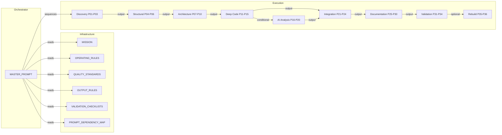

# Component Map

> Complete inventory of all major components in the Enterprise Reverse Engineering Framework (Hermes canonical variant), organized by architectural layer.

---

## Layer 1: Infrastructure Components

### Mission Component

| Attribute | Value |
|-----------|-------|
| File | `MISSION.md` |
| Responsibility | Defines core mission, success criteria, scope, principles, and constraints |
| Consumed by | Orchestrator (initialization), all prompts (implicit) |
| Key content | 6 core principles, 12 success criteria, 6 constraints |

### Operating Rules Component

| Attribute | Value |
|-----------|-------|
| File | `OPERATING_RULES.md` |
| Responsibility | Binding behavioral rules that constrain all agent activity |
| Consumed by | All execution prompts (compliance), validation prompts (enforcement) |
| Key content | 12 rules: Sequential Discipline, Evidence-Based Analysis, Completeness, Documentation Integrity, Transparency, No Code Modification, Scale Adaptation, Dependency Handling, Error Handling in Analysis, Output Hygiene, Reproducibility, Boundaries |

### Quality Standards Component

| Attribute | Value |
|-----------|-------|
| File | `QUALITY_STANDARDS.md` |
| Responsibility | Defines quality metrics, measurement methods, and phase-specific quality gates |
| Consumed by | Every quality gate check, Phase 8 validation prompts |
| Key content | Q1 Technical Accuracy, Q2 Completeness, Q3 Traceability, Q4 Structural Quality, Q5 Diagram Quality, Q6 Consistency, Q7 Clarity, Q8 Verifiability, Q9 Quality Gates (per-phase table), Q10 Continuous Improvement |

### Output Rules Component

| Attribute | Value |
|-----------|-------|
| File | `OUTPUT_RULES.md` |
| Responsibility | Governs format, structure, and delivery of all documentation |
| Consumed by | All output-producing prompts (P01-P36) |
| Key content | 7 sections: Document Structure (headers/footers), Code Referencing, Diagram Rules, Table Standards, File Naming, Style Rules, Delivery structure |

### Validation Checklists Component

| Attribute | Value |
|-----------|-------|
| File | `VALIDATION_CHECKLISTS.md` |
| Responsibility | Per-phase pass/fail verification checklists |
| Consumed by | Orchestrator (gate enforcement), Phase 8 prompts |
| Key content | 9 phase checklists with binary check items covering inventory, structure, architecture, code, AI, integration, documentation, validation, and rebuild |

### Prompt Dependency Map Component

| Attribute | Value |
|-----------|-------|
| File | `PROMPT_DEPENDENCY_MAP.md` |
| Responsibility | Defines execution order, parallelization opportunities, and context handoff requirements |
| Consumed by | Orchestrator (sequencing decisions) |
| Key content | Dependency graph (ASCII), dependency table (35 rows), parallelization table (8 batches), context handoff table (33 entries) |

### Glossary Component

| Attribute | Value |
|-----------|-------|
| File | `GLOSSARY.md` |
| Responsibility | Standardized terminology definitions for consistency |
| Consumed by | All documentation outputs (terminology enforcement per Q6) |
| Key content | ~50 terms organized alphabetically from "Agent" to "Workflow" |

### Framework Design Philosophy Component

| Attribute | Value |
|-----------|-------|
| File | `FRAMEWORK_DESIGN_PHILOSOPHY.md` |
| Responsibility | Documents design rationale, failure modes addressed, and tradeoffs |
| Consumed by | Framework maintainers and extenders |
| Key content | 6 failure modes solved, rationale for 9 phases, modular design justification, conditional phase logic, rebuild optionality |

### Prompt Design Guide Component

| Attribute | Value |
|-----------|-------|
| File | `PROMPT_DESIGN_GUIDE.md` |
| Responsibility | Template and conventions for writing new prompts |
| Consumed by | Framework extenders adding new prompts |
| Key content | Seven-section template, naming conventions, quality gate design |

### Diagram Templates Component

| Attribute | Value |
|-----------|-------|
| File | `DIAGRAM_TEMPLATES.md` |
| Responsibility | Reusable Mermaid diagram templates for common diagram types |
| Consumed by | Phase 7 documentation prompts (P25-P28) |
| Key content | Templates for system context, component, data flow, state, sequence, and flowchart diagrams |

### Master Index Component

| Attribute | Value |
|-----------|-------|
| File | `MASTER_INDEX.md` |
| Responsibility | Complete navigational index of all framework files |
| Consumed by | Operators and agents for file location |
| Key content | Categorized file listing with paths |

### Project Specification Component

| Attribute | Value |
|-----------|-------|
| File | `PROJECT_SPECIFICATION.md` |
| Responsibility | Defines the target project context and initial scope parameters |
| Consumed by | Orchestrator at initialization, P01 for scope definition |
| Key content | Target repository details, analysis scope, special instructions |

---

## Layer 2: Orchestrator Component

### Master Prompt (Orchestrator)

| Attribute | Value |
|-----------|-------|
| File | `MASTER_PROMPT.md` |
| Responsibility | Loads infrastructure, sequences all prompts, manages context, enforces gates, handles conditionals |
| Depends on | All 13 infrastructure files (reads at initialization) |
| Consumed by | Operator (as the single entry point to the framework) |
| Key content | 5 sections: Mission, System Prompt (with Load Instructions, Execution Model, Context Management, Quality Enforcement, Adapt to Repository), Phase Sequence (9 phases), Output Directory Structure, Completion Criteria (28 items) |

**Orchestrator sub-functions:**

| Function | Description |
|----------|-------------|
| Load Infrastructure | Reads MISSION, OPERATING_RULES, QUALITY_STANDARDS, OUTPUT_RULES, PROMPT_DEPENDENCY_MAP, VALIDATION_CHECKLISTS |
| Prerequisite Verification | Checks that required prior outputs exist before loading next prompt |
| Context Summary Generation | Creates concise handoff document between phases |
| Quality Gate Enforcement | Validates prompt output against VALIDATION_CHECKLISTS before transition |
| Conditional Branching | Decides Phase 5 execution based on AI pattern detection |
| Scale Adaptation | Adjusts analysis depth based on repository size |

---

## Layer 3: Execution Components (by Phase)

### Phase 1: Discovery Module

| Component | File | Input | Output |
|-----------|------|-------|--------|
| Repository Scanner | `PROMPT_01_Repository_Scan.md` | Target repo path | Scan report: stats, tree, tech indicators, notable files |
| File Inventorist | `PROMPT_02_File_Inventory.md` | Scan results | Categorized file inventory, exclusion list |
| Technology Detector | `PROMPT_03_Technology_Stack_Detection.md` | Scan results + inventory | Language/framework/library/tool catalog with versions |

### Phase 2: Structural Analysis Module

| Component | File | Input | Output |
|-----------|------|-------|--------|
| Folder Architect | `PROMPT_04_Folder_Architecture.md` | Inventory + tech stack | Directory structure map, naming conventions, package org |
| Dependency Mapper | `PROMPT_05_Module_Dependency_Graph.md` | Folder architecture | Dependency graph (internal + external), circular warnings |
| Entry Point Analyzer | `PROMPT_06_Entry_Point_Analysis.md` | Folder architecture | Entry point catalog with signatures, invocation methods |

### Phase 3: Architecture Reconstruction Module

| Component | File | Input | Output |
|-----------|------|-------|--------|
| System Architect | `PROMPT_07_System_Architecture.md` | P04 + P05 + P06 outputs | Architecture style, component map, decisions |
| Component Decomposer | `PROMPT_08_Component_Decomposition.md` | System architecture | Component internals, interfaces, internal structure |
| Layer Analyst | `PROMPT_09_Layer_Analysis.md` | System architecture | Layer definitions, responsibilities, violations |
| Pattern Recognizer | `PROMPT_10_Design_Pattern_Recognition.md` | System architecture | Design pattern catalog with code locations |

### Phase 4: Deep Code Analysis Module

| Component | File | Input | Output |
|-----------|------|-------|--------|
| Data Flow Tracer | `PROMPT_11_Data_Flow_Analysis.md` | P08 + P09 + P10 outputs | Data flow maps, transformation pipelines |
| Path Reconstructor | `PROMPT_12_Execution_Path_Reconstruction.md` | Data flow analysis | Execution path maps, branch conditions |
| State Analyst | `PROMPT_13_State_Management.md` | Data flow analysis | State machines, stores, transition models |
| Error Cataloger | `PROMPT_14_Error_Handling_Retry.md` | P11 + P12 + P13 outputs | Error catalog, retry strategy, fallback logic |
| Concurrency Analyst | `PROMPT_15_Concurrency_Performance.md` | Error handling output | Concurrency model, synchronization, performance |

### Phase 5: AI and Automation Module [CONDITIONAL]

| Component | File | Input | Output |
|-----------|------|-------|--------|
| Prompt Architect | `PROMPT_16_Prompt_Architecture_Analysis.md` | System arch + file inventory | Prompt inventory, dependency graph, quality assessment |
| Agent Reconstructor | `PROMPT_17_Agent_Workflow_Reconstruction.md` | System arch + prompt inventory | Agent inventory, communication, orchestration |
| Tool Cataloger | `PROMPT_18_Tool_Integration_Analysis.md` | P15 + P16 + P17 outputs | Tool catalog, interfaces, security |
| Planning Analyst | `PROMPT_19_Planning_Reasoning_Pipeline.md` | Tool integration output | Planning pipeline, decision framework |
| Memory/RAG Analyst | `PROMPT_20_Memory_RAG_Workflow_Analysis.md` | Tool integration output | Memory architecture, RAG pipeline, vector stores |

### Phase 6: Integration and Boundary Module

| Component | File | Input | Output |
|-----------|------|-------|--------|
| API Documenter | `PROMPT_21_Internal_API_Contracts.md` | P11 + P12 + P15 outputs | Internal API contracts, service interfaces |
| External Service Mapper | `PROMPT_22_External_Service_Integration.md` | API contracts output | External service catalog, endpoints, auth |
| Event Stream Analyst | `PROMPT_23_Event_Stream_Workflow.md` | API contracts output | Event types, producers, consumers, guarantees |
| Configuration Mapper | `PROMPT_24_Configuration_Environment.md` | P21 + P22 + P23 outputs | Configuration map, env var catalog |

### Phase 7: Documentation Generation Module

| Component | File | Input | Output |
|-----------|------|-------|--------|
| Architecture Writer | `PROMPT_25_Architecture_Handbook_Generation.md` | All prior outputs | Architecture Handbook |
| Developer Guide Writer | `PROMPT_26_Developer_Handbook_Generation.md` | Architecture Handbook | Developer Handbook |
| Rebuild Guide Writer | `PROMPT_27_Rebuild_Guide_Generation.md` | Architecture Handbook | Rebuild Guide |
| Reference Generator | `PROMPT_28_API_Reference_Class_Catalog.md` | Architecture Handbook | API Reference / Class Catalog |
| Cross-Reference Builder | `PROMPT_29_Engineering_Notes_Cross_References.md` | P25 + P26 outputs | Feature map, cross-reference catalog |
| Validation Handover | `PROMPT_30_Validation_Handover_Protocol.md` | P25-P29 outputs | Validation-ready artifact package |

### Phase 8: Validation and Quality Module

| Component | File | Input | Output |
|-----------|------|-------|--------|
| Accuracy Validator | `PROMPT_31_Cross_Phase_Accuracy_Validation.md` | All Phase 1-7 outputs | Discrepancy report, correction map |
| Completeness Auditor | `PROMPT_32_Completeness_Deep_Audit.md` | All Phase 1-7 outputs | Coverage report, gap analysis |
| Consistency Checker | `PROMPT_33_Consistency_Contradiction_Verification.md` | All Phase 1-7 outputs | Contradiction catalog, resolution plan |
| Quality Gate Officer | `PROMPT_34_Final_Quality_Gate_Signoff.md` | P31 + P32 + P33 outputs | Quality scores, signoff status |

### Phase 9: Rebuild Package Module [OPTIONAL]

| Component | File | Input | Output |
|-----------|------|-------|--------|
| Package Assembler | `PROMPT_35_Rebuild_Package_Assembly.md` | P27 + P34 outputs | Build instructions, dependency lists, configuration |
| Rebuild Verifier | `PROMPT_36_Rebuild_Verification_Protocol.md` | Rebuild package | Verification test results |

---

## Component Interaction Summary

---

## Cross-References

- [System Design](./system-design.md) - three-layer architecture overview
- [Module Map](./module-map.md) - detailed prompt-level dependency graph
- [Working Logic](./working-logic.md) - execution trace through components
- [Prompt Template Docs](../03-prompt-template-docs/03-prompt-template-docs.md) - internal structure of each component
