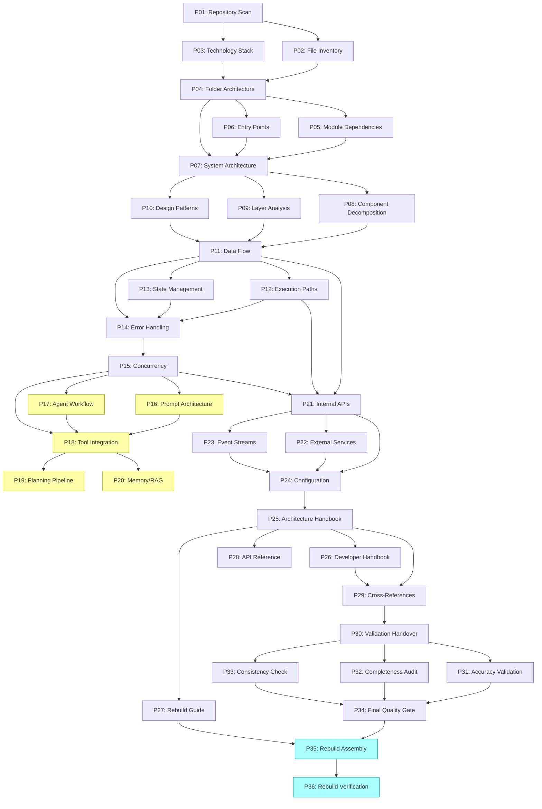

# Module Map

> The dependency graph between prompts represents information dependency rather than import dependency. Each edge means "the downstream prompt requires output from the upstream prompt to execute."

---

## Dependency DAG Overview

The framework's 36 execution prompts form a Directed Acyclic Graph (DAG) with a longest path of 25 nodes (P01 through P35 via the non-conditional route) and 8 parallelization opportunities.



**Legend:** Yellow nodes = conditional (Phase 5, AI detection required). Cyan nodes = optional (Phase 9, rebuild requested).

---

## Dependency Table

| Prompt | Name | Depends On | Parallelizable With |
|--------|------|-----------|-------------------|
| P01 | Repository Scan | None (first) | None |
| P02 | File Inventory | P01 | P03 |
| P03 | Technology Stack Detection | P01 | P02 |
| P04 | Folder Architecture | P02, P03 | None |
| P05 | Module Dependency Graph | P04 | P06 |
| P06 | Entry Point Analysis | P04 | P05 |
| P07 | System Architecture | P04, P05, P06 | None |
| P08 | Component Decomposition | P07 | P09, P10 |
| P09 | Layer Analysis | P07 | P08, P10 |
| P10 | Design Pattern Recognition | P07 | P08, P09 |
| P11 | Data Flow Analysis | P08, P09, P10 | P12, P13 |
| P12 | Execution Path Reconstruction | P11 | P11, P13 |
| P13 | State Management Analysis | P11 | P11, P12 |
| P14 | Error Handling and Retry | P11, P12, P13 | None |
| P15 | Concurrency and Performance | P14 | None |
| P16 | Prompt Architecture [CONDITIONAL] | P15 | P17 |
| P17 | Agent Workflow [CONDITIONAL] | P15 | P16 |
| P18 | Tool Integration | P15, P16, P17 | None |
| P19 | Planning/Reasoning Pipeline | P18 | None |
| P20 | Memory/RAG Workflow | P18 | None |
| P21 | Internal API Contracts | P11, P12, P15 | P22 |
| P22 | External Service Integration | P21 | P21 |
| P23 | Event Stream Workflow | P21 | None |
| P24 | Configuration and Environment | P21, P22, P23 | None |
| P25 | Architecture Handbook | All prior | None |
| P26 | Developer Handbook | P25 | P27, P28 |
| P27 | Rebuild Guide | P25 | P26, P28 |
| P28 | API Reference/Class Catalog | P25 | P26, P27 |
| P29 | Engineering Notes/Cross-References | P25, P26 | None |
| P30 | Validation Handover Protocol | P25-P29 | None |
| P31 | Cross-Phase Accuracy Validation | P30 (all P01-P29 outputs) | P32, P33 |
| P32 | Completeness Deep Audit | P30 (all P01-P29 outputs) | P31, P33 |
| P33 | Consistency/Contradiction Verification | P30 (all P01-P29 outputs) | P31, P32 |
| P34 | Final Quality Gate Signoff | P31, P32, P33 | None |
| P35 | Rebuild Package Assembly [OPTIONAL] | P27, P34 | None |
| P36 | Rebuild Verification [OPTIONAL] | P35 | None |

---

## Parallelization Batches

The DAG permits 8 explicit parallelization points where multiple prompts can execute concurrently:

| Batch | Prompts | Join Point | Rationale |
|-------|---------|------------|-----------|
| P1 | P02, P03 | Before P04 | Both depend only on P01 output |
| P2 | P05, P06 | Before P07 | Both depend only on P04 output |
| P3 | P08, P09, P10 | Before P11 | All depend only on P07 output |
| P4 | P11, P12, P13 | Before P14 | P12 and P13 need only P11 (partial overlap) |
| P5 | P16, P17 | Before P18 | Both depend only on P15 + AI detection |
| P6 | P21, P22 | Before P23 | P22 depends on P21 but can start in parallel with partial output |
| P7 | P26, P27, P28 | Before P29 | All depend only on P25 output |
| P8 | P31, P32, P33 | Before P34 | All read the same input set independently |

---

## Phase-to-Phase Data Flow

Each phase produces output that feeds the next. The critical data items transferred at phase boundaries:

```mermaid
graph LR
    Ph1[Phase 1 Output] -->|"File inventory, tech stack, initial patterns"| Ph2[Phase 2]
    Ph2[Phase 2 Output] -->|"Folder map, dependency graph, entry points"| Ph3[Phase 3]
    Ph3[Phase 3 Output] -->|"Architecture style, components, layers, patterns"| Ph4[Phase 4]
    Ph4[Phase 4 Output] -->|"Data flows, exec paths, state, errors, concurrency"| Ph5{Phase 5?}
    Ph5 -->|"If AI detected: prompt/agent/tool analysis"| Ph6[Phase 6]
    Ph4 -->|"If no AI: skip to Phase 6"| Ph6
    Ph6[Phase 6 Output] -->|"APIs, external services, events, config"| Ph7[Phase 7]
    Ph7[Phase 7 Output] -->|"All documentation artifacts"| Ph8[Phase 8]
    Ph8[Phase 8 Output] -->|"Validation report, quality scores"| Ph9{Phase 9?}
```



---

## Context Handoff Items (per PROMPT_DEPENDENCY_MAP.md)

| From Prompt | Context Items Transferred |
|-------------|--------------------------|
| P01 | Repository path, initial scan findings, file count, notable patterns |
| P02 | Complete file inventory (categorized), exclusion list |
| P03 | Language, framework, library, tool inventory with versions |
| P04 | Directory structure map, naming conventions, package organization |
| P05 | Dependency graph (internal + external), circular dependency warnings |
| P06 | All entry points with signatures, invocation methods |
| P07 | Architecture style, component map, key architectural decisions |
| P08 | Component list with responsibilities, interfaces, internal structure |
| P09 | Layer definitions, layer responsibilities, violations |
| P10 | Design pattern catalog with code locations, anti-patterns |
| P11 | Data flow maps, transformation pipelines, data validation points |
| P12 | Execution path maps for all entry points, branch conditions |
| P13 | State machines, state stores, transition models |
| P14 | Error catalogs, retry strategy, fallback logic, error handling patterns |
| P15 | Concurrency model, synchronization patterns, performance characteristics |
| P16 | System prompt inventory, prompt structure, prompt dependencies |
| P17 | Agent inventory, agent roles, agent communication, orchestration |
| P18 | Tool catalog, tool interfaces, invocation patterns, security |
| P19 | Planning pipeline, reasoning steps, decision framework |
| P20 | Memory architecture, RAG pipeline, vector stores, retrieval logic |
| P21 | Internal API contracts, service interfaces, data format specs |
| P22 | External service catalog, endpoints, auth methods, failure modes |
| P23 | Event types, producers, consumers, delivery guarantees |
| P24 | Complete configuration map, environment variable catalog |
| P25-P29 | Complete documentation set (passed to validation) |
| P30-P33 | Validation findings, gap reports, correction recommendations |
| P34 | Final quality scores, sign-off status |

---

## Circular Dependencies

**None detected.** The pipeline is strictly unidirectional. No prompt's output feeds back into an earlier prompt. The DAG property is maintained by design (per `PROMPT_DEPENDENCY_MAP.md`).

---

## Critical Path

The longest dependency chain (critical path) determines minimum sequential execution time:

```
P01 -> P02 -> P04 -> P05 -> P07 -> P08 -> P11 -> P14 -> P15 -> P18 -> P21 -> P23 -> P24 -> P25 -> P29 -> P30 -> P31 -> P34
```

**Length:** 18 sequential steps (assuming parallelization within batches is exploited).

Without parallelization: 36 sequential steps (or 31 if Phase 5 is skipped and Phase 9 is not requested).

---

## Cross-References

- [System Design](./system-design.md) - layer architecture context
- [Component Map](./component-map.md) - what each prompt component does
- [Working Logic](./working-logic.md) - how the DAG is traversed at runtime
- [Prompt Template Docs](../03-prompt-template-docs/03-prompt-template-docs.md) - internal structure of each module
