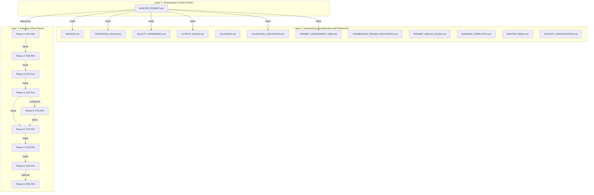
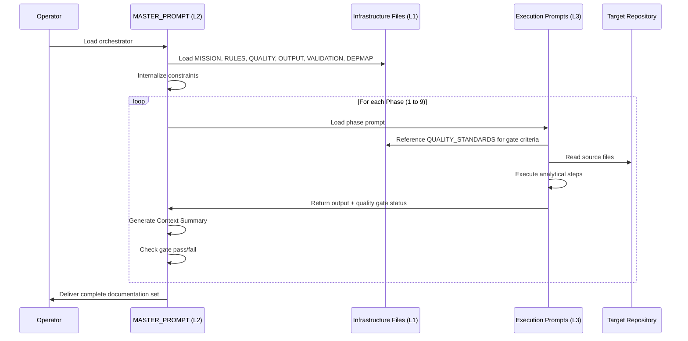

# System Design

> The Enterprise Reverse Engineering Framework implements a Three-Layer Prompt Architecture that separates configuration, orchestration, and execution concerns.

---

## Three-Layer Architecture



---

## Layer 1: Infrastructure (Configuration and Reference)

**Responsibility:** Provides globally-binding rules, quality thresholds, output format standards, and reference definitions that constrain all execution prompts.

**File count:** 13 files (in the Hermes canonical variant)

| File | Role | Consumed By |
|------|------|-------------|
| `MISSION.md` | Defines the core mission and success criteria | Orchestrator at initialization |
| `OPERATING_RULES.md` | 12 binding behavioral rules for the agent | All prompts implicitly |
| `QUALITY_STANDARDS.md` | Q1-Q10 quality metrics with measurement criteria | Quality gates in every prompt |
| `OUTPUT_RULES.md` | Document structure, code referencing, diagram, and table standards | All output-producing prompts |
| `VALIDATION_CHECKLISTS.md` | Per-phase pass/fail checklists | Phase transitions |
| `PROMPT_DEPENDENCY_MAP.md` | Directed acyclic graph of prompt execution order | Orchestrator for sequencing |
| `GLOSSARY.md` | Standardized terminology definitions | All documentation outputs |
| `FRAMEWORK_DESIGN_PHILOSOPHY.md` | Rationale for framework design decisions | Framework maintainers |
| `PROMPT_DESIGN_GUIDE.md` | Template and conventions for writing new prompts | Framework extenders |
| `DIAGRAM_TEMPLATES.md` | Reusable Mermaid diagram templates | Phase 7 documentation |
| `MASTER_INDEX.md` | Complete index of all framework files | Navigation reference |
| `PROJECT_SPECIFICATION.md` | Target project context and scope | Initial configuration |

**Design principle:** Infrastructure files are read-only during execution. They define invariants that no execution prompt may violate.

---

## Layer 2: Orchestration (Control Plane)

**Responsibility:** Loads infrastructure rules, sequences execution prompts, manages context handoffs, enforces quality gates, and handles conditional branching.

**File count:** 1 file (`MASTER_PROMPT.md`)

**Orchestration logic (from `MASTER_PROMPT.md` Section 2.2):**

```
For each Phase (1 to 9):
  Step 1: Load the first prompt file for the phase
  Step 2: Read Mission, Prerequisites, and System Prompt sections
  Step 3: Verify prerequisites from previous phase outputs
  Step 4: Execute the System Prompt against the target repository
  Step 5: Validate output against Quality Gate
  Step 6: Generate Context Summary for next phase
  Step 7: Proceed to next prompt/phase
```

**Key orchestrator decisions:**

| Decision Point | Condition | Action |
|---------------|-----------|--------|
| Phase 5 trigger | AI/agent patterns detected in Phase 3 | Execute P16-P20 |
| Phase 5 skip | No AI patterns detected | Jump from Phase 4 to Phase 6 |
| Phase 9 trigger | Rebuild guide requested and Phase 7 complete | Execute P35-P36 |
| Scale adaptation | Repository < 50 files | Read every file directly |
| Scale adaptation | Repository > 500 files | Strategic sampling |
| Quality failure | Gate check fails | Remediate or document gap |

---

## Layer 3: Execution (Data Plane)

**Responsibility:** Performs the actual analytical work against the target repository. Each prompt reads source code, produces structured analysis, and generates documentation artifacts.

**File count:** 36 prompt files across 9 phase subdirectories

| Phase | Directory | Prompts | Analytical Focus |
|-------|-----------|---------|-----------------|
| 1 | `Phase 1 - Discovery/` | P01-P03 | Repository scanning, file inventory, technology detection |
| 2 | `Phase 2 - Structural Analysis/` | P04-P06 | Folder architecture, module dependencies, entry points |
| 3 | `Phase 3 - Architecture Reconstruction/` | P07-P10 | System architecture, components, layers, patterns |
| 4 | `Phase 4 - Deep Code Analysis/` | P11-P15 | Data flow, execution paths, state, errors, concurrency |
| 5 | `Phase 5 - AI and Automation Analysis/` | P16-P20 | Prompts, agents, tools, planning, memory/RAG |
| 6 | `Phase 6 - Integration and Boundary Analysis/` | P21-P24 | APIs, external services, events, configuration |
| 7 | `Phase 7 - Documentation Generation/` | P25-P30 | Handbooks, guides, diagrams, cross-references |
| 8 | `Phase 8 - Validation and Quality/` | P31-P34 | Accuracy, completeness, consistency, final gate |
| 9 | `Phase 9 - Rebuild Package/` | P35-P36 | Assembly, verification |

**Execution characteristics:**

- Each prompt reads input from prior prompt outputs and the target repository
- Each prompt produces one or more Markdown documentation artifacts
- Context is managed through explicit Context Summary handoffs (not raw output forwarding)
- 8 parallelization opportunities exist within the pipeline (documented in `PROMPT_DEPENDENCY_MAP.md`)

---

## Layer Interaction Model



---

## Architectural Style Classification

The framework itself implements a **Pipeline Architecture** with characteristics of an **Agent-Based Architecture**:

| Style | Evidence |
|-------|----------|
| Pipeline | Sequential phase execution, each phase transforms input to output, unidirectional data flow |
| Agent-Based | Autonomous AI agent executing prompts, tool usage (file system), decision-making (conditional phases) |
| Layered | Three distinct layers with strict dependency direction (L3 depends on L1 through L2, never directly) |

**Purity:** Adapted. The pipeline is not purely linear (8 parallelization points exist, 2 conditional branches).

---

## Cross-References

- [Component Map](./component-map.md) - detailed breakdown of every framework component
- [Module Map](./module-map.md) - dependency DAG between all prompts
- [Working Logic](./working-logic.md) - end-to-end execution trace
- [Business Logic](./business-logic.md) - domain rules governing agent behavior
- [Prompt Template Docs](../03-prompt-template-docs/03-prompt-template-docs.md) - internal structure of each prompt
