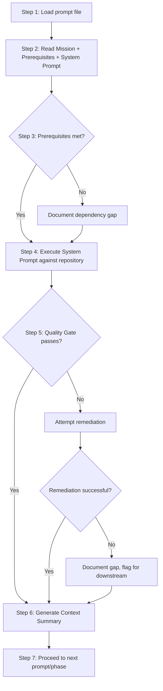
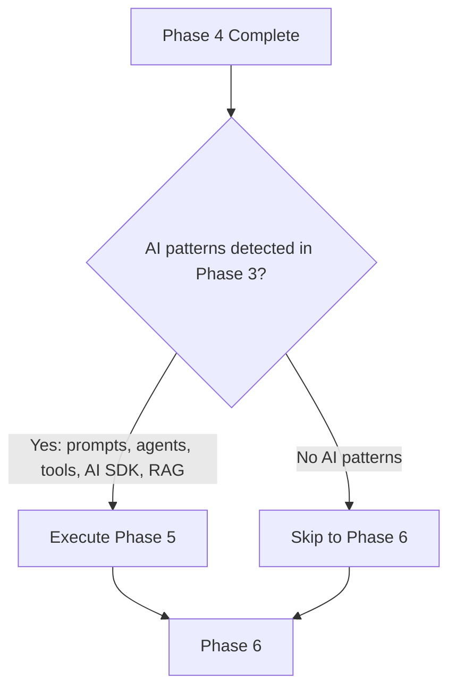

# Working Logic

> End-to-end execution trace of the framework from operator invocation through final documentation delivery.

---

## Execution Overview

The framework operates as a deterministic state machine with conditional branches. An operator provides a target repository path, and the orchestrator drives the agent through 36 prompts (or fewer, depending on conditionals) to produce a complete documentation set.

---

## Phase 0: Initialization

### Step 0.1: Operator Loads MASTER_PROMPT

The operator provides `MASTER_PROMPT.md` to the AI agent along with the target repository path. This is the single entry point to the framework.

### Step 0.2: Infrastructure Loading

The orchestrator (Section 2.1 of `MASTER_PROMPT.md`) instructs the agent to load these files in order:

```
1. MISSION.md           - Internalize the mission
2. OPERATING_RULES.md   - Internalize the rules
3. QUALITY_STANDARDS.md - Know the quality bar
4. OUTPUT_RULES.md      - Know the output format
5. PROMPT_DEPENDENCY_MAP.md - Understand execution order
6. VALIDATION_CHECKLISTS.md - Know what "done" looks like
```

After loading, the agent has internalized:
- 6 core principles and 12 success criteria (from MISSION)
- 12 binding operational rules (from OPERATING_RULES)
- 10 quality standards with measurement methods (from QUALITY_STANDARDS)
- 7 output format sections (from OUTPUT_RULES)
- The complete DAG with 8 parallelization points (from PROMPT_DEPENDENCY_MAP)
- 9 phase-specific validation checklists (from VALIDATION_CHECKLISTS)

### Step 0.3: Scale Assessment

Before executing Phase 1, the orchestrator evaluates repository size and adapts strategy (from `MASTER_PROMPT.md` Section 2.5):

| Repository Size | Strategy |
|----------------|----------|
| < 50 files | Read every file directly (accelerated mode) |
| 50-500 files | Read architecturally significant files, sample utilities |
| > 500 files | Categorize by role, read 100% architectural, sample rest |

---

## Phase Execution Loop

For each phase (1 through 9), the orchestrator executes a fixed 7-step protocol:



---

## Detailed Phase Execution Trace

### Phase 1: Discovery (P01, P02, P03)

**Entry condition:** Repository path available.

```
P01 executes:
  - Root analysis (list all top-level files/dirs)
  - Directory structure mapping (recursive to depth based on size)
  - Initial technology detection (from config files)
  - Large file detection (>1000 lines)
  - Pattern detection (monorepo, microservices, etc.)
  -> Output: 01_repository_scan.md

P02 executes (can parallelize with P03):
  - Categorize every file (source, config, test, doc, build, generated)
  - Produce complete file inventory
  -> Output: File inventory table

P03 executes (can parallelize with P02):
  - Deep technology stack identification
  - Version extraction from manifest files
  -> Output: Technology stack catalog

Quality Gate: File count matches actual listing; all languages identified.
Context Summary generated for Phase 2.
```

### Phase 2: Structural Analysis (P04, P05, P06)

**Entry condition:** Phase 1 Context Summary available.

```
P04 executes:
  - Map directory structure with purpose annotations
  - Identify naming conventions
  - Identify package/module boundaries
  -> Output: Folder architecture document

P05 executes (can parallelize with P06):
  - Trace every import/require/include
  - Separate internal from external dependencies
  - Detect circular dependencies
  -> Output: Module dependency graph

P06 executes (can parallelize with P05):
  - Identify all entry points (main, handlers, routes)
  - Document signatures and invocation methods
  -> Output: Entry point catalog

Quality Gate: All imports traceable; all entry points identified.
Context Summary generated for Phase 3.
```

### Phase 3: Architecture Reconstruction (P07, P08, P09, P10)

**Entry condition:** Phase 2 Context Summary available.

```
P07 executes:
  - Classify architecture style (from 14 candidates)
  - Identify major components
  - Map component relationships
  - Document system context
  - Record architectural decisions
  -> Output: System architecture document

P08 executes (can parallelize with P09, P10):
  - Decompose each component internally
  - Document interfaces and internal structure
  -> Output: Component decomposition

P09 executes (can parallelize with P08, P10):
  - Identify architectural layers
  - Document layer responsibilities
  - Detect layer violations
  -> Output: Layer analysis

P10 executes (can parallelize with P08, P09):
  - Recognize design patterns with code locations
  - Note anti-patterns
  -> Output: Design pattern catalog

Quality Gate: Architecture diagram correctly represents code organization.
Context Summary generated for Phase 4.
```

### Phase 4: Deep Code Analysis (P11, P12, P13, P14, P15)

**Entry condition:** Phase 3 Context Summary available.

```
P11 executes:
  - Trace all data from source to sink
  - Document transformations
  -> Output: Data flow maps

P12 executes (partially parallel with P13):
  - Map execution paths from every entry point
  - Document branch conditions
  -> Output: Execution path diagrams

P13 executes (partially parallel with P12):
  - Identify state stores
  - Document state machines and transitions
  -> Output: State management analysis

P14 executes:
  - Catalog all error types
  - Document retry strategies and fallbacks
  -> Output: Error handling catalog

P15 executes:
  - Document concurrency model
  - Identify synchronization patterns
  -> Output: Concurrency and performance analysis

Quality Gate: 10% spot-check of claims against source code passes.
Context Summary generated.
```

### Decision Point: Phase 5 Conditional



**Detection criteria (from `MASTER_PROMPT.md` Section 2.5 and `FRAMEWORK_DESIGN_PHILOSOPHY.md`):**
- Files containing system prompts (`.md` with AI role definitions, `.txt` with prompt content)
- Agent orchestration patterns (`orchestrator`, `agent`, `planner`, `executor` naming)
- AI SDK usage (`llamaindex`, `langchain`, `openai`, `anthropic`, `vercel-ai-sdk`)
- Tool definitions (`tool/`, `mcp/`, `function/` patterns)
- Memory/RAG patterns (`vector store`, `embedding`, `retrieval`, `reranker`)

### Phase 5: AI and Automation Analysis (P16-P20) [IF TRIGGERED]

```
P16 executes (can parallelize with P17):
  - Locate all prompt artifacts
  - Document each prompt (content, variables, model config, usage)
  - Map prompt engineering techniques
  - Build prompt dependency graph
  -> Output: Prompt architecture document

P17 executes (can parallelize with P16):
  - Identify all agents and their roles
  - Document agent communication
  - Map orchestration logic
  -> Output: Agent workflow document

P18 executes:
  - Catalog all tools available to agents
  - Document tool interfaces and safety
  -> Output: Tool integration analysis

P19 executes:
  - Map planning/reasoning pipelines
  -> Output: Planning pipeline document

P20 executes:
  - Analyze memory architecture
  - Document RAG pipeline
  -> Output: Memory/RAG analysis

Quality Gate: Every prompt traced to handler; every tool traced to implementation.
```

### Phase 6: Integration and Boundary Analysis (P21-P24)

**Entry condition:** Phase 4 (and optionally Phase 5) Context Summary available.

```
P21 executes (can parallelize with P22):
  - Document all internal API contracts
  -> Output: Internal API contracts

P22 executes (can parallelize with P21):
  - Catalog external service calls
  -> Output: External service catalog

P23 executes:
  - Map event types, producers, consumers
  -> Output: Event stream analysis

P24 executes:
  - Map all configuration sources and keys
  -> Output: Configuration and environment catalog

Quality Gate: All external calls documented; all configuration cataloged.
```

### Phase 7: Documentation Generation (P25-P30)

```
P25 executes:
  - Transform all prior analysis into Architecture Handbook
  -> Output: ARCHITECTURE_HANDBOOK.md

P26, P27, P28 execute (can parallelize):
  - Developer Handbook, Rebuild Guide, API Reference
  -> Outputs: Three documentation artifacts

P29 executes:
  - Build feature map and cross-reference catalog
  -> Output: Engineering notes

P30 executes:
  - Prepare validation-ready package
  -> Output: Handover protocol document

Quality Gate: Outputs comply with OUTPUT_RULES.md.
```

### Phase 8: Validation and Quality (P31-P34)

```
P31, P32, P33 execute (can parallelize):
  - Accuracy cross-validation
  - Completeness deep audit
  - Consistency/contradiction verification
  -> Outputs: Three validation reports

P34 executes:
  - Aggregate all validation findings
  - Compute final quality scores
  - Issue signoff or rejection
  -> Output: Final quality gate report

Quality Gate: All Q1-Q8 standards met above threshold.
```

### Decision Point: Phase 9 Optional

```
IF (Phase 7 completed successfully AND rebuild guide requested):
  Execute Phase 9
ELSE:
  Pipeline complete
```

### Phase 9: Rebuild Package (P35-P36) [IF TRIGGERED]

```
P35 executes:
  - Assemble complete rebuild artifact set
  -> Output: Rebuild package

P36 executes:
  - Verify rebuild is possible from documentation alone
  -> Output: Verification report

Quality Gate: Build succeeds from documentation alone.
```

---

## Context Management Strategy

The orchestrator uses a Context Summary mechanism to prevent context window overflow (addressing Failure Mode 4 from `FRAMEWORK_DESIGN_PHILOSOPHY.md`):

| Mechanism | Purpose |
|-----------|---------|
| Context Summary | Concise structured handoff between phases (key findings, ambiguities, priorities) |
| `_analysis/` files | Detailed working notes saved to disk, pulled back only when needed |
| Selective loading | Each prompt loads only the context items listed in PROMPT_DEPENDENCY_MAP handoff table |
| Explicit handoff section | Every prompt's Section 7 specifies exactly what to pass downstream |

---

## Completion Criteria

The pipeline is complete when all 28 items from `MASTER_PROMPT.md` Section 5 are satisfied. Key categories:

| Category | Items | Source Phase |
|----------|-------|-------------|
| Inventory and identification | 2 | Phase 1 |
| Structure and dependencies | 3 | Phase 2 |
| Architecture and components | 4 | Phase 3 |
| Code analysis | 5 | Phase 4 |
| AI analysis (if applicable) | 1 | Phase 5 |
| Integration | 4 | Phase 6 |
| Documentation | 4 | Phase 7 |
| Validation | 4 | Phase 8 |
| Rebuild (if applicable) | 1 | Phase 9 |

---

## Cross-References

- [System Design](./system-design.md) - layer architecture that this logic traverses
- [Module Map](./module-map.md) - the DAG that determines execution order
- [Component Map](./component-map.md) - what each prompt component produces
- [Business Logic](./business-logic.md) - domain rules enforced during execution
