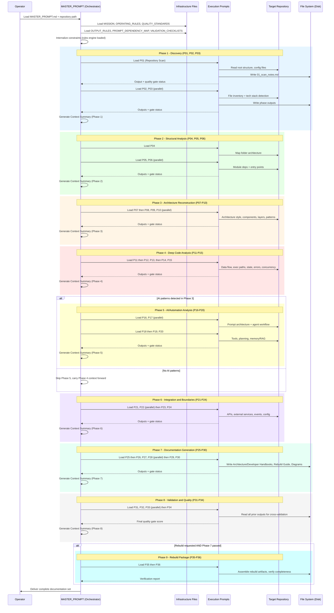
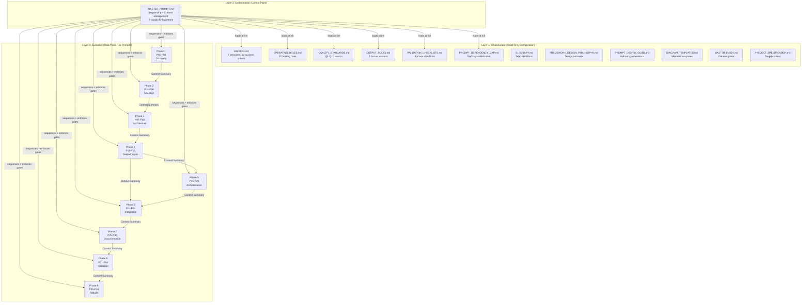
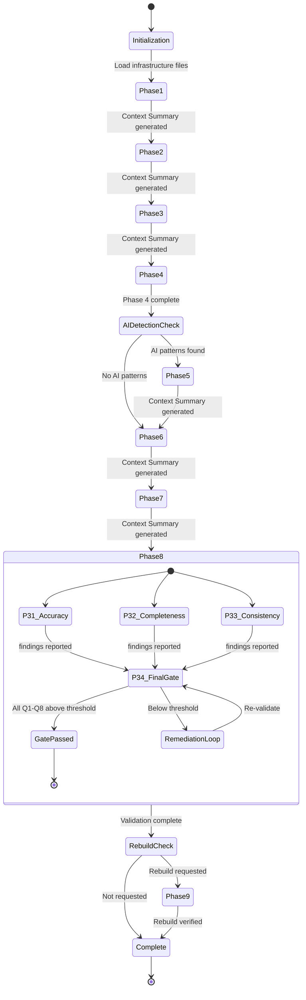

# Phase 5: Diagrams

> Mermaid diagrams derived from the [Phase 4 Architecture Reconstruction](./04-architecture/system-design.md). Each diagram visualizes a distinct architectural concern that cannot be captured in prose alone.

---

## 1. Execution Flow Sequence Diagram

This sequence diagram traces the full lifecycle of a single framework invocation, from operator initialization through all 9 phases to final delivery. It shows how the Orchestrator mediates every interaction between infrastructure rules, execution prompts, and the target repository, compressing context at each phase boundary via the Context Summary mechanism.

The diagram reveals three key architectural properties: (1) the Orchestrator never accesses the target repository directly, always delegating to execution prompts; (2) context is compressed at every phase boundary, preventing window overflow; (3) conditional branches at Phase 5 and Phase 9 are the only non-linear control flow in the pipeline.

---

## 2. Three-Layer Architecture Component Diagram

This component diagram shows the structural separation between Infrastructure (configuration invariants), Orchestration (control plane), and Execution (data plane). Arrows indicate the direction of dependency and data flow, demonstrating that Layer 3 components never bypass Layer 2 to access Layer 1 directly at runtime.

The 12 infrastructure files act as compile-time constants: loaded once, never mutated. The Orchestrator is the sole runtime authority that decides sequencing, gating, and conditional branching. Execution prompts consume context summaries (not raw prior outputs) to stay within token budgets.

---

## 3. Conditional Branching State Diagram

This state diagram models the two decision points that break the otherwise linear pipeline: the Phase 5 conditional (triggered by AI pattern detection) and the Phase 8 subsection skip logic (each validation prompt may produce a "no findings" result that causes downstream remediation to be skipped). These are the only points where the framework's execution path diverges.

The state diagram makes explicit that Phase 5 is guarded by a runtime detection check (not a static configuration flag), while Phase 9 depends on both a user request and successful Phase 7 completion. The Phase 8 remediation loop can cycle indefinitely until thresholds are met or the gap is documented.

---

## 4. Framework Variant Comparison Diagram

This diagram compares the structural differences between the two framework variants present in the repository: the Hermes canonical variant (with DeepSeek) and the Antigravity variant (with Gemini). It highlights divergent prompt counts, phase numbering, and output structures while showing shared architectural principles.

```mermaid
graph LR
    subgraph Shared["Shared Architecture"]
        direction TB
        S1["Three-Layer Model"]
        S2["Context Summary Handoffs"]
        S3["Quality Gate Enforcement"]
        S4["Conditional Phase 5"]
        S5["DAG-Based Sequencing"]
    end

    subgraph Hermes["Hermes (DeepSeek v4 Flash)"]
        direction TB
        H1["36 execution prompts"]
        H2["9 phases"]
        H3["13 infrastructure files"]
        H4["Explicit PROMPT_DEPENDENCY_MAP"]
        H5["Phase 9: Rebuild Package"]
        H6["8 parallelization batches"]
    end

    subgraph Antigravity["Antigravity (Gemini 3.1 Pro)"]
        direction TB
        A1["35 execution prompts"]
        A2["9 phases"]
        A3["Fewer infrastructure files"]
        A4["Implicit dependency ordering"]
        A5["Phase 9: Rebuild Package"]
        A6["Similar parallelization"]
    end

    Shared --- Hermes
    Shared --- Antigravity

    Hermes ---|"Differences"| DiffH["More explicit infrastructure<br/>Formal DAG document<br/>36 vs 35 prompts<br/>Detailed validation checklists"]
    Antigravity ---|"Differences"| DiffA["Leaner infrastructure set<br/>Ordering via convention<br/>35 prompts<br/>Integrated validation"]
```

Both variants implement identical architectural principles (three-layer separation, context compression, conditional AI analysis) but differ in configuration granularity. Hermes favors explicit formal specification (13 infrastructure files, explicit DAG), while Antigravity favors convention over configuration with fewer governance documents.

---

## 5. Diagrams Not Applicable

### ER Diagram (Entity-Relationship)

**Status:** Not applicable.

**Reason:** This repository contains no database, no persistent data store, and no entity relationships. All data is ephemeral (held in LLM context) or serialized as Markdown files on disk. There are no tables, foreign keys, or relational constraints to diagram.

### UML Class Diagram

**Status:** Not applicable.

**Reason:** This repository contains no classes, no object-oriented inheritance hierarchies, and no typed interfaces. The "components" are Markdown files consumed as text by an LLM. There is no type system, no polymorphism, and no method dispatch to represent in UML class notation.

---

## Cross-References

- [System Design](./04-architecture/system-design.md) - Three-Layer Architecture prose description
- [Module Map](./04-architecture/module-map.md) - Dependency DAG in tabular form
- [Working Logic](./04-architecture/working-logic.md) - Execution trace with inline flowcharts
- [Business Logic](./04-architecture/business-logic.md) - Rules governing conditional branches
