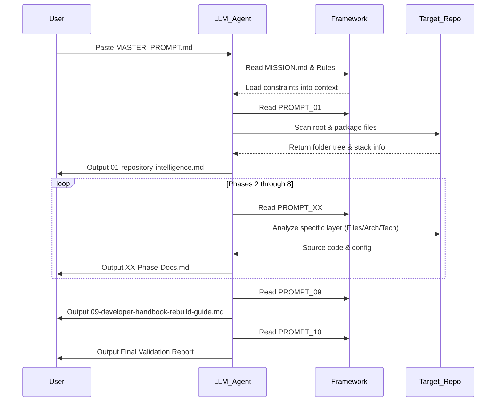
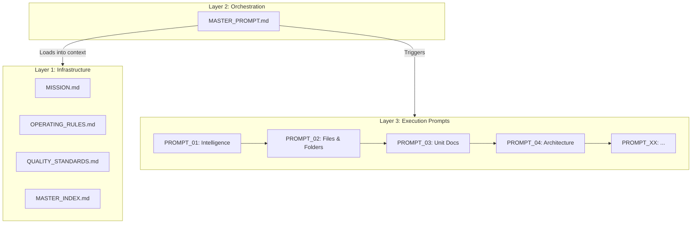

# 05-diagrams

## Execution Sequence Diagram
This diagram illustrates the sequence of execution when an AI agent processes a target repository using the framework.

*Caption: The sequence of interactions between the user, the LLM agent, the framework rules, and the target codebase being analyzed.*

## Framework Component Diagram
This diagram illustrates the logical separation of concerns within the prompt framework itself.

*Caption: The three-layer architecture of the prompt framework, showing how orchestration loads infrastructure rules before triggering the sequential execution pipeline.*

*Note: ER Diagram, Call Graph, and UML Class Diagrams are N/A as there is no traditional runtime source code or database in this repository.*
