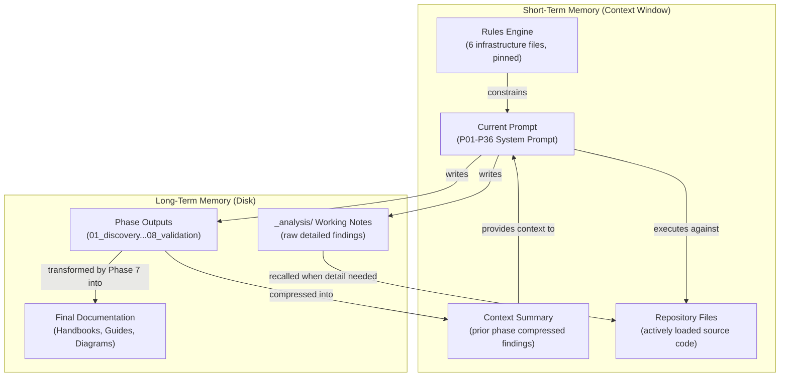

# Phase 6: AI Agent Workflow

> This phase applies because the repository IS AI agent orchestration code expressed in prompt form. The framework defines a complete agentic system: it orchestrates 36 sub-prompts, manages memory across context windows, calls implicit filesystem tools, and implements structured planning via a DAG. This document analyzes those agentic behaviors.

---

## 1. Prompt Flow

### Overview

`MASTER_PROMPT.md` functions as a meta-orchestrator that does not perform analysis itself. Instead, it instructs the LLM to load and execute 36 specialized prompts (P01 through P36) in a defined sequence with context handoffs at every phase boundary.

### Orchestration Mechanism

| Aspect | Implementation | Classification |
|--------|---------------|----------------|
| Prompt loading | Sequential, one at a time per Section 2.2 | **Deterministic** (framework structure) |
| Variable injection | Context Summary from prior phase injected as input | **Deterministic** (framework structure) |
| Phase sequencing | Fixed order defined by `PROMPT_DEPENDENCY_MAP.md` | **Deterministic** (framework structure) |
| Prompt execution | LLM interprets System Prompt section against target repo | **Model-driven** (depends on LLM output) |
| Quality gate evaluation | LLM self-audits output against `VALIDATION_CHECKLISTS.md` | **Model-driven** (depends on LLM judgment) |

### Prompt Chain Structure

The 36 prompts are organized into 9 phases, each containing 2-6 prompts:

```
MASTER_PROMPT.md (meta-orchestrator)
  |
  +-- Phase 1: P01, P02, P03     (Discovery)
  +-- Phase 2: P04, P05, P06     (Structural Analysis)
  +-- Phase 3: P07, P08, P09, P10 (Architecture Reconstruction)
  +-- Phase 4: P11, P12, P13, P14, P15 (Deep Code Analysis)
  +-- Phase 5: P16, P17, P18, P19, P20 (AI/Automation) [CONDITIONAL]
  +-- Phase 6: P21, P22, P23, P24 (Integration and Boundaries)
  +-- Phase 7: P25, P26, P27, P28, P29, P30 (Documentation Generation)
  +-- Phase 8: P31, P32, P33, P34 (Validation and Quality)
  +-- Phase 9: P35, P36           (Rebuild Package) [OPTIONAL]
```

### Variable Injection Protocol

Each prompt receives three categories of input:

1. **Static context** (from Layer 1 infrastructure, loaded once): MISSION, OPERATING_RULES, QUALITY_STANDARDS, OUTPUT_RULES
2. **Dynamic context** (from prior prompt execution): Context Summary containing key findings, unresolved ambiguities, and priority items
3. **Repository context** (from filesystem reads): Source code files selected by the prompt's analytical scope

The orchestrator does not perform string interpolation or template substitution. Instead, it relies on the LLM's ability to reference loaded documents within its context window.

---

## 2. Reasoning Flow

### Classification: Fixed Sequential Pipeline with Conditional Branching

This framework does NOT implement a ReAct (Reason-Act-Observe) loop, a planner-executor pattern, or a tree-of-thought reasoning strategy. Instead, it implements a **fixed sequential pipeline** where:

- The execution order is predetermined by the DAG
- Each prompt has a single, well-defined analytical objective
- The LLM does not choose what to do next; the framework dictates it
- Conditional branching is limited to two explicit decision points

| Reasoning Property | Value | Classification |
|-------------------|-------|----------------|
| Execution order | Fixed by DAG, not chosen at runtime | **Deterministic** (framework structure) |
| Analytical method per prompt | Free-form LLM reasoning within System Prompt constraints | **Model-driven** (depends on LLM output) |
| Branch decisions | Phase 5 trigger (AI detection) and Phase 9 trigger (rebuild request) | **Model-driven** (LLM evaluates detection criteria) |
| Remediation decisions | Re-examine failing areas when quality gate fails | **Model-driven** (LLM judges sufficiency) |
| Scope adaptation | Repository size determines strategy (< 50, 50-500, > 500 files) | **Deterministic** (framework structure) |

### Comparison to Common Agentic Patterns

| Pattern | Used Here? | Evidence |
|---------|-----------|----------|
| ReAct (Reason-Act-Observe) | No | No observation-driven replanning loop; prompts execute once in fixed order |
| Planner-Executor | Partially | DAG acts as a static plan; no dynamic replanning |
| Chain-of-Thought | Yes (within prompts) | Each prompt's System Prompt section implies step-by-step analysis |
| Self-Reflection | Yes (quality gates) | Post-execution validation with remediation loop |
| Tree-of-Thought | No | No branching exploration of alternative reasoning paths |

---

## 3. Planning Flow

### DAG-Based Task Decomposition

The framework's planning is encoded statically in `PROMPT_DEPENDENCY_MAP.md`. This document defines:

- Which prompts depend on which prior outputs
- Which prompts can execute in parallel (8 batches)
- Which prompts are conditional or optional

| Planning Property | Implementation | Classification |
|------------------|---------------|----------------|
| Task decomposition | 36 tasks (prompts), pre-defined at framework authoring time | **Deterministic** (framework structure) |
| Task ordering | DAG edges encode prerequisites | **Deterministic** (framework structure) |
| Parallelization decisions | 8 batch points identified statically | **Deterministic** (framework structure) |
| Adaptive scope | Repository size triggers strategy selection | **Deterministic** (framework structure with model-driven size detection) |
| Conditional inclusion | Phase 5 and Phase 9 presence decided at runtime | **Model-driven** (LLM evaluates criteria) |

### Critical Path

The longest sequential dependency chain (assuming maximum parallelization) is 18 steps:

```
P01 -> P02 -> P04 -> P05 -> P07 -> P08 -> P11 -> P14 -> P15 -> P18 -> P21 -> P23 -> P24 -> P25 -> P29 -> P30 -> P31 -> P34
```

Without parallelization: 36 sequential steps (31 if Phase 5 skipped and Phase 9 not requested).

### Plan vs. Execution Distinction

Unlike planner-executor architectures where the plan is generated at runtime, this framework's plan is a compile-time artifact. The `PROMPT_DEPENDENCY_MAP.md` is written by the framework author, not generated by the LLM. The LLM's role is purely executorial within each prompt: it follows the plan, it does not create it.

---

## 4. Tool Calling

### Implicit Filesystem Tools

The framework assumes execution within an agentic IDE environment (Cursor, Claude Code, Opencode, or equivalent) that provides filesystem access. The tools are never explicitly declared in the framework files; they are assumed to exist as capabilities of the runtime environment.

| Tool | Operation | Invocation Method | Classification |
|------|-----------|-------------------|----------------|
| **Read File** | Read contents of a source file by path | Implicit (LLM accesses files when executing analysis prompts) | **Model-driven** (LLM decides which files to read) |
| **List Directory** | Enumerate files and subdirectories | Implicit (used during P01 repository scan and folder architecture mapping) | **Model-driven** (LLM decides traversal depth) |
| **Search** | Find files matching patterns or containing text | Implicit (used when tracing imports, callers, and data flows) | **Model-driven** (LLM constructs search queries) |
| **Write File** | Write analysis output to disk | Implicit (Context Summaries and `_analysis/` notes written to filesystem) | **Deterministic** (framework mandates output paths) |

### Tool Usage Patterns

1. **Discovery phase (P01-P03):** Heavy use of List Directory and Read File to build inventory
2. **Analysis phases (P04-P20):** Targeted Read File and Search to trace dependencies, flows, and patterns
3. **Documentation phase (P25-P30):** Write File to produce final documentation artifacts
4. **Validation phase (P31-P34):** Read File to re-verify claims against source code

### Security Model

The framework enforces a read-only policy toward the target repository (Operating Rule: "No Code Modification"). Write operations are restricted to the documentation output directory (`docs/reverse-engineering/`). The agent never modifies, creates, or deletes files in the target codebase.

---

## 5. Memory Flow

### Short-Term Memory (Active Context Window)

| Component | Content | Lifetime | Size Constraint |
|-----------|---------|----------|-----------------|
| Current prompt | The System Prompt section of the active P01-P36 file | Single prompt execution | ~2,000-4,000 tokens |
| Context Summary | Compressed findings from prior phase(s) | One phase transition, then replaced | Concise (target: < 2,000 tokens) |
| Infrastructure rules | MISSION, OPERATING_RULES, QUALITY_STANDARDS, OUTPUT_RULES | Entire pipeline (pinned) | ~8,000-12,000 tokens |
| Active repository files | Source code files currently being analyzed | Single prompt execution | Variable (model-driven selection) |

**Classification:** The structure of short-term memory (what categories exist) is **deterministic** (framework structure). The content within each category is **model-driven** (LLM generates Context Summaries, selects files to load).

### Long-Term Memory (Disk-Persisted Artifacts)

| Artifact Type | Purpose | Written By | Read By |
|---------------|---------|-----------|---------|
| Phase output documents | Detailed analytical results | Execution prompts (L3) | Downstream prompts, validation prompts |
| `_analysis/` working notes | Raw notes too detailed for context window | Any prompt during execution | Same or downstream prompts when detail needed |
| Context Summary files | Compressed phase handoffs | Orchestrator (L2) | Next phase's first prompt |
| Final documentation | Deliverable artifacts | Phase 7 prompts | Phase 8 validation, operator |

**Classification:** The existence and structure of long-term memory is **deterministic** (framework defines output directory structure in Section 4 of `MASTER_PROMPT.md`). The content is **model-driven** (LLM generates all written artifacts).

### Rules Engine (Pinned Infrastructure Context)

Six infrastructure files remain loaded in the context window for the duration of pipeline execution:

1. `MISSION.md` - constrains scope and success criteria
2. `OPERATING_RULES.md` - constrains behavioral boundaries
3. `QUALITY_STANDARDS.md` - constrains output quality
4. `OUTPUT_RULES.md` - constrains formatting
5. `PROMPT_DEPENDENCY_MAP.md` - constrains execution order
6. `VALIDATION_CHECKLISTS.md` - constrains phase transitions

These function as a rules engine: they do not change during execution but are continuously evaluated. Every prompt execution is implicitly constrained by these loaded rules, analogous to a configuration-driven rules engine in traditional software.

**Classification:** Rules engine structure and content are fully **deterministic** (framework structure, authored by human, immutable at runtime).

### Memory Architecture Diagram



---

## 6. Deterministic vs. Model-Driven Summary

| Behavior | Classification | Rationale |
|----------|---------------|-----------|
| Prompt sequencing order | Deterministic | DAG is static, authored by framework designer |
| Phase inclusion/exclusion | Model-driven | LLM evaluates detection criteria at runtime |
| File selection for analysis | Model-driven | LLM decides which files to read based on prompt goals |
| Quality gate pass/fail | Model-driven | LLM self-audits against checklist criteria |
| Context Summary generation | Model-driven | LLM compresses findings into concise handoff |
| Remediation actions | Model-driven | LLM decides what to re-examine and how to fix |
| Output directory structure | Deterministic | Framework defines paths in MASTER_PROMPT Section 4 |
| Output format and style | Deterministic | OUTPUT_RULES.md constrains all formatting |
| Parallelization batch membership | Deterministic | DAG edges define which prompts can run concurrently |
| Scale adaptation strategy | Deterministic | Repository size thresholds map to fixed strategies |
| Analytical methodology within prompt | Model-driven | LLM applies reasoning within System Prompt constraints |
| Tool invocation (which files to read) | Model-driven | LLM chooses based on analytical needs |
| Tool availability | Deterministic | Framework assumes fixed set (Read, List, Search, Write) |

---

## Cross-References

- [System Design](./04-architecture/system-design.md) - Three-Layer Architecture that enables this workflow
- [Working Logic](./04-architecture/working-logic.md) - Detailed execution trace of the pipeline
- [Module Map](./04-architecture/module-map.md) - The DAG that governs planning flow
- [Business Logic](./04-architecture/business-logic.md) - Rules engine contents and enforcement
- [Diagrams](./05-diagrams.md) - Visual representations of these flows
